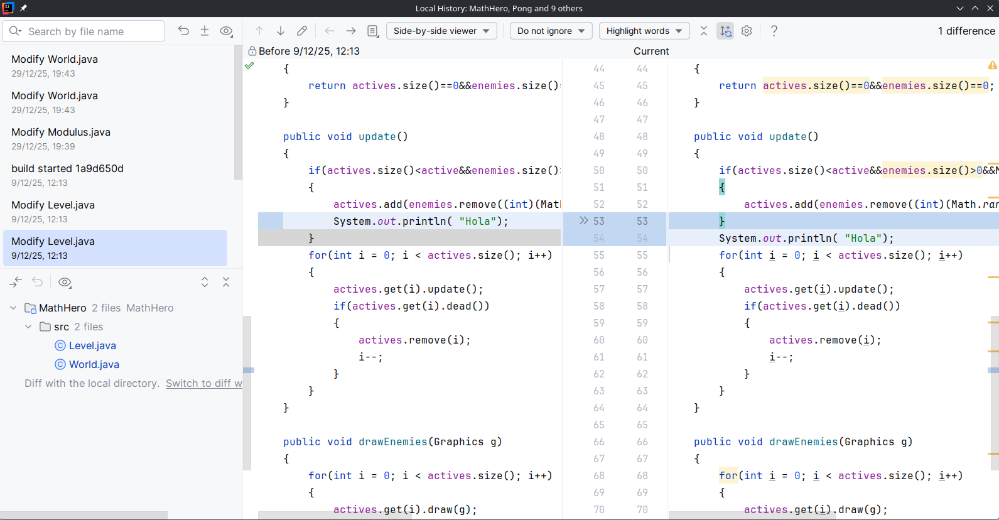
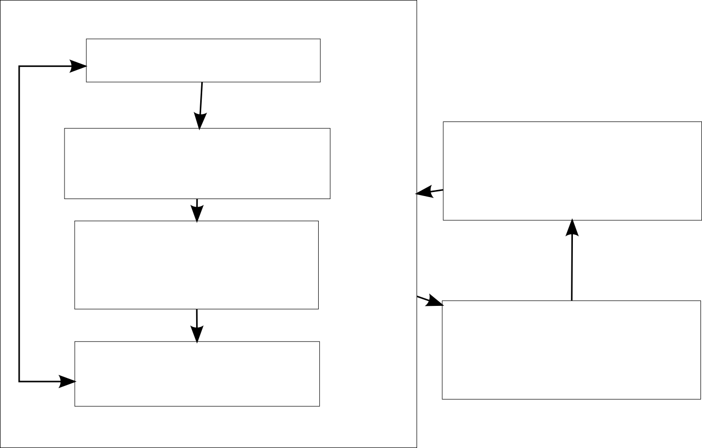
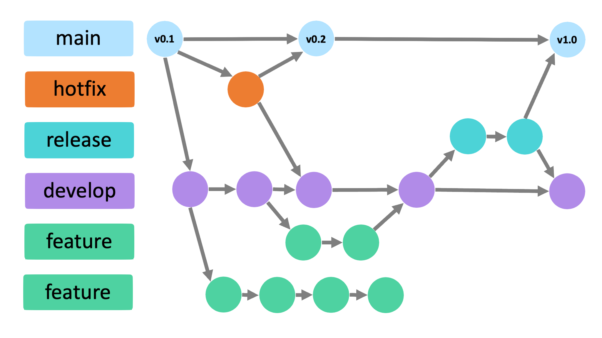
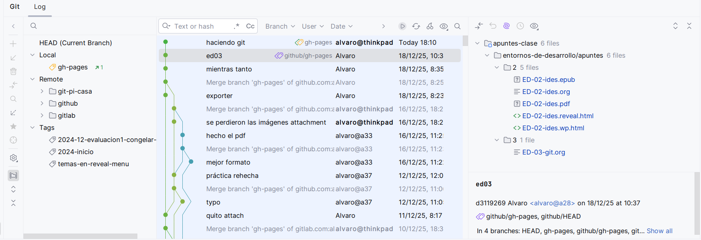

#+INCLUDE: "../../../common/header.org"
#+TITLE:  Control de versiones (git)
#+REVEAL_HLEVEL: 1

* Introducción
- Problemas típicos en el desarrollo de aplicaciones
  - ¿Cómo trabajan varios desarrolladores sobre el mismo código?
  - ¿Qué cambios se han realizado?
  - ¿Quién ha realizado los cambios?

* Trabajo en solitario
- Los IDE suelen tener /historia local/
- Indica los cambios que ha tenido el código en la máquina local
    

* Trabajo colaborativo

** Integración de código

  - Cada miembro del equipo realiza su parte del trabajo
  - Si hay errores
    - ¿Cómo se aislan los cambios que dieron lugar a un /bug/?  
  - Si hay más de una versión
    - ¿Cómo se recupera una versión antigua?
    - ¿Cómo se fusionan dos versiones?
    
  

** Control de versiones
  - Un control de versiones (de código) mantiene una base de datos con todos los cambios producidos sobre el código fuente y otros ficheros necesarios para generar una aplicación
  - Pueden ser
    - Centralizados/distribuidos
    - Basados en ficheros/Basados en /changesets/
    - Bloqueantes/No bloqueantes
  - Ejemplos
    - GIT
    - Subversion
    - Mercurial
  
    [[https://en.wikipedia.org/wiki/Version\_control][Control de versiones en Wikipedia]]
  

** Conceptos de control de versiones (I)
  - *Repositorio*: Base de datos con las sucesivas versiones
  - *Copia de trabajo*: Ficheros sobre los que trabaja el programador
  - */Commit/*: Confirmación de una nueva versión (de la copia de trabajo al repositorio)
  - */Checkout/*: (Re)generación de la copia de trabajo a partir de la información del repositorio
  - */Changeset/*: Conjunto de cambios en el repositorio, considerado atómico
  

** Conceptos de control de versiones (II)
  - *Rama (/Branch/)*: Versión paralela (ni anterior, ni posterior)
  - *Rama =master= o =main=*: Rama principal del desarrollo
  - *Fusión (/Merge/)*: Acumular cambios en una misma versión
    - Tras un /checkout/, mezclando la copia de trabajo con la versión del repositorio
    - Entre diferentes /branchs/ del repositorio
    
  - *Comentario*: Cada /commit/ debería documentar sus efectos y motivaciones.
  

* GIT
  - Gratis, de código abierto
  - Muy popular, en múltiples plataformas
  - Distribuido
  - Basado en /changesets/
  - No bloqueante 
  

** GIT como cliente-servidor
- Git tiene una arquitectura [[https://en.wikipedia.org/wiki/Peer-to-peer][peer-to-peer]]
  - Todos los repositorios son igual de "/importantes/"
- Por convenio, suele haber un repositorio "/central/"
  - Como servicio: [[https://github.com/][github]], [[https://gitlab.com/users/sign_in][gitlab]], [[https://codeberg.org/][codeberg]]...
  - Autoalojado: [[https://about.gitea.com/products/gitea/][gitea]], [[https://forgejo.org/][forjego]]
  - [[https://www.systutorials.com/set-up-git-server-through-ssh-connection/][O solo con Git y linux]]

** Flujo de trabajo básico

#+attr_html: :width 100%
#+attr_latex: :width 0.7\textwidth
  

#+reveal:split

#+attr_html: :width 100%
#+attr_latex: :width 0.7\textwidth
  

#+MACRO: referenciagit [[https://git-scm.com/docs/git-$1][Comando /git $1/]]

** Ramas
- Cada /commit/ genera una nueva versión del código
- Generalmente, una versión "/desciende/" de otra versión  
  - En un /merge/, se puede "/descender/" de más de una versión
- Las versiones se identifican por un /hash/
- Una *rama* (=branch=) es un nombre que se da a un /hash/, y que va avanzando al hacer nuevas versiones
- Un =tag= es como un =branch=, pero no avanza al hacer nuevas versiones 

*** Ramas típicas
- =master= o =main=: Versiones oficiales del código
  - Se garantiza que funcionan
  - Se entregan al usuario final
- =develop=: Trabajo para las siguientes versiones oficiales
  - Se acaban fusionando (/merge/) en =master=
- =feature=: Trabajo para una sola funcionalidad
  - Se acaban fusionando en =develop=
  - Pueden ser personales: solo las utiliza un desarrollador
- =hotfix=: Un arreglo urgente en =master=    

#+reveal:split  

* Comandos de Git

** =init=

  
  - Crea un nuevo repositorio en el directorio
  - Inicialmente vacío
  - Se almacena en el directorio oculto =.git=
  
#+label: Ejemplo de =git init=
#+begin_src bash
alvaro@debian8-64-alvarogonzalez:~/aplicacion-web$ git init
Initialized emp
#+end_src

** =clone= <<#clone>>
  :PROPERTIES:
  :CUSTOM_ID: clone
  :END:

  - Crea un nuevo repositorio, copia de uno ya existente
  - El repositorio puede ser local o remoto, dependiendo de la [[https://git-scm.com/docs/git-clone#_git_urls][URL]]
  - La copia de trabajo será la de la rama =master=
  

#+label: Ejemplo de =git clone=
#+begin_src bash
  alvaro@debian8-64-alvarogonzalez:~/aplicacion-web$ git clone https://github.com/alvarogonzalezsotillo/aplicacion-php.git
  Cloning into 'aplicacion-php'...
  remote: Counting objects: 50, done.
  remote: Compressing objects: 100%
  ....
#+end_src

{{{referenciagit(clone)}}}

** =add= <<#add>>
  :PROPERTIES:
  :CUSTOM_ID: add
  :END:

  - Git no incluye todos los ficheros de la copia de trabajo en el repositorio
  - Si se desea un fichero en el repositorio, se debe incluir con =add=
  - Cada cambio posterior debe indicarse también con =add=
  - Se puede quitar con =rm= (las versiones antiguas siguen en el repositorio)

  

{{{referenciagit(add)}}}

** =status=
  
  
  - Imprime un resumen del estado de los ficheros de la copia de trabajo
   
    - *Untracked*: No guardados en el repositorio. Git ignora el fichero
    - *Unmodified*: Igual que en la rama activa del repositorio
    - *Modified*: Con cambios respecto al repositorio, pero que no está previsto guardar    
  
{{{referenciagit(status)}}}
  
  
  

** =diff=

  Muestra los cambios de los ficheros en estado *modified*
  
  - =@@ -lineO,nlinesO +lineD,nlinesD @@=    
    - Se muestra a partir de =lineO= del fichero antiguo y =lineD= del fichero actual
    - Se muestran =nlinesO= líneas del fichero antiguo y =nlinesD= líneas del fichero actual 
    
  - =-= Línea borrada
  - =+= Línea añadida
  
  
  
  {{{referenciagit(diff)}}}

  
** =commit= <<#commit>>
  :PROPERTIES:
  :CUSTOM_ID: commit
  :END:

#+label: Ejemplo de =commit -a=
#+begin_src bash
[master 906fa20] Cambiados varios permisos de ejecución
 5 files changed, 411 insertions(+), 2 deletions(-)
 create mode 100644 09/estados-fichero-git.svg
 mode change 100755 => 100644 borrar-temporales-latex.sh
 mode change 100755 => 100644 generar-pdf.sh
 mode change 100755 => 100644 generar-pdfs.sh
 mode change 100755 => 100644 publicar-pdfs.sh
#+end_src

  

  {{{referenciagit(commit)}}}

** =push= <<#push>>
  :PROPERTIES:
  :CUSTOM_ID: push
  :END:
  
  - Sube las versiones del repositorio local a un repositorio remoto
  - El repositorio remoto puede establecerse:
    - con =git clone= (en este caso se denomina *origin*) 
    - con =git remote add=    
  - El repositorio debe tener todas las versiones del repositorio remoto
    - En otro caso, deberá realizarse un =git pull= previo

{{{referenciagit(push)}}}
{{{referenciagit(remote)}}}

#+label: Ejemplo de =git push=con error}
#+begin_src bash
alvaro@debian8-64-alvarogonzalez:~/aplicacion-web$ git push
Password for 'https://alvarogonzalezsotillo@bitbucket.org': 
To https://alvarogonzalezsotillo@bitbucket.org/alvarogonzalezsotillo/aplicacion-web.git
! [rejected]        master -> master (fetch first)
error: failed to push some refs to 
'https://alvarogonzalezsotillo@bitbucket.org/alvarogonzalezsotillo/aplicacion-web.git'
hint: Updates were rejected because the remote contains work that you do
hint: not have locally. This is usually caused by another repository pushing
hint: to the same ref. You may want to first integrate the remote changes
hint: (e.g., 'git pull ...') before pushing again.
hint: See the 'Note about fast-forwards' in 'git push --help' for details.

  #+end_src

** =pull= <<#pull>>
  :PROPERTIES:
  :CUSTOM_ID: pull
  :END:
  
  - Consigue la última versión de la rama actual
  

** =checkout= <<#checkout>>
  :PROPERTIES:
  :CUSTOM_ID: checkout
  :END:
  
  - Extrae versiones del repositorio a la copia de trabajo
    
    - *Un fichero*: =git checkout <fichero>=
    - *Una versión*: =git checkout <hashdeversión>=
    - *Un branch*: =git checkout <branch>=    
  - También crea nuevas ramas, con =git checkout -b <nombrerama>=
  - Si coinciden una versión/nombre de fichero
    - Utilizar [[https://www.kernel.org/pub/software/scm/git/docs/gitrevisions.html#_specifying_revisions][Referencias a objetos en Git]]
    - Es *mejor* evitar que coincidan
    

  

  
{{{referenciagit(checkout)}}}
{{{referenciagit(branch)}}}

** =merge= <<#merge>>
  :PROPERTIES:
  :CUSTOM_ID: merge
  :END:
- Fusiona la rama actual con otra rama
- En el caso de que haya conflictos:
  - Los ficheros se quedan con [[https://www.kernel.org/pub/software/scm/git/docs/git-merge.html#_how_conflicts_are_presented][marcas de conflictos]]
  - Para aceptar el fichero completo de la otra rama: =git checkout --theirs path/file=  
  - Para aceptar el fichero completo de la rama actual: =git checkout --ours path/file=
  - Para casos más complicados, editar los ficheros y confirmarlos con =git add=
- Recomendación: =git mergetool=, o usar el IDE

{{{referenciagit(merge)}}}: Fusión de dos ramas

        

** Otros comandos

  
  - {{{referenciagit(blame)}}}: Lista un fichero con el autor de cada línea
  - {{{referenciagit(log)}}}: Historia de cambios de un repositorio
  - {{{referenciagit(gui)}}}: Interfaz gráfica básica para utilizar git
  - {{{referenciagit(switch)}}}: Cambia rápidamente entre ramas
  - {{{referenciagit(reset)}}}: Deshace cambios (con precaución)
  - {{{referenciagit(tag)}}}: Da un nombre legible (no un /hash/) a una versión
  
  

* Ejercicio GIT
- Clona el repositorio https://codeberg.org/alvarogonzalezsotillo/Java-Games.git
- Crea la rama =translate= a partir de =master= (comando =checkout= o =branch=)
- Traduce a otro idioma las interfaces de los juegos:
  - Tetris
  - MathHero
  - FallDown
- Incorpora los cambios a la rama =translate= (comando =add= y =commit=)
- Fusiona los cambios con la rama =master=
  - =git checkout master=
  - =git merge --no-ff translate=
- Enseña los resultados al profesor
  - =git log --graph --oneline=
  
* Git desde Intellij

* Ejercicio GIT (II)
- Crea una cuenta en [[https://codeberg.org][Codeberg]]
  - Usa tu cuenta de correo de educamadrid
- Clona el repositorio [[https://codeberg.org/alvarogonzalezsotillo/ejercicio-listado-alumnos.git]]
  - Comando [[#clone][=clone=]]
- Extrae la rama =curso-2025-2026=
  - Comando [[#checkout][=checkout=]]
- Modifica el fichero =listado-alumnos.md= y añade tu nombre y apellidos en el orden correcto
- Confirma tus cambios en local ([[#add][=add=]],[[#commit][=commit=]])
- Sube tus cambios con [[#push][=push=]]
  - Si algún compañero ha cambiado el fichero antes que tú, consigue sus cambios con [[#pull][=pull=]], y vuelve a intentar subir tus cambios

* ¿Qué es un /pull request/ y un /fork/?
- Un PR es un concepto ajeno a Git
  - El equivalente de Git a un PR es un /push/
- En servicios de Git (como GitHub)
  - A veces se quieren hacer cambios en un repositorio donde no tenemos permisos de escritura
  - Se hace un /fork/ (copia) de ese repositorio
  - Se realizan los cambios que se considere en esa copia
  - Finalmente, se pide que el dueño del repositorio original haga un /pull/
- [[https://docs.github.com/en/get-started/start-your-journey/hello-world?source=post_page-----62dea67aa2eb--------------------------------][Guía de Github]]       

* Si todo se complica...
[[https://training.github.com/downloads/github-git-cheat-sheet.pdf][Git cheat sheet]]
[[https://www.explainxkcd.com/wiki/index.php/1597:_Git][file:./media/xkcd-git.png]]

* Referencias
#+include: "../../../common/footer.org"

