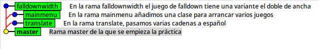
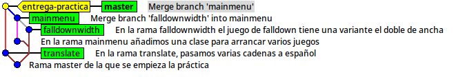
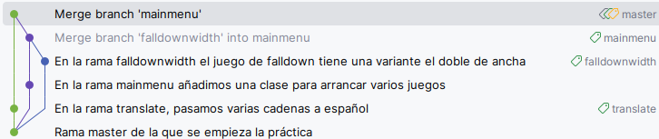

#+INCLUDE: "../../../common/header-examen-practica.org"

#+OPTIONS: author:nil date:nil toc:nil title:nil

#+LATEX_HEADER: \lhead{Git}
#+LATEX_HEADER: \rhead{Entornos de desarrollo}

* Objetivo de la práctica
En esta práctica el alumno manejará un repositorio Git, trabajando los siguientes aspectos
- Uso básico desde línea de comandos o IDE
- Manejo de diferentes ramas
- Trabajo colaborativo
- Corresponden con los CE f) y h) del RA04  

La última versión de este documento está accesible en [[https://alvarogonzalezsotillo.github.io/apuntes-clase/entornos-de-desarrollo/apuntes/3/ED-03-practica-git.pdf][este enlace]]

* Cuenta en Codeberg
1. Crea una cuenta en [[https://codeberg.org/][codeberg]]. Utiliza tu correo de educamadrid.
2. La práctica se realiza por parejas. En caso necesario, puede haber grupos de tres alumnos.   
3. Un alumno hace un [[https://docs.github.com/en/pull-requests/collaborating-with-pull-requests/working-with-forks/fork-a-repo][/fork/]] del repositorio https://codeberg.org/alvarogonzalezsotillo/Java-Games.git
   - Da permisos de lectura al profesor (=alvarogonzalezsotillo=)
   - Da permisos completos a tu compañero de práctica

* Ramas concurrentes de desarrollo
Los siguientes trabajos se repartirán entre los integrantes del equipo, de forma concurrente.
La rama =master= es [[https://codeberg.org/alvarogonzalezsotillo/Java-Games/commit/3b8e873b3bf77ff4390d8d3cd031be0cd8c58482][=3b8e873b=]]

#+latex: \begin{multicols}{3}

** Rama =translate=
- Crea la rama =translate= a partir de =master=
- Traduce a otro idioma las interfaces de los juegos:
  - Tetris
  - MathHero
  - FallDown

** Rama =mainmenu=
- Crea la rama =mainmenu= a partir de =master=
- Añade un módulo que implemente un menú para ejecutar cualquier juego
    
** Rama =falldownwidth=
- Crea la rama =falldonwwidth= a partir de =master=
- Crea una nueva clase de nombre =PlayFallDownWide= en el módulo =FallDown=
- Ejecutará el juego, pero con un tablero el doble de ancho que =PlayFallDown=

#+latex: \end{multicols}

#+caption: Cómo se ven las ramas en Gitk

* Fusiones hasta =master=
- Fusiona =translate= con =master=
- Fusiona =falldownwidth= con =mainmenu=. El menú debe tener dos entradas para el juego FallDown, una para el juego original y otra para la variante ancha
- Fusiona =mainmenu= con =master=

* Haz una /release/
- Crea una etiqueta (/tag/) con el nombre =entrega-practica= en la rama =master= cuando estén todas las ramas fusionadas

#+caption: Cómo se ven las ramas ya fusionadas en Gitk

#+caption: Cómo se ven las ramas ya fusionadas en Intellij

#+latex: \begin{Aviso}
Dependiendo del orden en que se fusionen las ramas, y de los /commits/ intermedios, puede haber diferencias en la visualización de todas las ramas fusionadas
#+latex: \end{Aviso}

* Qué se entrega
- Todos los integrantes del equipo hacen la entrega
- Sube en la tarea del aula virtual
  - La URL a tu repositorio en Codeberg. Contendrá todas las ramas, /commits/ y etiquetas que se hayan hecho en la práctica
  - El /hash/ del /commit/ de la etiqueta =entrega-practica=
  - La salida del comando =git log --all --graph=  

* Qué se valorará
- Las ramas y etiquetas siguen lo indicado en la práctica
- Todos los integrantes del equipo han trabajado de forma equilibrada. Al menos han sido responsables de una rama.
- El programa final funciona y hace lo pedido  
