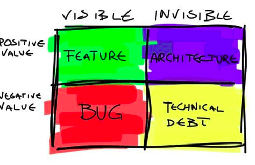
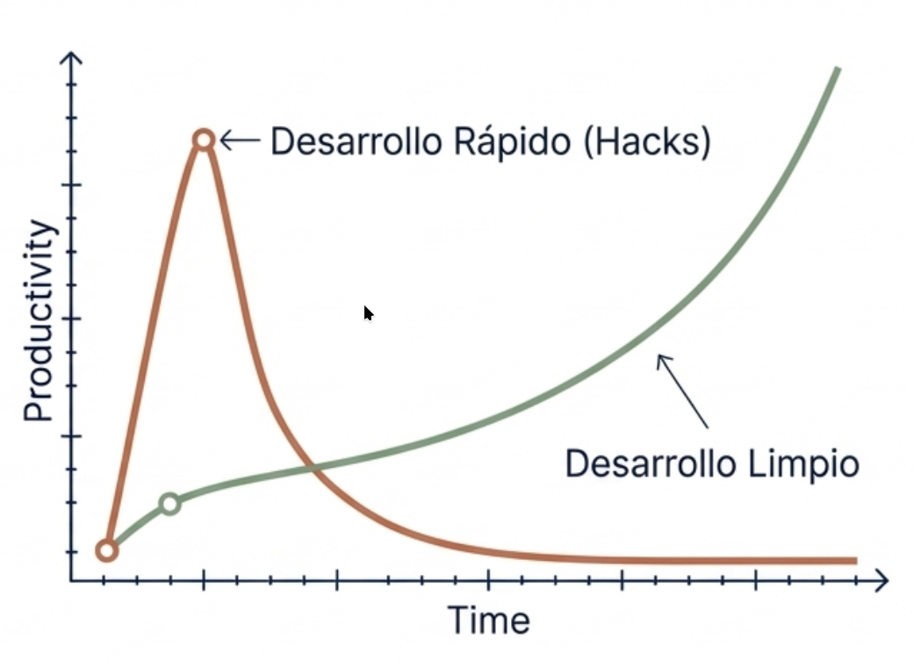
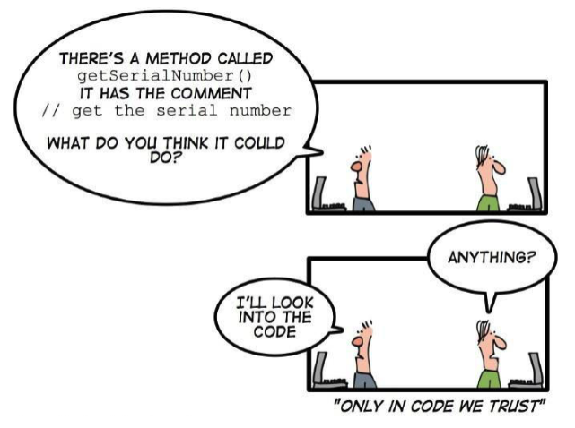
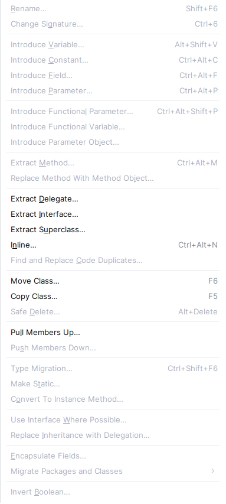

#+INCLUDE: "../../../common/header.org"
#+TITLE:  Optimización, refactorización y documentación
#+REVEAL_HLEVEL: 1

* Deuda técnica
- Esfuerzo que se va a tener que hacer adicionalmente, porque se ha elegido un desarrollo sencillo y rápido, en lugar de utilizar un mejor enfoque más lento inicialmente
- Metáfora: Es un un crédito de tiempo, ahora se /ahorra/ en una implementación insuficiente, en el futuro se /paga/ rehaciendo gran parte del código

** Cómo evitar la deuda técnica
- Buen diseño
- Refactorizaciones cuando sea necesario
- Buena documentación
- Entre otros muchos factores: planificación, buena comunicación, gestión del proyecto...  

  
* Documentación
- Documentación externa:
  - Manuales, sitios web, wikis...
  - Se desfasa con mayor facilidad  
- Documentación interna
  - Incluida en el código
  - Al estar más /cercana/ al programa se suele actualizar más rápido

** Javadoc
- Documentación sobre el código en el propio código
- Usando comentarios ~/** */~ con texto libre
- Pueden incluir HTML
- Las @etiquetas definen propiedades concretas del código

** Etiquetas Javadoc
| =@author=     | Autor o autores del bloque de código      |
| =@code=       | Similar a <pre></pre>                     |
| =@deprecated= | El método/clase se eliminará en un futuro |
| =@link=       | Enlace a página web                       |
| =@param=      | Argumento que recibe un método.           |
| =@return=     | Valor de retorno del método               |
| =@see=        | Añade un comentario /See Also/            |
| =@since=      | Desde que versión está disponible         |
| =@throws=     | Explicación de excepciones lanzadas       |
| =@version=    | Versión actual del bloque código          |

** Ejemplo: =java.util.Set.contains()=

#+caption: Documentación del método =Set.contains()=
#+begin_src java
  /**
     * Returns {@code true} if this set contains the specified element.
     * More formally, returns {@code true} if and only if this set
     * contains an element {@code e} such that
     * {@code Objects.equals(o, e)}.
     *
     * @param o element whose presence in this set is to be tested
     * @return {@code true} if this set contains the specified element
     * @throws ClassCastException if the type of the specified element
     *         is incompatible with this set
     * (<a href="Collection.html#optional-restrictions">optional</a>)
     * @throws NullPointerException if the specified element is null and this
     *         set does not permit null elements
     * (<a href="Collection.html#optional-restrictions">optional</a>)
     */
    boolean contains(Object o);  
#+end_src

** Ejercicio
- El código fuente de Java es un gran ejemplo de uso
- Consulta la documentación de =java.util.Arrays=
  - En [[https://github.com/openjdk/jdk21/blob/master/src/java.base/share/classes/java/util/Arrays.java][su repositorio]]   
  - En la [[https://docs.oracle.com/en/java/javase/21/docs/api/java.base/java/util/Arrays.html][documentación oficial]]
  - En el código fuente (usa IntelliJ, =CTRL-n ArrayList=)

** Ejercicio
- Completa la documentación Javadoc de tus clases para crear el menú de =Java-games=
- Genera la documentación
  #+begin_src bash
  javadoc -sourcepath src -d docs -subpackages <paquetes>
  #+end_src
- Para clases sin paquete:
  #+begin_src bash
  javadoc -d docs src/*.java
  #+end_src
  

** Documentación vs Código

(Lo que tiene relación con el [[https://agilemanifesto.org/iso/es/manifesto.html][manifiesto ágil]]: Software funcionando sobre documentación extensiva)
* /Bad smells/
https://openwebinars.net/blog/code-smells-y-deuda-tecnica/

    - No tienen por qué ser errores o bugs de programación, ya que pueden no ser técnicamente incorrectos y el programa funcione correctamente.
    - Indican deficiencias en el diseño
    - Pueden hacer que se realice un desarrollo más lento.
    - Aumentan el riesgo de /bugs/ en el futuro.

** Algunos /bad smells/
    - Código duplicado (Duplicated code)
    - Métodos muy largos (Long Method)
    - Clases muy grandes (Large class)
    - Lista de parámetros extensa (Long parameter list)
    - Cambio divergente (Divergent change)
    - Cirugía a tiros (Shotgun surgery)
    - Envidia de funcionalidad (Feature Envy)
    - Legado rechazado (Refused bequest)

    Más en https://sourcemaking.com/refactoring  
      
** Duplicated code
    Si se detectan bloques de código iguales o muy parecidos en distintas partes del programa, se debe extraer creando un método para unificarlo.
 #+begin_src java
 public void leerCSV(String[] filas) {
    for (String fila : filas) {
        if (fila.isEmpty()) {
            System.out.println("Aviso: fila vacía");
        }
        if (fila.length() < 3) {
            System.out.println("Aviso: fila demasiado corta");
        }
    }
} 
 #+end_src

 #+begin_src java
public void leerCSV(String[] filas) {
    for (String fila : filas) {
        if (fila.isEmpty()) {
            aviso("fila vacía");
        }
        if (fila.length() < 3) {
            aviso("fila demasiado corta");
        }
    }
}

private void aviso(String msg) {
    System.out.println("Aviso: " + msg);
} 
 #+end_src

** Long Method
- Los método de muchas lineas dificultan su comprensión.
- Un método largo probablemente está realizando distintas tareas, que se podrían dividir en otros métodos
- Las funciones deben ser los más pequeñas posibles (3 lineas mejor que 15).
- Cuanto más corto es un método, más fácil es reutilizarlo.
- Un método debe hacer solo una cosa, hacerla bien, y que sea la única que haga.

** Large class
- Problema anterior aplicado a una clase.
- Una clase debe tener solo una finalidad.
- Si una clase se usa para distintos problemas tendremos clases con demasiados métodos, atributos e incluso instancias.
- Las clases deben el menor numero de responsabilidades y que esté bien delimitado.

** Long parameter list
- Las funciones deben tener el mínimo número de parámetros posible, siendo 0 lo perfecto.
- Si un método requiere muchos parámetros puede que sea necesario crear una clase con esa cantidad de datos y pasarle un objeto de la clase como parámetro.
- También ocurre con el valor de retorno, si necesito devolver más de un dato.

#+begin_src java
    /** Encuentra los puntos de corte entre dos parábolas
     ,* y = a1x² + b1x + c1
     ,* y = a2x² + b2x + c2
     ,*/ 
    public static double[] puntosCorte(double a1, double b1, double c1, double a2, double b2, double c2) {
        ....
    }
#+end_src

#+begin_src java
public class Parabola {
    double a;
    double b;
    double c;
}
public static double[] puntosCorte(Parabola p1, Parabola p2) {
    ....
}
#+end_src

    

** Divergent change
- Si una clase necesita ser modificada a menudo y por razones muy distintas, puede que la clase esté realizando demasiadas tareas.
- Podría ser eliminada y/o dividida.

** Shotgun surgery
- Si al modificar una clase, se necesitan modificar otras clases o elementos ajenos a ella para compatibilizar el cambio.
- Lo opuesto al smell anterior.

** Feature Envy
- Ocurre cuando una clase usa más métodos de otra clase, o un método usa más datos de otra clase, que de la propia.

** Refused bequest
- Cuando una subclase extiende (hereda) de otra clase, y utiliza pocas características de la superclase, puede que haya un error en la jerarquía de clases.      

      
* Sonarqube
- Permite localizar /bad smells/
- Se puede utilizar como /plugin/
- Pero en entorno empresarial es preferible un servidor    

** /plugin/ para Intellij  
- Instala el /plugin/ para Intellij
- Comprueba las recomendaciones que da para el fichero =FallDownComponent.java=
- Para ignorar avisos: =@java.lang.SuppressWarnings("squid:S00112")=
  
[[file:media/plugin-sonarqube.png]]

** Servidor Sonarqube
- Permite usarlo para proyectos completos
  - Compartido con otros desarrolladores
  - Desde la línea de comandos (se puede poner en un /script/)
- Ejemplo de [[https://medium.com/@akashlomas/code-evaluation-with-sonar-qube-sonar-scanner-on-podman-4e647866ea6b][instalación simplificada]], no apta para trabajo /serio/
  - Usuario =admin=, contraseña =admin= (se puede cambiar por =Contraseñacomplicada1=)
  #+begin_src sh
  podman run -p 9000:9000 --name sonarqube docker.io/sonarqube:community 
  #+end_src

** Cliente Sonarqube
- Cambiar =/home/alvaro/repos/Java-Games/FallDown= por el directorio del proyecto
- Cambiar el valor de =sonar.token= por el /token/ que se genere en el servidor

#+begin_src sh
podman run --rm \
       --volume /home/alvaro/repos/Java-Games/FallDown:/usr/src:ro \
       --workdir /usr/src \
       --network=host \
       docker.io/sonarsource/sonar-scanner-cli \
       -Dsonar.projectKey=java-games \
       -Dsonar.java.binaries=bin \
       -Dsonar.projectName='java-games' \
       -Dsonar.exclusions=doc \
       -Dsonar.host.url=http://localhost:9000 \
       -Dsonar.token=sqp_0373d5cbb31d95200fa97cab4998315f14add870
#+end_src
* Refactorización
- Modificación del código sin cambiar su funcionamiento, para tener un código más claro y sencillo
- Los /bad smell/ se eliminan mediante la refactorización

** Refactorización en intellij
- Tecla rápida (con contexto): =CTRL-ALT-SHIFT-t=
- Menú general: Botón derecho en editor ➡️ /Refactor/
  
#+reveal: split  

| Rename... — Shift+F6                                 | Change Signature... — Ctrl+6           | Introduce Variable... — Alt+Shift+V |
| Introduce Constant... — Ctrl+Alt+C                   | Introduce Field... — Ctrl+Alt+F        | Introduce Parameter... — Ctrl+Alt+P |
| Introduce Functional Parameter... — Ctrl+Alt+Shift+P | Introduce Functional Variable...       | Introduce Parameter Object...       |
| Extract Method... — Ctrl+Alt+M                       | Replace Method With Method Object...   | Extract Delegate...                 |
| Extract Interface...                                 | Extract Superclass...                  | Inline... — Ctrl+Alt+N              |
| Find and Replace Code Duplicates...                  | Move Class... — F6                     | Copy Class... — F5                  |
| Safe Delete... — Alt+Delete                          | Pull Members Up...                     | Push Members Down...                |
| Type Migration... — Ctrl+Shift+F6                    | Make Static...                         | Convert To Instance Method...       |
| Use Interface Where Possible...                      | Replace Inheritance with Delegation... | Encapsulate Fields...               |
| Migrate Packages and Classes >                       | Invert Boolean...                      |                                     |

#+reveal: split

  
** /Introduce value/
- A veces hay cálculos complicados en una línea de código
- Queda más claro si se utilizan variables intermedias
- Ejemplo: =MathHero.java:36=

** /Extract method/
- Si un método es muy largo, es aconsejable dividirlo
- Hay que tener en cuenta qué variables necesita (serán parámetros) y qué devuelve
- Ejemplo:  =TetrisGrid.draw()=   
    

** /Encapsulate field/
- No es aconsejable que se acceda directamente a propiedades de objetos
  - Ni siquiera desde dentro de la clase
- Ejemplo: =FallDownEngine.affectBall()= (solo cambiar =ball= al final)

** /Introduce parameter object/
- Si un método tiene demasiados parámetros, crea/reutiliza una clase para agruparlos
- Ejemplo: constructor =GameComponent()=

** /Pull up/
- Un miembro de la clase podría estar definido más alto en la jerarquía
- Ejemplo: =Division.problem= y =Division.solution=
  - También es un ejemplo de /encapsulate field/  

** /Invert if/
- Cambia la rama /then/ y la rama /else/ de un /if/
- Ejemplo: =TetrisGrid.setWorkingBlock()=  

** /Refactor/ como solución a /bad smells/
- Los ejemplos más evidentes son:
  - Código duplicado (Duplicated code) ➡️ =Find and replace code duplicates=
  - Métodos muy largos (Long Method) ➡️ =Extract method=
  - Clases muy grandes (Large class) ➡️
    - =Pull members up=
    - =Extract superclass=  
  - Lista de parámetros extensa (Long parameter list) ➡️ =Introduce parameter object=
- Otros /bad smells/ tienen soluciones combinadas, o maś complejas que una refactorización automática
  #+begin_example
  Copilot:
  All subclasses of Enemy must use setSolution() and setProblem() if possible, instead of using their own fields.
  #+end_example      
 
* Diseño
- *POLA* = Principle Of Least Astonishment
  - El código no debería sorprender a quien tenga que entenderlo en un futuro
  - Nombres de variables y funciones, 
- *KISS* = Keep It Small and Simple
  - Intentar no abarcar demasiado. Limitar el código a lo que se pide.
  - Puede entrar en conflicto con planificar a largo plazo  
- *YAGNI* = You Aren’t Gonna Need It
  - Es muy problable que esa extensión de funcionalidad que no se pide acabe no haciendo falta
  - Se parece mucho a *KISS*  

** SOLID
- Responsabilidad única (*S* ingle responsibility)
    - Un objeto solo debería tener una única razón para cambiar.
    - Cada parte del código (variable, método, clase) debe tener una única tarea  
- Abierto/cerrado (*O* pen/closed)
    - Las entidades de software deben estar abiertas para su extensión, pero cerradas para su modificación.
    - El código no se debería cambiar si aparecen nuevos requisitos, sino que se de debería añadir más código  
- Sustitución de Liskov (*L* iskov substitution)
    - Los objetos de un programa deberían ser reemplazables por instancias de sus subtipos sin alterar el correcto funcionamiento del programa.
- Segregación de la interfaz (*I* nterface segregation)
    - Muchas interfaces cliente específicas son mejores que una interfaz de propósito general
- Inversión de la dependencia (*D* ependency inversion)
    - Se debe depender de abstracciones, no depender de implementaciones
    - Una clase base no debería conocer a sus clases hijas  
    - Inyección de Dependencias

* Buenas prácticas
** Nivel de indentación
  - A partir de 3-4 niveles, el código se vuelve ilegible
  - Mucha indentación suele  implicar métodos muy largos
  - Solución:
    - dividir el método en varios métodos
    - eliminar duplicados

** Identificadores adecuados
  - El nombre de un método
    - Debe ser descriptivo
    - Debe indicar todo lo que hace
    - Si es difícil encontrar un nombre, dividir el método
  - El nombre de una variable
    - Debe ser descriptivo    

#+include ./P.java src java
  
** Visibilidad
  - =private= mejor que =protected=
  - =protected= mejor que =public=
  - Si no sabes que existe, no puedes /romperlo/ o usarlo mal

** Mutabilidad
  - =final= si es posible
  - Evitar reasignación de variables (hacer nuevas variables)
    
** Tiempo de vida limitado
  - Una variable debe existir mientras haga falta
  - Solo en el bloque ={= =}= más interno posible  

      

    
* COSAS :noexport:
** Buenas prácticas

    Manejo de Strings: Los Strings son objetos, por lo que crearlos es costoso. Es mucho más rápido instanciarlos con una asignación, que con el operador new.
        Concatenar String con el operador '+' también genera mucha carga, ya que crea un nuevo String en memoria (Los objetos String son inmutables). Se debe tratar de evitar siempre las concatenaciones (+) dentro de un bucle, o usar otras clases en ese caso (p.e. StringBuilder)

    Tipos primitivos mejor que clases wrapper (envoltorio) : Las clases wrapper al ser objetos, proveen de métodos para trabajar mejor con ellas, pero al igual que los Strings, son más lentos que los tipos primitivos.

    Comparación de objetos: Recordar que tanto los Strings como las tipos Wrapper son objetos y sus variables solo contienen sus referencias (direcciones). Los objetos no se comparan con ==.

    Evitar la creación innecesaria de objetos. Como se ha dicho, generan mucha carga.

    Visibilidad de atributos: Los campos de una clase 'estándar' no deben declararse nunca como public, ni mucho menos no indicarle un modificador de visibilidad. Se usan sus setters y getters para su acceso.

    Limitar siempre el alcance de una variable local. Crear la variable local e inicializarla lo más cerca posible de su uso.

    Usar siempre una variable para un único propósito. A veces sentimos la tentación de reutilizar una variable, pero complica la legibilidad.

    Bucle for. Optar por el for siempre que se pueda (frente a while, do-while). Las ventajas son que reune todo el control del bucle en la misma linea (inicio, fin, e incremento), y la variable de control ('i') no es accesible desde fuera de él. Si se necesita modificar su variable de control, usar otro bucle.

    Constantes: Cualquier valor literal debe ser definido como constante, excepto 1, -1, 0 ó 2 que son usados por el bucle for.

    Switch: Siempre debe llevar un break despues de cada caso, y tambien el caso default que ayudará a corregir futuros aumentos del número de casos.

    El copiado defensivo es salvador. Cuando creamos un constructor que recibe el mismo tipo de objeto de la clase, debemos tener cuidado y crear un nuevo objeto a partir del recibido.

https://entornos.abrilcode.com/doku.php?id=apuntes:refactorizacion

* Referencias
#+include: "../../../common/footer.org"

