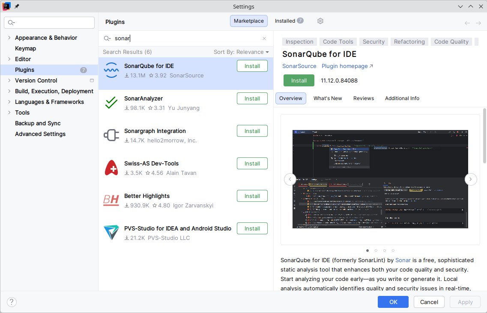

#+INCLUDE: "../../../common/header.org"
#+TITLE:  Optimización, refactorización y documentación
#+REVEAL_HLEVEL: 1

* Introducción 
- Optimización
- Refactorización
- Documentación
- /Clean code/

[[file:media/clipboard-20260203T131100.png]]

* Documentación
- Documentación externa:
  - Manuales, sitios web, wikis...
  - Se desfasa con mayor facilidad  
- Documentación interna
  - Incluida en el código
  - Al estar más /cercana/ al programa se suele actualizar más rápido

** Javadoc
- Documentación sobre el código en el propio código
- Usando comentarios ~/** */~ con texto libre
- Pueden incluir HTML
- Las @etiquetas definen propiedades concretas del código

** Etiquetas Javadoc
@author: autor o autores del bloque de código
@version: versión actual del bloque código
@since: desde que versión está disponible
@see: añade un comentario See Also. Muy versátil.
@param: argumento que recibe un método.
@return: valor de retorno del método
@deprecated:
@link
@throws
  
      
* Sonarqube
- La instalación es complicada
** Servidor Sonarqube
- No es necesario
- Una instalación simplificada, no apta para trabajo /serio/
  - Usuario =admin=, contraseña =admin= (se puede cambiar por =Contraseñacomplicada1=)
  #+begin_src sh
  podman run -p 9000:9000 --name sonarqube docker.io/sonarqube:community 
  #+end_src

** /plugin/ para Intellij  

* /Bad smells/
https://openwebinars.net/blog/code-smells-y-deuda-tecnica/

    - No tienen por qué ser errores o bugs de programación, ya que pueden no ser técnicamente incorrectos y el programa funcione correctamente.
    - Indican deficiencias en el diseño
    - Pueden hacer que se realice un desarrollo más lento.
    - Aumentan el riesgo de /bugs/ en el futuro.

** Algunos /bad smells/
    - Código duplicado (Duplicated code)
    - Métodos muy largos (Long Method)
    - Clases muy grandes (Large class)
    - Lista de parámetros extensa (Long parameter list)
    - Cambio divergente (Divergent change)
    - Cirugía a tiros (Shotgun surgery)
    - Envidia de funcionalidad (Feature Envy)
    - Legado rechazado (Refused bequest)

    Más en https://sourcemaking.com/refactoring  
      
** Duplicated code
    Si se detectan bloques de código iguales o muy parecidos en distintas partes del programa, se debe extraer creando un método para unificarlo.

** Long Method
    Los método de muchas lineas dificultan su comprensión. Un método largo probablemente está realizando distintas tareas, que se podrían dividir en otros métodos. Las funciones deben ser los más pequeñas posibles (3 lineas mejor que 15). Cuanto más corto es un método, más fácil es reutilizarlo. Un método debe hacer solo una cosa, hacerla bien, y que sea la única que haga.

** Large class
    Problema anterior aplicado a una clase. Una clase debe tener solo una finalidad. Si una clase se usa para distintos problemas tendremos clases con demasiados métodos, atributos e incluso instancias. Las clases deben el menor numero de responsabilidades y que esté bien delimitado.

** Long parameter list
    Las funciones deben tener el mínimo número de parámetros posible, siendo 0 lo perfecto. Si un método requiere muchos parámetros puede que sea necesario crear una clase con esa cantidad de datos y pasarle un objeto de la clase como parámetro. Del mismo modo ocurre con el valor de retorno, si necesito devolver más de un dato.

** Divergent change
    Si una clase necesita ser modificada a menudo y por razones muy distintas, puede que la clase esté realizando demasiadas tareas. Podría ser eliminada y/o dividida.

** Shotgun surgery
    Si al modificar una clase, se necesitan modificar otras clases o elementos ajenos a ella para compatibilizar el cambio. Lo opuesto al smell anterior.

** Feature Envy
    Ocurre cuando una clase usa más métodos de otra clase, o un método usa más datos de otra clase, que de la propia.

** Refused bequest
    Cuando una subclase extiende (hereda) de otra clase, y utiliza pocas características de la superclase, puede que haya un error en la jerarquía de clases.      

* Refactorización
- Modificación del código sin cambiar su funcionamiento, para tener un código más claro y sencillo
- Los /bad smell/ se eliminan mediante la refactorización

* Diseño
POLA = Principle Of Least Astonishment
KISS = Keep It Small and Simple
YAGNI = You Aren’t Gonna Need It

* SOLID
- Responsabilidad única (Single responsibility principle)
    - un objeto solo debería tener una única razón para cambiar.
    - Cada parte del código (variable, método, clase) debe tener una única tarea  
- Abierto/cerrado (Open/closed principle)
    - las entidades de software deben estar abiertas para su extensión, pero cerradas para su modificación.
    - El código no se debería cambiar si aparecen nuevos requisitos, sino que se de debería añadir más código  
- Sustitución de Liskov (Liskov substitution principle)
    - los objetos de un programa deberían ser reemplazables por instancias de sus subtipos sin alterar el correcto funcionamiento del programa.
- Segregación de la interfaz (Interface segregation principle)
    - muchas interfaces cliente específicas son mejores que una interfaz de propósito general
- Inversión de la dependencia (Dependency inversion principle)
    - se debe depender de abstracciones, no depender de implementaciones
    - Una clase base no debería conocer a sus clases hijas  
    - Inyección de Dependencias

* COSAS :noexport:
** Buenas prácticas

    Manejo de Strings: Los Strings son objetos, por lo que crearlos es costoso. Es mucho más rápido instanciarlos con una asignación, que con el operador new.
        Concatenar String con el operador '+' también genera mucha carga, ya que crea un nuevo String en memoria (Los objetos String son inmutables). Se debe tratar de evitar siempre las concatenaciones (+) dentro de un bucle, o usar otras clases en ese caso (p.e. StringBuilder)

    Tipos primitivos mejor que clases wrapper (envoltorio) : Las clases wrapper al ser objetos, proveen de métodos para trabajar mejor con ellas, pero al igual que los Strings, son más lentos que los tipos primitivos.

    Comparación de objetos: Recordar que tanto los Strings como las tipos Wrapper son objetos y sus variables solo contienen sus referencias (direcciones). Los objetos no se comparan con ==.

    Evitar la creación innecesaria de objetos. Como se ha dicho, generan mucha carga.

    Visibilidad de atributos: Los campos de una clase 'estándar' no deben declararse nunca como public, ni mucho menos no indicarle un modificador de visibilidad. Se usan sus setters y getters para su acceso.

    Limitar siempre el alcance de una variable local. Crear la variable local e inicializarla lo más cerca posible de su uso.

    Usar siempre una variable para un único propósito. A veces sentimos la tentación de reutilizar una variable, pero complica la legibilidad.

    Bucle for. Optar por el for siempre que se pueda (frente a while, do-while). Las ventajas son que reune todo el control del bucle en la misma linea (inicio, fin, e incremento), y la variable de control ('i') no es accesible desde fuera de él. Si se necesita modificar su variable de control, usar otro bucle.

    Constantes: Cualquier valor literal debe ser definido como constante, excepto 1, -1, 0 ó 2 que son usados por el bucle for.

    Switch: Siempre debe llevar un break despues de cada caso, y tambien el caso default que ayudará a corregir futuros aumentos del número de casos.

    El copiado defensivo es salvador. Cuando creamos un constructor que recibe el mismo tipo de objeto de la clase, debemos tener cuidado y crear un nuevo objeto a partir del recibido.

https://entornos.abrilcode.com/doku.php?id=apuntes:refactorizacion

* Referencias
#+include: "../../../common/footer.org"

