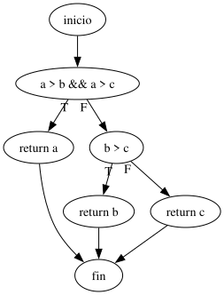
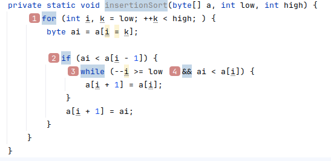
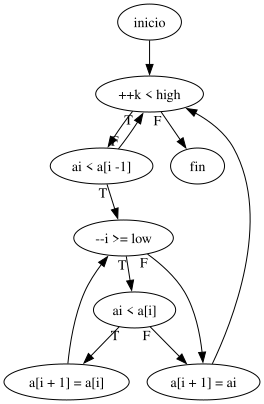
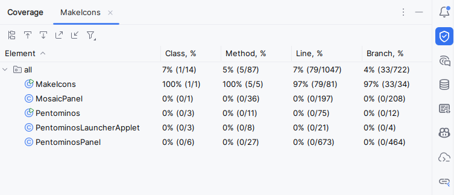
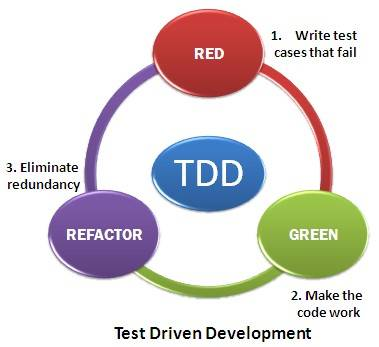

#+INCLUDE: "../../../common/header.org"
#+TITLE:  Diseño e implementación de pruebas
#+REVEAL_HLEVEL: 1

* Pruebas del /software/
- El desarrollo solo termina tras comprobar que el código funciona
  - Un método
  - Varias clases que colaboran
  - Una aplicación
  - Un conjunto de aplicaciones y servidores
- Se comprueba que funciona mediante *pruebas*

** Ejemplos
| Objeto de prueba                                  | Caso de prueba                                                                                          |
|---------------------------------------------------+---------------------------------------------------------------------------------------------------------|
| =Math.abs()= se corresponde con el valor absoluto | Se espera que ~Math.abs(-10)~ sea ~10~                                                                  |
| Si Mario cae sobre un /goompa/, Mario rebota      | Se espera que Mario rebote al saltar sobre el pimer /goompa/ en el mundo 1-1                            |
| No se puede comprar a crédito                     | Se espera que el usuario ~US9474~, con saldo ~35~, no puede comprar el artículo ~AR324~, con coste ~40~ |

** Qué es un caso de prueba
- Objeto de prueba:
  - qué requisito se está comprobando
- Condiciones de la prueba:
  - estado del sistema previo a la prueba: variables, base de datos, conexiones, ventanas abiertas, ficheros...
  - acciones sobre el sistema: invocar métodos, pulsar botones, lanzar comandos...
- Resultado esperado
  - estado final del sistema: variables, base de datos, ventanas mostradas...

** Nivel de las pruebas
[[file:diagrama-pruebas.svg]]

*** Pruebas unitarias
- Prueban unidades de código
- En java, un método o una clase
*** Pruebas de integración
- Comprueban varias clases trabajando de forma conjunta
*** Pruebas de sistema
- Se verifica el sistema completo (aplicación o conjunto de aplicaciones)
- Se suelen realizar en sistemas no finales
  - Entorno de preproducción / entorno de pruebas   
*** Pruebas de implantación
- Se verifica el sistema completo (como las pruebas de sistema)
- Pero el entorno es el definitivo
  - Entorno de producción  
*** Pruebas de aceptación
- Se verifica el sistema completo (como las pruebas de implantación)
- Se realizan por el usuario final
- Suelen tener valor contractual: si las pruebas se aceptan, el proyecto está legalmente entregado y es funcional

** Cuánto probar
- ¿Cuántas pruebas se necesitan para asegurar que =Math.abs()= es correcto?
- Que funcione para =4=, =24=, =-2341=, =3113= no garantiza al 100% que funcione para =-54=.
- Pero tampoco es práctico probar para todos los números =int=, =log=, =float= y =double=
- Es necesario definir un conjunto de pruebas
  - Factible: no demasiadas pruebas
  - Completo: lo probado garantiza que los casos no probados también son correctos

** Cómo decidir qué probar
- Caja blanca: decido qué probar mirando el código
  - Cobertura de decisiones
- Caja negra: decido qué probar en base a la funcionalidad
  - Particiones equivalentes
  - Análisis de valores límite
  - Conjetura de errores    

* Pruebas de caja blanca
- Se basan en la cobertura del código
  - Cobertura de decisiones: cada salto (=if=, =while=, =for=) se ha ejecutado como cierto y falso
  - Cobertura de condiciones: cada parte de una condición compuesta (=and=, =or=) se ha ejecutado como cierta y falso
- Complejidad ciclomática
  - Medida de cuántos caminos de ejecución son posibles
  - Son un límite mínimo para conseguir la cobertura

** Complejidad ciclomática
- Lo aplicaremos solo a funciones (métodos)
- Un método se representa como un grafo
  - Solo un nodo de entrada
  - Un nodo final por cada =return=  
  - Las operaciones son los nodos
  - Un nodo puede tener varias salidas si es de decisión (=if=, =switch=, =for=)
- La complejidad final es el número de áreas:
  #+begin_src bash
  Complejidad = Aristas - Nodos + 2*NodosFinales
  #+end_src
- Más complejo implica más difícil de probar (y de entender)
  
** Ejemplo de complejidad ciclomática
- Miraremos la cobertura de decisiones

  #+html: <table><tr><td>  

#+begin_src java
    public int calcularMaximo(int a, int b, int c) {
        if (a > b && a > c) { // Camino 1
            return a;
        } else if (b > c) { // Camino 2
            return b;
        } else { // Camino 3
            return c;
        }
    }
#+end_src

#+html: </td><td>

#+begin_src dot :file ./media/calcular-maximo.svg :exports results :cmdline -Tsvg
digraph{

  "inicio" -> "a > b && a > c"

  "a > b && a > c" -> "return a" [taillabel="T"]

  "a > b && a > c" -> "b > c" [taillabel="F"]

  "b > c" -> "return b" [taillabel="T"]

  "b > c" -> "return c" [taillabel="F"]

  "return a" -> "fin"
  "return b" -> "fin"
  "return c" -> "fin"

}
#+end_src

#+RESULTS:

#+html: </td></tr></table>

** Ejemplo de complejidad cilomática (II)
- Ejemplo de cobertura de condiciones
- Nota: Sonarqube no calcula la complejidad ciclomática, sino la [[https://www.c-sharpcorner.com/blogs/cognitive-complexity-vs-cyclomatic-complexity-an-example-with-c-sharp][complejidad cognitiva]]
#+html: <table><tr><td>  

#+html: </td><td> 

#+begin_src dot :file ./media/sort.svg :exports results :cmdline -Tsvg
digraph{

  "inicio" -> "++k < high"

  "++k < high" -> "ai < a[i -1]" [taillabel="T"]
  "++k < high" -> "fin" [taillabel="F"]

  "ai < a[i -1]" -> "--i >= low" [taillabel="T"]
  "ai < a[i -1]" -> "++k < high" [taillabel="F"]

  "--i >= low" -> "ai < a[i]" [taillabel="T"]
  "--i >= low" -> "a[i + 1] = ai" [taillabel="F"]

  "ai < a[i]" -> "a[i + 1] = a[i]" [taillabel="T"]
  "ai < a[i]" -> "a[i + 1] = ai" [taillabel="F"]

  "a[i + 1] = a[i]" -> "--i >= low"

  "a[i + 1] = ai" -> "++k < high"
}
#+end_src

#+RESULTS:

#+html: </td></tr></table>

** Reducir la complejidad ciclomática
- Dividir funciones grandes: Extraer métodos pequeños para reducir la complejidad.
- Evitar estructuras de control anidadas: /fail fast/ (=return= en cuanto se pueda)

* Herramientas para la cobertura de código
- Idea: el código no puede estar probado si no se pasa por todas las líneas de código
- Pruebas de cobertura: durante las pruebas, todas las líneas de código se deben ejecutar al menos una vez

** Cobertura en Intellij
- =SHIFT SHIFT run with coverage=

** Condiciones y decisiones
- Cobertura de decisiones: cada salto (=if=, =while=, =for=) se ha ejecutado como cierto y falso
- Cobertura de condiciones: cada parte de una condición compuesta (=and=, =or=) se ha ejecutado como cierta y falso
  - Esta es más complicada de conseguir
[[file:popup-cobertura-por-linea-intellij.png]]

** Cobertura en proyectos grandes
- Por ejemplo, [[https://www.jacoco.org/jacoco/][Jacoco]]
- Se puede [[https://docs.sonarsource.com/sonarqube-server/analyzing-source-code/test-coverage/java-test-coverage][integrar en SonarQube]]

* Pruebas de caja negra
- Clases de equivalencia
- Análisis de valores límite
- Conjetura de errores

** Clases de equivalencia
- Los valores de entrada suelen se de varias /clases/
- Hacemos una prueba por cada /clase/
- Ejemplo:
  - =Math.abs()= puede recibir positivos, negativos, cero, [[https://docs.oracle.com/javase/8/docs/api///java/lang/Double.html#NEGATIVE_INFINITY][Inf]] y [[https://docs.oracle.com/javase/8/docs/api///java/lang/Double.html#NaN][NaN]].
- Ejercicios:
  - =int[] ordenaTresEnterosDeMayorAMenor(int,int,int)= (sin usar [[https://docs.oracle.com/javase/8/docs/api/java/util/Arrays.html#sort-int:A-][sort]])
  - Función que valida un número de teléfono, que puede ser local a España o internacional

** AVL
- Los errores se acumulan en los límites de los algoritmos
- Idea: probar los valores límite entre las clases de equivalencia
- Ejercicios
  - =boolean esEdadLaboral(int edad)=
  - =boolean esEdadLaboral(int edad, int añoactual)=

** Conjetura de errores
- La experiencia da una idea de qué puede fallar
  - ¿=0013462353= es un número de teléfono válido?
  - ¿=+33 341234522,2,2= es un número de teléfono válido?
  - El número 1, ¿es primo?
  - ¿Podemos tener ciudadanos rusos en la base de datos?
  - ¿puedo leer un fichero con un emoji?

* TDD
- /Test Driven Development/
  - Se deciden las pruebas que el /software/ debe pasar
  - Se implementan dichas pruebas (rojo, ninguna funciona)
  - Se desarrolla el /software/ hasta que se pasan las pruebas
  - Se revisa el código para mejorar el diseño
- Problemas
  - Es cortoplacista (se centra en solucionar pruebas)
  - No favorece el diseño con vista a largo plazo 

* JUnit
- JUnit permite automatizar pruebas unitarias y de integración
- Origen de facto de la familia [[https://en.wikipedia.org/wiki/XUnit][XUnit]]: CCPUnit, NUnit, PyUnit...
- Muy popular: integración con prácticamente todas las herramientas e IDEs

** Añadir JUnit
- Las clases de JUnit están en [[https://github.com/junit-team/junit4/wiki/Download-and-Install][su fichero jar]]. También necesita el jar de [[https://github.com/hamcrest/JavaHamcrest][Hamcrest]].
  - Esto es para la versión 4.x
  - La versión[[https://docs.junit.org/6.0.3/appendix.html#dependency-metadata-dependencies][6 es bastante más complicad]]a (para este curso, no compensa)  
- Intellij: añadir los ficheros jar como librerías del proyecto/módulo
- En proyectos reales: aconsejable utilizar maven o [[https://github.com/junit-team/junit4/wiki/Use-with-Gradle][gradle]]  

** Definir métodos de prueba
- Una prueba es un método [[https://docs.oracle.com/javase/tutorial/java/annotations/basics.html][anotado]] con =@Test=
  - El método no recibe parámetros
  - Se realizan varias pruebas con =Assert.assertXXXX=  

#+begin_src java
import org.junit.*;
import static org.junit.Assert.*;

import example.util.Calculator;

class CalculatorTest {

    private final Calculator calculator = new Calculator();

    @Test
    void addition() {
        assertEquals(2, calculator.add(1, 1));
    }
}
#+end_src

** Aserciones
- Todas en https://junit.org/junit4/javadoc/4.8/org/junit/Assert.html
  #+begin_src java
  assertArrayEquals(expected, actual)
  assertEquals(expected, actual)
  assertFalse(boolean condition)
  assertNotNull(Object object)
  assertNotSame(Object unexpected, Object actual)
  assertNull(Object object)
  assertSame(Object expected, Object actual)
  assertTrue(boolean condition)
  fail(String message)
  #+end_src

** Excepciones
#+begin_src java
    @Test(expected = EmailFormatException.class)
    public void testEmaiVacio() throws EmailFormatException {
        EmailSeparator.separaEmail("");
    }
 
#+end_src

** Más anotaciones
| Anotacion    | Descripcion                                                                                                |
|--------------+------------------------------------------------------------------------------------------------------------|
| @Test        | Indica que el método es un test                                                                            |
| @DisplayName | Indica un nombre para el test class o el test method                                                       |
| @Tag         | Define etiquetas para filtrar por tests                                                                    |
| @Before      | Se aplica a un método para indicar que se ejecute antes de cada método de prueba.                          |
| @After       | Se aplica a un método para indicar que se ejecuta después de cada método de prueba.                        |
| @BeforeClass | Se aplica a un método static para indicar que se ejecuta antes que todos lo métodos de prueba de la clase. |
| @AtterClass  | Se aplica a un método static para indicar que se ejecuta antes que todos lo métodos de prueba de la clase. |
| @Ignore      | Ese aplica a un método de prueba para evitar esa prueba                                                    |

** Ejemplo: email

#+begin_src java
    /**
     ,* Separa un correo electrónico en dos partes: nombre de usuario y dominio.
     ,*
     ,* @param email La dirección de correo electrónico a separar.
     ,* @return Un array de cadenas donde el primer elemento 
     ,*         es el nombre de usuario y el segundo es el dominio.
     ,*         Devuelve null si el formato del correo no es correcto.
     ,*/
    public static String[] separaEmail(String email) {
        ...
    }
#+end_src

#+reveal: split

#+begin_src java
 public class EmailSeparator {
    public static String[] separaEmail(String email) {

        // Detectar la posición del símbolo '@'
        int atIndex = -1;
        for (int i = 0; i < email.length(); i++) {
            if (email.charAt(i) == '@') {
                atIndex = i;
            }
        }

        // Si no se encontró '@' o está al principio o al final
        if (atIndex <= 0 || atIndex >= email.length() - 1) {
            return null;
        }

        // Separar el nombre de usuario y el dominio
        String username = email.substring(0, atIndex);
        String domain = email.substring(atIndex + 1);

        // Verificar que el dominio no esté vacío
        if (domain.isEmpty()) {
            return null;
        }

        // Devolver el resultado en un array
        return new String[]{username, domain};
    }
}
#+end_src

** Ejercicio
- Pensar en casos de prueba: AVL, clases de equivalencia...
- Implementar los casos de prueba
- Y solucionar los problemas del método =separaEmail()=

** Buenas prácticas
- Cada caso de prueba debe:
  - Probar una sola cosa
  - Ser lo más pequeño posible
  - Ser independiente: no debe depender de otros casos de prueba
  - Poder ser repetido las veces necesarias (idempotente)

* COSAS :noexport:

* Referencias
#+include: "../../../common/footer.org"
- https://entornos.abrilcode.com/doku.php?id=apuntes:pruebas
