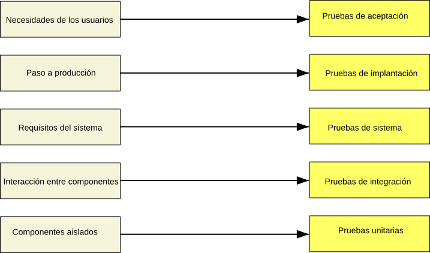

#+INCLUDE: "../../../common/header.org"
#+TITLE:  Pruebas
#+REVEAL_HLEVEL: 1

* Pruebas del /software/
- El desarrollo solo termina tras comprobar que el código funciona
  - Un método
  - Varias clases que colaboran
  - Una aplicación
  - Un conjunto de aplicaciones y servidores
- Se comprueba que funciona mediante *pruebas*

** Ejemplos
| Objeto de prueba                                  | Caso de prueba                                                                                          |
|---------------------------------------------------+---------------------------------------------------------------------------------------------------------|
| =Math.abs()= se corresponde con el valor absoluto | Se espera que ~Math.abs(-10)~ sea ~10~                                                                  |
| Si Mario cae sobre un /goompa/, Mario rebota      | Se espera que Mario rebote al saltar sobre el pimer /goompa/ en el mundo 1-1                            |
| No se puede comprar a crédito                     | Se espera que el usuario ~US9474~, con saldo ~35~, no puede comprar el artículo ~AR324~, con coste ~40~ |

** Qué es un caso de prueba
- Objeto de prueba:
  - qué requisito se está comprobando
- Condiciones de la prueba:
  - estado del sistema previo a la prueba: variables, base de datos, conexiones, ventanas abiertas, ficheros...
  - acciones sobre el sistema: invocar métodos, pulsar botones, lanzar comandos...
- Resultado esperado
  - estado final del sistema: variables, base de datos, ventanas mostradas...

** nivel de las pruebas

* COSAS :noexport:

* Referencias
#+include: "../../../common/footer.org"
- https://entornos.abrilcode.com/doku.php?id=apuntes:pruebas

