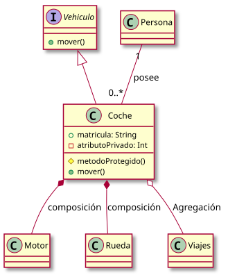
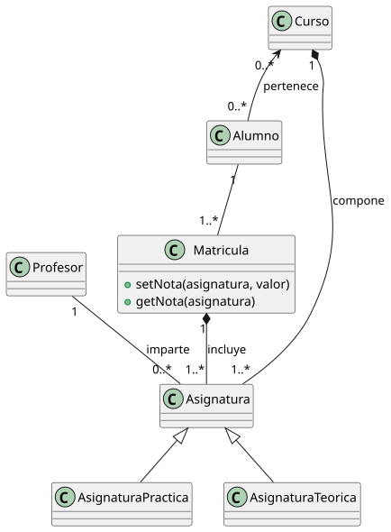
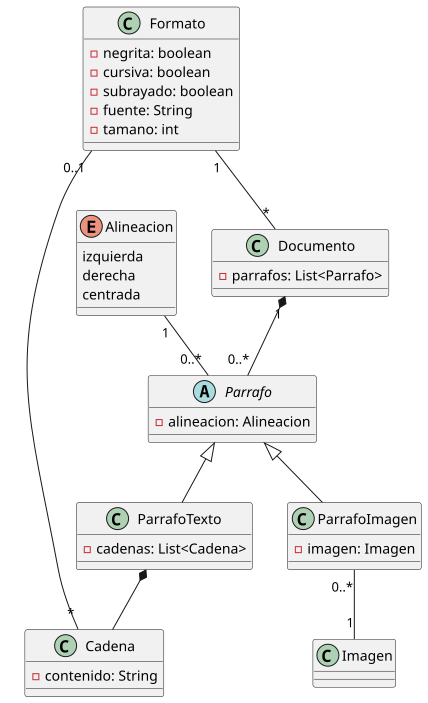
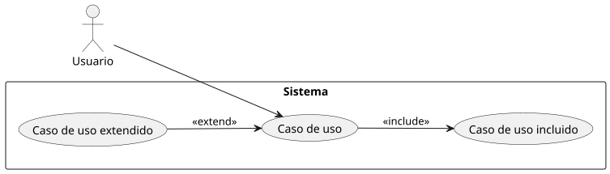
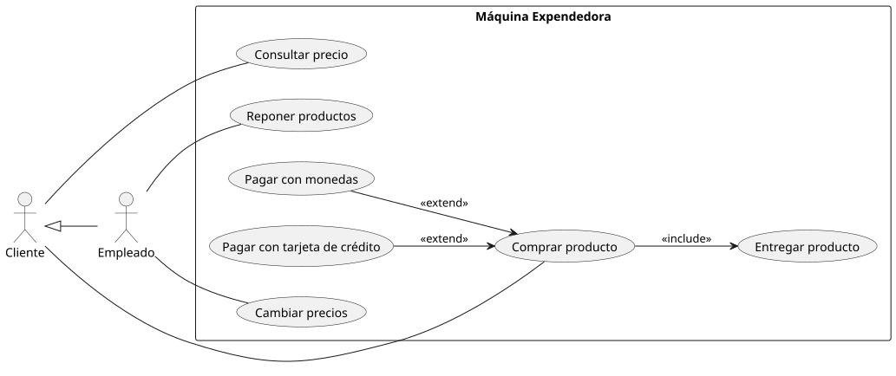
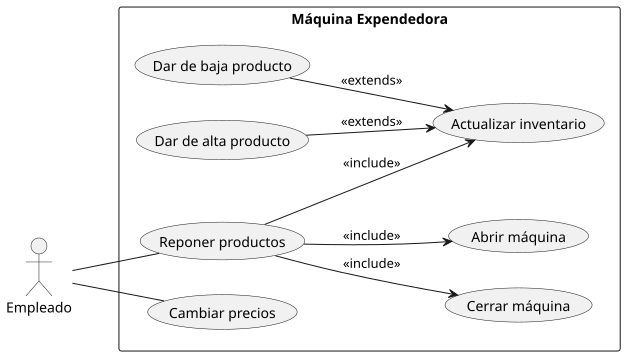
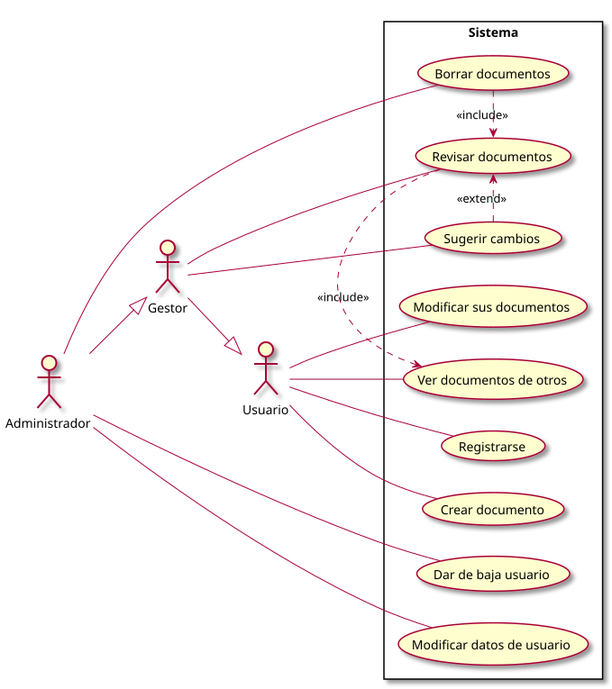
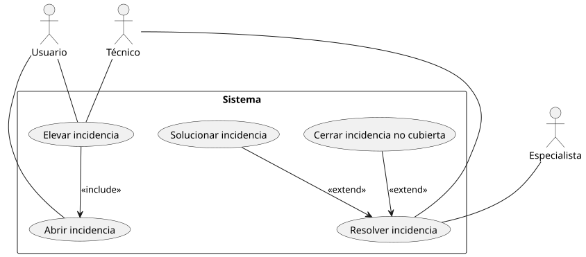
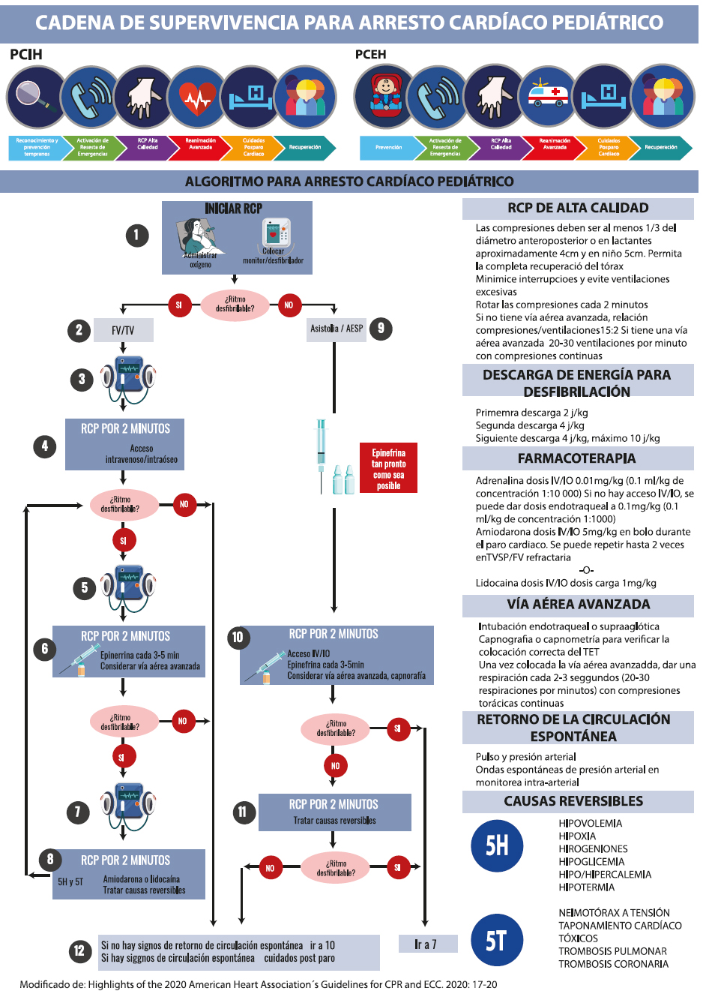
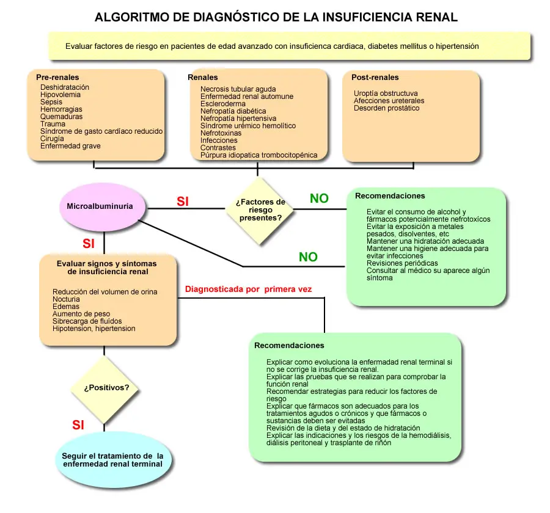

#+INCLUDE: "../../../common/header.org"
#+TITLE:  Unified Modeling Language (UML)
#+REVEAL_HLEVEL: 1

* UML
- Lenguaje Unificado de Modelado
- Conjunto de diagramas para modelar y documentar un sistema software
  - Misma idea que los diagramas E-R de base de datos.
- Es un estándar de facto
- Su origen es la fusión de varios métodos orientación a objetos:
  - OMT - Object Modeling Technique (Jim Rumbaugh et al.).
  - Método-Booch (Grady Booch).
  - OOSE - Object-Oriented Software Engineering (Ivar Jacobson) .

** Por qué modelar
- Mejor documentación
  - Un diagrama es más rápido de entender que un texto largo
  - Un diagrama suele ser menos ambiguo que un texto
  - Permite la comunicación efectiva entre miembros del equipo
- Desarrollo rápido
  - Más rápido que la implementación en código
  - Algunas herramientas permiten generar código a partir de los diagramas    

** Cuándo modelar    
- Ingeniería directa
  - Se diseña el sistema usando (entre otros) diagramas UML
  - Después se implementa
- Ingeniería inversa
  - Se estudia un sistema ya existente
  - Se crean diagramas UML para mejorar la comprensión

** Tipos de diagramas
- Diagramas de clases
- Diagramas de casos de uso
- Diagramas de

** Herramientas
- Lápiz y papel
- [[https://editor.plantuml.com/uml][Plantuml]] y [[https://www.umlet.com/][UMLet]]
- Prácticamente cualquier herramienta de diagramas      

* Diagramas de clases

#+MACRO: src-to-dataurl (eval (let* ((name $1) (info (org-babel-get-src-block-info 'light)) (body (with-current-buffer (current-buffer) (org-babel-goto-named-src-block name) (nth 1 (org-babel-get-src-block-info 'light)))))   (concat "data:text/plain;base64," (base64-encode-string (string-as-unibyte body) t))))
          
- Rectángulo: una clase
  - Cada línea es un método o atributo
  - ~#~ para protegido, ~+~ para público, ~-~ para privado
- Línea: relación entre clases (una referencia)
  - Cardinalidad: como en E-R
  - Con triángulo: herencia
  - Con rombo hueco: agregación (tiene varias instancias)
  - Con rombo lleno: composición (se compone de varias instancias, similar a una entidad débil E-R)  

** Ejemplo con PlantUML    

#+name: leyenda-clases    
#+begin_src plantuml :file media/leyenda-clases.svg
@startuml

' === Clases e interfaces ===
interface Vehiculo {
  +mover()
}

class Helicoptero{
        
}

class Coche {
  +matricula: String
  -atributoPrivado: Int
  #metodoProtegido()
  +mover()
}

class Motor
class Rueda
class Persona

' === Herencia (generalización) ===
Vehiculo <|-- Coche
Vehiculo <|-- Helicoptero

' === Composición (parte fuerte, ciclo de vida dependiente) ===
Coche *-- Motor : composición

' === Agregación (parte débil) ===
Coche *-- Rueda : composición

Coche o-- Viajes : Agregación

' === Relación con cardinalidad ===
Persona "1" -- "0..*" Coche : posee

@enduml
#+end_src

#+RESULTS: leyenda-clases

** Ejemplo:

- Un curso está compuesto por varias asignaturas.
- Cada alumno pertenece a un único curso, aunque un curso puede tener muchos alumnos.
- Un profesor puede impartir varias asignaturas, y una asignatura puede ser impartida por un único profesor.
- Las asignaturas se dividen en dos tipos: teóricas y prácticas, utilizando herencia.
- Un alumno se matricula en asignaturas mediante una matrícula.
- La matrícula representa la relación entre un alumno y el conjunto de asignaturas en las que está inscrito.
- Las calificaciones de un alumno en cada asignatura se almacenan en una clase llamada Nota.
- Cada matrícula debe permitir:
  - Registrar una calificación para una asignatura (setNota(asignatura, valor)).
  - Consultar la calificación de una asignatura (getNota(asignatura)).

*** solución :noexport:
#+begin_src plantuml :file media/profesores-y-asignaturas.svg
@startuml

class Profesor {
}

class Alumno {
}

class Curso {
}

class Asignatura {
}

class AsignaturaPractica {
}

class AsignaturaTeorica {
}

class Matricula {
    +setNota(asignatura, valor)
    +getNota(asignatura)
}

' Herencia
Asignatura <|-- AsignaturaPractica
Asignatura <|-- AsignaturaTeorica

' Relaciones curso-asignaturas
Curso "1" *-- "1..*" Asignatura : compone

' Alumno pertenece a un curso
Curso "0..*" <-- "0..*" Alumno : pertenece

' Profesor imparte asignaturas
Profesor "1" -- "0..*" Asignatura : imparte

' Matricula
Alumno "1" -- "1..*" Matricula
Matricula "1" *-- "1..*" Asignatura : incluye

@enduml
#+end_src

#+RESULTS:

** Ejercicio
- Una empresa quiere manejar el stock de un almacén
- Cada venta indica qué productos incluye, y la cantidad de cada uno, y a qué precio
- Cada entrada en el almacén indica qué productos incluye, y la cantidad de cada uno
- El gestor del almacén se encarga de que no haya ventas que sobrepasen el /stock/ de ningún producto
- Se puede preguntar a una venta por su importe       

*** solución :noexport:
  
#+begin_src plantuml :file media/stock-almacen.svg
  @startuml

class Producto {
  - nombre : String
  - stock : int
  + getStock() : int
  + aumentarStock(cantidad : int)
  + disminuirStock(cantidad : int)
}

class Venta {
  - fecha : Date
  - lineas : List<LineaVenta>
  + getImporte() : double
}

class LineaVenta {
  - cantidad : int
  - precio : double
  + getSubtotal() : double
}

class Entrada {
  - fecha : Date
  - lineas : List<LineaEntrada>
}

class LineaEntrada {
  - cantidad : int
}

class Almacen {
  - cantidad : int
  + getStock(Producto): int
  + validaVenta(Venta): Boolean      
}

Almacen "1" o-- "0..*" Producto
Almacen "1" o-- "0..*" Venta
Almacen "1" o-- "0..*" Entrada

Producto "1" -- "0..*" LineaVenta
Producto "1" -- "0..*" LineaEntrada

Venta "1" *-- "1..*" LineaVenta
Entrada "1" *-- "1..*" LineaEntrada

@enduml
#+end_src

#+RESULTS:
[[file:media/stock-almacen.svg]]

** Ejercicio
- Un procesador de textos maneja documentos compuestos de párrafos.
- Un párrafo puede contener texto o ser una imagen.
- Un párrafo de texto contiene cadenas, que van una detrás de otra.
- Un párrafo puede tener alineación izquierda, derecha o centrada.
- Una cadena puede tener negrita, cursiva, subrayado.
- Cada cadena tiene un tipo de letra (arial, cursiva...) y un tamaño. Si no se especifica, toman la de por defecto del documento.

*** solución :noexport:
#+begin_src plantuml :file media/procesador-de-texto.svg
@startuml

class Documento {
  - parrafos: List<Parrafo>
  - fuentePorDefecto: String
  - tamanoPorDefecto: int
}

abstract class Parrafo {
  - alineacion: Alineacion
}

class ParrafoTexto {
  - cadenas: List<Cadena>
}

class ParrafoImagen {
  - imagen: Imagen
}

class Cadena {
  - contenido: String
  - negrita: boolean
  - cursiva: boolean
  - subrayado: boolean
  - fuente: String
  - tamano: int
}

class Imagen

enum Alineacion {
  izquierda
  derecha
  centrada
}

Alineacion "1" -- "0..*" Parrafo

Documento "1" *-- "0..*" Parrafo
Parrafo <|-- ParrafoTexto
Parrafo <|-- ParrafoImagen

ParrafoTexto "1" *-- "1..*" Cadena
ParrafoImagen --> Imagen

@enduml
  
#+end_src

#+RESULTS:

** Ejercicio
- Un sistema de ficheros tiene ficheros y carpetas
- Una carpeta puede contener otros ficheros y carpetas
- Tanto ficheros como carpetas tienen:
  - un nombre
  - [[https://www.jaimealberto.io/post/44_permisos/][permisos tipo linux]] (rwxrwxr)
- Los ficheros y carpetas
  - Se pueden renombrar
  - Se pueden copiar (las carpetas se copian recursivamente)
  - Se pueden borrar
- Los ficheros tienen un contenido, que es una cadena de texto

*** solución :noexport:
#+begin_src plantuml :file media/sistema-de-archivos.svg

@startuml

' Clase abstracta común
abstract class Nodo {
  - nombre : String
  - permisos : String
  + renombrar(nuevoNombre : String)
  + copiar() : Nodo
  + borrar()
}

class Fichero {
  - contenido : String
}

class Carpeta {
  - hijos : List<Nodo>
  + agregar(n : Nodo)
  + eliminar(n : Nodo)
}

' Herencia
Nodo <|-- Fichero
Nodo <|-- Carpeta

' Composición (una carpeta contiene nodos)
Carpeta "1" *-- "0..*" Nodo : contiene

@enduml  
#+end_src

#+RESULTS:
[[file:media/sistema-de-archivos.svg]]

* Diagramas de casos de uso
- Se representan
  - Actores: usuarios u otros sistemas externos que interaccionan con nuestro sistema
  - Responsabilidades/acciones de nuestro sistema
- Sirven para
  - Saber qué tiene que hacer el sistema
  - Saber quién es el responsable de iniciar una acción, o quién puede hacerla, o a quién hay que notificar resultados
- No suelen ser útiles para la codificación
  - Pero sí para delimitar el alcance de la aplicación  

** Nomenclatura
#+begin_src plantuml :file media/nomemclatura-casos-de-uso.svg
  @startuml
left to right direction

' Actor
actor Usuario

' Sistema (límite del sistema)
rectangle "Sistema" {

  ' Casos de uso
  usecase "Caso de uso" as UC1
  usecase "Caso de uso extendido" as UC2
  usecase "Caso de uso incluido"  as UC3     

}

' Relaciones
Usuario --> UC1
UC2 --> UC1 : <<extend>>
UC1 --> UC3 : <<include>>

@enduml
#+end_src

#+RESULTS:

** Ejemplo
- La máquina de /vending/ da productos a los clientes
- Los clientes pueden consultar el precio de los productos  
- Los productos se pueden cobrar mediante tarjeta de crédito o con monedas
- Un empleado puede
  - Abrir la máquina para reponer productos
  - Cambiar los precios de los productos
- Un empleado, como cualquier otra persona, puede comprar productos y consultar precios    

*** solución :noexport:
#+begin_src plantuml :file media\vending.svg

@startuml
left to right direction

actor Cliente
actor Empleado

Cliente <|-down- Empleado

rectangle "Máquina Expendedora" {

  Cliente -- (Comprar producto)
  Cliente -- (Consultar precio)

  (Pagar con tarjeta de crédito) --> (Comprar producto) : <<extend>>
  (Pagar con monedas) --> (Comprar producto)  : <<extend>>
  (Comprar producto) --> (Entregar producto) : <<include>>

  Empleado -- (Reponer productos)
  Empleado -- (Cambiar precios)
}

@enduml    
  
#+end_src

#+RESULTS:

** Refinamiento
- Los casos de uso se pueden refinar o /explotar/

#+begin_src plantuml :file media\vending-refinado-reponedor.svg

@startuml
left to right direction

actor Empleado

rectangle "Máquina Expendedora" {

  Empleado -- (Reponer productos)
  Empleado -- (Cambiar precios)

  (Reponer productos) --> (Abrir máquina) : <<include>>
  (Reponer productos) --> (Actualizar inventario) : <<include>>
  (Dar de alta producto) --> (Actualizar inventario) : <<extends>>
  (Dar de baja producto) --> (Actualizar inventario) : <<extends>>
  (Reponer productos) --> (Cerrar máquina) : <<include>>
}

@enduml    
#+end_src  

#+RESULTS:

** Ejercicio
- Un usuario puede darse de alta y crear documentos en la web, y modificar sus propios documentos
- Un usuario puede ver los documentos de otros usuarios  
- Un gestor también puede revisar los documentos de otros usuarios y sugerir cambios en forma de notas
- Un administrador puede hacer lo que un gestor, y además
  - dar de baja a cualquier usuario
  - cambiar los datos de cualquier usuario
  - Borrar documentos, tras revisar su contenido

*** solución :noexport:
#+begin_src plantuml :file media/documentos-web.svg
@startuml
left to right direction

actor Usuario
actor Gestor
actor Administrador

rectangle Sistema {

  Usuario -- (Registrarse)
  Usuario -- (Crear documento)
  Usuario -- (Modificar sus documentos)
  Usuario -- (Ver documentos de otros)

  Gestor -- (Revisar documentos)
  Gestor -- (Sugerir cambios)

  Administrador -- (Dar de baja usuario)
  Administrador -- (Modificar datos de usuario)
  Administrador -- (Borrar documentos)

  (Revisar documentos) .> (Ver documentos de otros) : <<include>>
  (Sugerir cambios) .> (Revisar documentos) : <<extend>>
  (Borrar documentos) .> (Revisar documentos) : <<include>>
}

Gestor --|> Usuario
Administrador --|> Gestor

@enduml  
#+end_src

#+RESULTS:

** Ejemplo
- Si un usuario tiene problemas, puede abrir una incidencia
- El técnico puede decidir no gestionar la incidencia si está fuera del contrato de soporte, y cerrarla
- El técnico trabaja en la incidencia, y la cierra cuando está resuelta y el usuario está de acuerdo
- Si el usuario no está conforme, puede pedir una elevación (/escalation/) del problema. Se crea una incidencia asociada a la indicencia original.
- El técnico puede elevar el problema a un especialista si no está formado para ello. Se crea una incidencia asociada a la indicencia original.
- El especialista trata las incidencias elevadas como una incidencia normal (excepto que no puede elevarlas)

*** solución :noexport:
#+begin_src plantuml :file media/soporte-tecnico.svg
@startuml

actor Usuario
actor Técnico
actor Especialista

rectangle Sistema {
    Usuario -- (Abrir incidencia)

    Técnico -- (Resolver incidencia)

    (Cerrar incidencia no cubierta) --> (Resolver incidencia) : <<extend>>
    (Solucionar incidencia) --> (Resolver incidencia) : <<extend>>
        
    Usuario -- (Elevar incidencia)
    Técnico -- (Elevar incidencia)
        
    (Elevar incidencia) --> (Abrir incidencia) : <<includes>>

    Especialista -- (Resolver incidencia)    
}

@enduml  
#+end_src

#+RESULTS:

* Diagramas de actividad

#+begin_src plantuml :file media/leyenda-actividad.svg
  @startuml

start

repeat
:Acción inicial;

if (¿Decisión?) then (Sí)
  :Acción rama Sí;
else (No)
  :Acción rama No;
endif

fork
  :Acción paralela 1;
fork again
  :Acción paralela 2;
end fork

:Acción;

repeat while (¿Decisión?) is (Si)
->No;

stop

@enduml
#+end_src

#+RESULTS:
[[file:media/leyenda-actividad.svg]]

** Ejemplo

** Ejemplo

* Vigencia de UML
- UML es comparable a los diagramas E-R
- No se usa mucho de forma "oficial" en las empresas
- Pero es muy útil para aclaraciones en reuniones y documentación de requisitos complicados
      
* Referencias
#+include: "../../../common/footer.org"

