#+INCLUDE: "../../../common/header.org"
#+TITLE: Awardspace
#+SUBTITLE: 
#+KEYWORDS: 
#+OPTIONS: reveal_single_file:nil

* Awardspace
- Hosting LAMP
  - PHP
  - MySQL
- Opciones gratuitas y de pago
  - Una opción de pago se puede considerar como /material escolar/, como un /pen drive/ o un libro.
  - También puede ser útil para el proyecto intermodular  
  
#+reveal: split
#+caption: Resumen de características gratuitas  
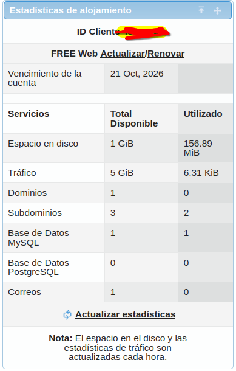

#+reveal: split
#+caption: Algunas opciones de pago
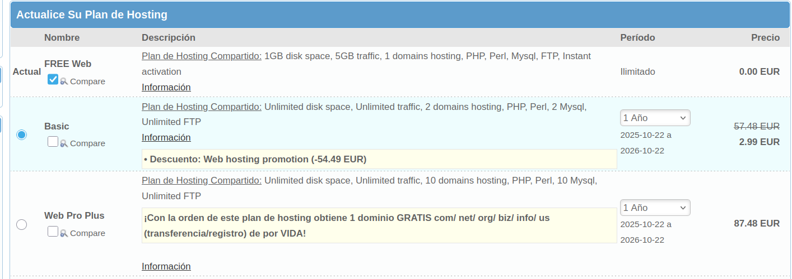

* Dominios

Aquí se enlazan dominos de DNS con directorios del espacio de ficheros. Hay que
1. Crear un subdominio
   - Opciones gratuitas y de pago
2. Comprobar el directorio donde se alojará   

#+reveal: split
#+caption: Gestor de dominios
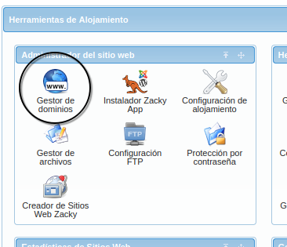

#+reveal: split
#+caption: Creación de dominio
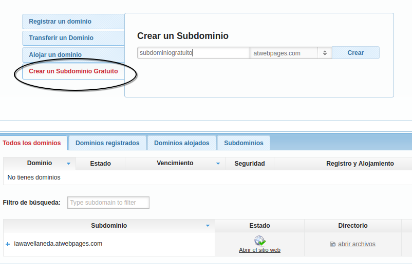

#+reveal: split
#+caption: Directorio asociado al dominio
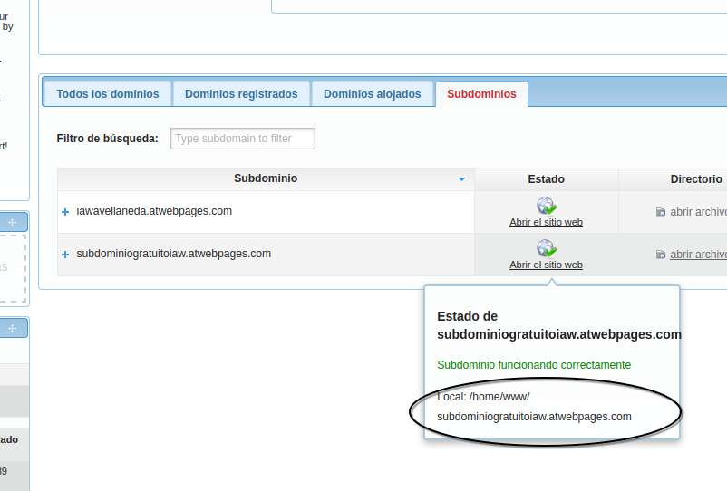

* Ficheros

1. Descomprimir wordpress en local
2. Subir los ficheros
   - Con interfaz web (no recomendado)
   - Con ftp y filezilla    
3. Atentos a las limitaciones
   - =Response:	530 Sorry, Only 5 connections per host are allowed=:
   - bajar el número de conexiones simultáneas de filezilla
4. Puede tardar incluso una hora ☹️

#+reveal: split
#+caption: Configuración FTP
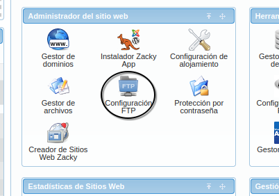
   
#+reveal: split
#+caption: Cuenta de FTP
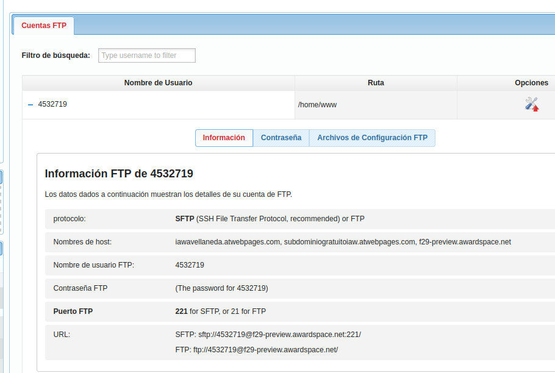

* Editar ficheros
Se puede hacer:
- Montando el directorio por sftp (cómodo, pero al ser gratuito es muy lento)
- Con filezilla
- Con el editor de la interfaz web de ficheros

#+reveal: split
#+caption: Editar un fichero via web  
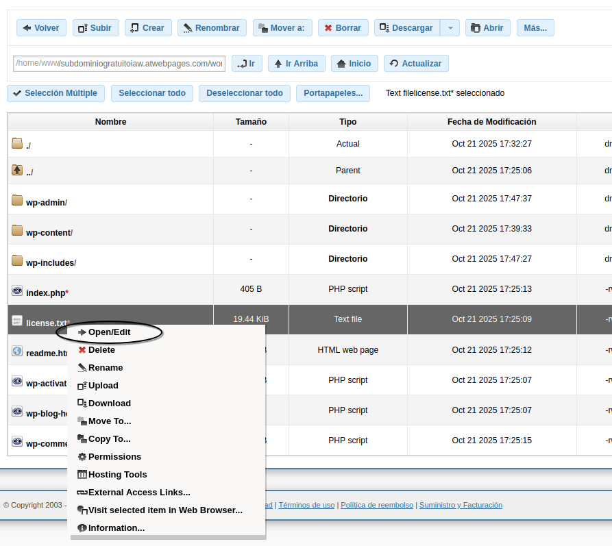

* Base de datos mysql   

1. Crear base de datos
   - Recordar host, usuario, contraseña y nombre
2. Se puede manejar con phpmyadmin

#+reveal: split
#+caption: Configuración de bases de datos   
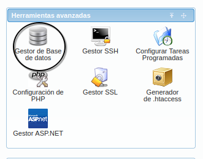

#+reveal: split
#+caption: Creación de base de datos
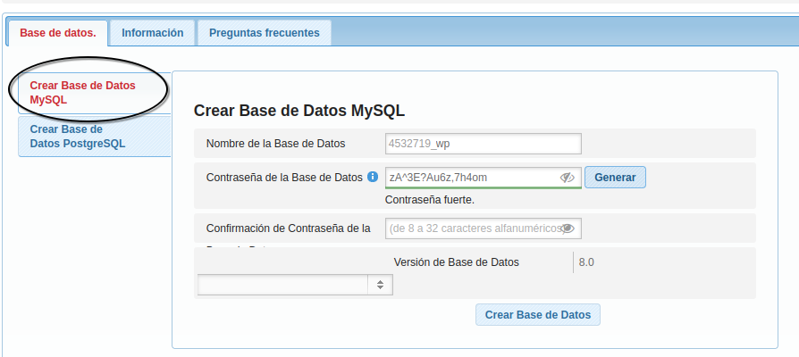

#+reveal: split
#+caption: Información de la base de datos
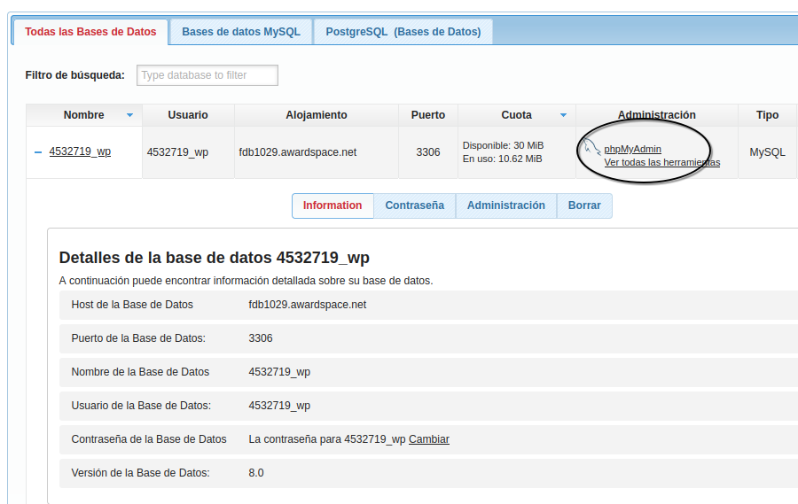

* Referencias
#+include: "../../../common/footer.org"

** privado :noexport:

Host de la Base de Datos
fdb1029.awardspace.net
Puerto de la Base de Datos:
3306
Nombre de la Base de Datos
4532719_wp
Usuario de la Base de Datos:
4532719_wp
Contraseña de la Base de Datos
La contraseña para 4532719_wp Cambiar
Versión de la Base de Datos:
8.0
ebg13: ;h#eZurP7s_)2e2j
