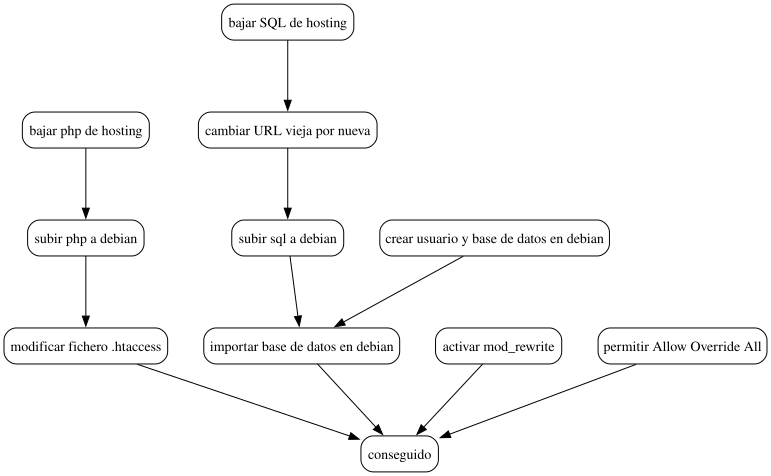

#+INCLUDE: "../../../common/header.org"
#+TITLE: Backups y restauración de CMS
#+SUBTITLE: 
#+KEYWORDS: 
#+OPTIONS: reveal_single_file:nil

* Backups de la aplicación
- La aplicación puede tener una forma de backup
- Wordpress: crea un fichero XML con:
  - Páginas
  - Entradas
  - Categorías
  - Usuarios
  - Comentarios      

** Ejercicio: copia de seguridad de Wordpres en /hosting/ gratis
- Consigue la copia de seguridad del hosting gratis
- Restaura ese fichero en un wordpress local (Coder, Debian...)
  
  

* Backups: conceptos generales
** Qué copiar
- Aplicación
- Plugins
- Ficheros extra
- Base de datos
- Configuración Linux y/o PHP y/o Apache  

** Cómo restaurar
- Cambio de ruta de ficheros
- Cambio de dominio y ruta en la URL de acceso
- Ajuste de otros parámetros
  - parámetros =php.ini=
  - nombres de base de datos, usuarios...
  - módulos de PHP y Apache    

* Backup MySQL/MariaDB
- Comando =mysqldump=
- Crea un fichero =sql= con
  - =create database=
  - =create table=
  - =insert into=
- Este fichero se ejecuta en la base de datos destino
- También se puede hacer desde PHPMyAdmin
  
** Ejercicio: base de datos del /hosting/ gratis
- Mediante línea de comandos o PHPMyAdmin
- Carga ese fichero en una instancia de MySQL local

* Backup de ficheros
- Incluye
  - Ficheros de aplicación (=.php=, accesibles por Apache)
  - Otros ficheros (a definir por la aplicación)

** Ejercicio: ficheros del /hosting/ gratis
- Mediante línea de comandos, Filezilla...

* Ejercicio
- Restaurar completamente el wordpress del hosting gratuito en la máquina Debian
  1. Bajar ficheros PHP
  2. Bajar fichero SQL de base de datos
  3. Modificar en la base de datos la URL antigua por la nueva
  4. Subir ficheros a debian
  5. Importar base de datos en MySQL
     - Con un usuario y base de datos nueva   
  6. Modificar fichero =.htaccess=
  7. Activar =mod_rewrite=
  8. =Allow override All= en el =directory= de Apache
  9. Es posible que algunos menús/enlaces se pusieran como URL en vez de a una página. Habrá que modificarlos con el backend.   
  10. 🙏🤞

[[https://developer.wordpress.org/advanced-administration/upgrade/migrating/][Instrucciones alternativas]]     

* Gráfico
#+begin_src dot :file ./pasos-migracion.svg :exports results :cmdline -Tsvg
digraph{
  graph [nodesep=0.5, ranksep=1]
  node [ shape="box", style="rounded"]
  edge [fontname="courier", fontsize="10"]
  splines=true

  "bajar php de hosting" -> "subir php a debian" -> "modificar fichero .htaccess" ->  "conseguido"
  "bajar SQL de hosting" -> "cambiar URL vieja por nueva" -> "subir sql a debian" -> "importar base de datos en debian"
  "crear usuario y base de datos en debian" -> "importar base de datos en debian" ->  "conseguido"
  "activar mod_rewrite" ->  "conseguido"
  "permitir Allow Override All" ->  "conseguido"

}
#+end_src

#+RESULTS:

* Referencias
#+include: "../../../common/footer.org"
  
    
