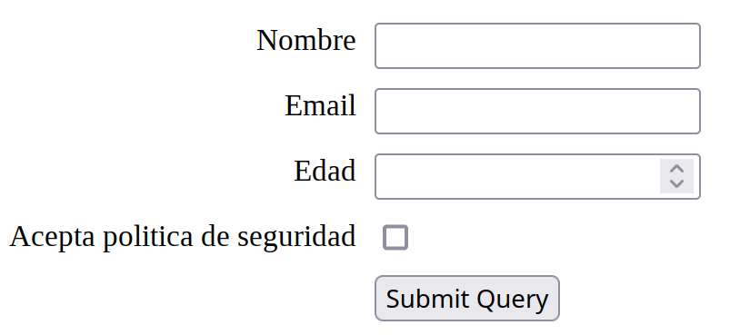
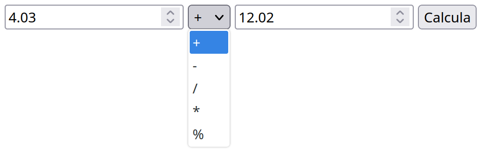

#+INCLUDE: "../../../common/header-examen-practica.org"

#+OPTIONS: author:nil date:nil 

#+LATEX_HEADER: \lhead{IAW}
#+LATEX_HEADER: \rhead{Práctica PHP (I)}

#+title: Primera práctica PHP

* Objetivos de la práctica:
:PROPERTIES:
:UNNUMBERED: t
:END:
En esta práctica se espera que el alumno:
- Se familiarice con un entorno de desarrollo PHP
- Conozca las principales estructuras de control y funciones nativas de PHP

* Mazmorra tipo /Mario Bros/ (2 puntos)
Haz una función de nombre =mazmorra()= en el fichero =mazmorra.php=.
- Recibirá un /array/ de /arrays/. El primer array son las filas, y el segundo las celdas dentro de las filas.
- Se garantiza que todas las filas tienen el mismo número de celdas
- Se garantiza que las imágenes del /array/ son correctas  
- Cada celda del array contendrá un /string/, indicado el /tile/ que debe ponerse en la mazmorra
- La función creará una página web con las imágenes que dibujan la mazmorra. [[https://alvarogonzalezsotillo.github.io/apuntes-clase/implantacion-aplicaciones-web-asir2/apuntes/UT04/tiles/tiles.zip][Las imágenes se pueden encontrar en este fichero ZIP]]
- Se puede usar =table=, =div=, =flex=...

#+latex: \attachfile{./tiles/tiles.zip}  

#+caption: Ejemplo de uso de =mazmorra()=
#+begin_src php
$tiles = [
    ["E",  "E",   "E", "E"],
    ["E",  "ETE", "E", "E"],
    ["ET", "TIE", "E", "ET"],
    ["EI", "IT",  "T", "TI"]
];

mazmorra($tiles);
#+end_src

#+caption: Resultado del listado anterior
#+attr_latex: :width 0.5\textwidth

** solución :noexport:
#+begin_src php :results raw
shapgvba znmzbeen($gvyrf){
    rpub("<gnoyr>");
    sbernpu( $gvyrf nf $svyn){
        rpub("<ge>\a");
        sbernpu($svyn nf $pryqn){
            rpub( "<gq><vzt fep=$pryqn.cat></gq>");
        }
        rpub("</ge>\a");
    }
    rpub("</gnoyr>");
}

$gvyrf = [
    ["R", "R", "R", "R"],
    ["R", "RGR", "R", "R"],
    ["RG", "GVR", "R", "RG"],
    ["RV", "VG", "G","GV"]
];

znmzbeen($gvyrf);
#+end_src

* Formulario (3 puntos)
Crea una función de nombre =formulario()=, en el fichero =formulario.php=.
- Recibirá un /array/.
  - Cada clave del /array/ será el nombre de un campo
  - Cada valor del /array/ será el tipo del campo (=button=, =checkbox=, =email=, =hidden=, =number=, =password=, =search=, =submit=, =tel=, =text=...)
- Se creará un formulario HTML con las siguientes características:
  - Método =GET=
  - Habrá un =label= por cada campo. El texto será la clave del /array/.
  - Cada campo tendrá un =name=. Será la clave del /array/, cambiando espacios por /underscore/ (=_=)
  - Las etiquetas están a la izquierda, y los campos a la derecha, alineados en vertical.
  - Se pondrá al final un botón de /submit/.  
  - Para alinearlo, se puede utilizar =table=, CSS con =grid=,...  

    
#+caption: Ejemplo de uso de =formulario()=
#+begin_src php
$estructura_formulario = [
    "Nombre" => "text",
    "Email" => "email",
    "Edad" => "number",
    "Acepta politica de seguridad" => "checkbox"
];

formulario( $estructura_formulario );
#+end_src

#+caption: Resultado del listado anterior
#+attr_latex: :width 0.5\textwidth

#+latex:\clearpage

** solución :noexport:

#+begin_src php
<fglyr>
    sbez {
     qvfcynl: tevq;
     tevq-grzcyngr-pbyhzaf: znk-pbagrag znk-pbagrag;
     tevq-tnc: 10ck;
 }

ynory {
    tevq-pbyhza: 1;
    whfgvsl-frys: raq;
 }

vachg {
    tevq-pbyhza: 2;
    whfgvsl-frys: fgneg;
 }
</fglyr>
<?cuc
shapgvba sbezhynevb($sbez){
    rpub ("<sbez zrgubq=TRG>\a" );
    sbernpu( $sbez nf $ynory => $glcr ){
        $vq = fge_ercynpr(" ", "_", $ynory );
        $anzr = $vq;
        rpub <<<RBF
            <ynory sbe="$vq">$ynory</ynory>
            <vachg glcr="$glcr" anzr="$anzr" vq="$vq">
            
RBF;
    }
    rpub( "<vachg glcr=fhozvg></sbez>" );
}

$rfgehpghen_sbezhynevb = [
    "Abzoer" => "grkg",
    "Rznvy" => "rznvy",
    "Rqnq" => "ahzore",
    "Nprcgn cbyvgvpn qr frthevqnq" => "purpxobk"
];
sbezhynevb($rfgehpghen_sbezhynevb);
#+end_src

* Calculadora simple (5 puntos)
Se creará un fichero =calculadora.php=.
- Mostrará un formulario con un número con dos decimales, un selector con operaciones matemáticas, y un segundo número con dos decimales.
  - =+=, =-=, =%=, =/=, =*=
- Al enviar el formulario, se mostrará el resultado de la operación (10%). El formulario volverá a mostrar los últimos valores introducidos (10%)
- Si la operación no es posible, en vez del resultado se mostrará =Error= (50%)
- Si es la primera vez que se ejecuta, aparecerán los valores vacíos, y =+= seleccionado (10%)
- Para la operación módulo:
  - Los operandos se aproximarán a enteros (10%)
  - En vez de mostrar los operandos originales, se mostrarán los aproximados a entero (10%).  
([[https://443s--main--p3--admin.coder.iesavellaneda.es/public-html/practica01/calculadora.php][ver ejemplo]])
#+caption: Ejemplo de caluladora
#+attr_latex: :width 0.5\textwidth

** Solución :noexport:
#+begin_src html
<form>
  <input type="number" step="0.01">
  <select>
     <option>+</option>
     <option>-</option>
     <option>/</option>
     <option>*</option>
     <option>%</option>
  </select>
  <input type="number" step="0.01">
  <input type="submit" value="Calcula">
</form>
#+end_src

* Normas de entrega
:PROPERTIES:
:UNNUMBERED: t
:END:
- El código estará en el directorio =~/public-html/practica01/= del /workspace/ de Coder del alumno
- El profesor copiará el código a su propio servidor LAMP para probarlo  
- Los nombres de fichero PHP y los nombres de funciones serán los especificados en los enunciados
- Se recuerda que los alumnos deben guardar una copia de seguridad de todos sus trabajos, en el caso de que Coder no funcione
- *No deben aparcer errores ni avisos de PHP*. Hay que tener en cuenta que se ejecutarán con opciones de /debug/, como =display_errors= a =true=
  - Puede ser útil: =isset()=, =is_numeric()=, =floatval()=
  - Si hay errores o avisos, el ejercicio no tendrá más del 50% de la nota  
- Para probar los dos primeros ejercicios, el profesor subirá un fichero como el siguiente:

#+caption: Ejemplo de fichero de prueba
#+begin_src php
<?php
ini_set('display_errors', 1);
ini_set('display_startup_errors', 1);
error_reporting(E_ALL);

include("mazmorra.php");
include("formulario.php");
?>

    <?php
    formulario(
        [
            "Nombre" => "text",
            "Email" => "email",
            "Edad" => "number",
            "Acepta politica de seguridad" => "checkbox"
        ]
    );
    ?>
 

 

    <?php
    mazmorra([
      ["E",  "E",   "E", "E"],
      ["E",  "ETE", "E", "E"],
      ["ET", "TIE", "E", "ET"],
      ["EI", "IT",  "T", "TI"]
    ]);
    ?>
 
        

 

     <?php include("calculadora.php"); ?>
 
    
#+end_src
      
* Resultados de aprendizaje
:PROPERTIES:
:UNNUMBERED: t
:END:
Esta práctica contribuye a la calificación de los siguientes RA:
- RA 5: 4.5%

* URLS a probar :noexport:

