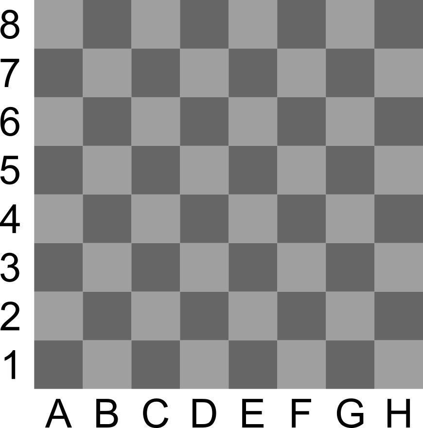
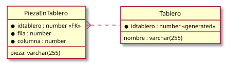

#+INCLUDE: "../../../common/header-examen-practica.org"

#+OPTIONS: author:nil date:nil 

#+LATEX_HEADER: \lhead{IAW}
#+LATEX_HEADER: \rhead{Práctica PHP (II)}
#+latex_header: \usepackage{skak}

#+title: Segunda práctica PHP

#+latex: \attachfile{../UT04//tiles/tiles.zip}  

* Objetivos de la práctica:
:PROPERTIES:
:UNNUMBERED: t
:END:
En esta práctica se espera que el alumno:
- Se familiarice con el manejo de sesiones
- Se familiarice con el uso de MySQL

#+latex: \begin{Aviso}[No se corregirá la práctica si...]
Estas son normas necesarias para poder corregir la práctica:
- La aplicación creará las tablas necesarias para su funcionamiento
- Se puede comenzar la aplicación por cualquier página (no debe suponerse que siempre se lanzará =mitablero.php= antes de =administracion.php=, por ejemplo)
- La información de conexión a la base de datos estará en un único fichero PHP. El resto de ficheros usarán esa información (=require()= o =include()=)
- El alumno debe ser capaz de explicar cada línea de PHP entregada. En otro caso, se considerará una práctica copiada
    
#+latex: \end{Aviso}
* Tablero personal (2 puntos)
- En la página =mitablero.php=
  - Se mostrará un tablero de ajedrez como el de la figura, inicialmente vacío, con indicaciones de filas y columnas (10%)
  - Cada sesión de usuario tendrá un tablero distinto (40%)
  - Habrá un formulario que permitirá introducir:
    - Una posición del tablero (=a8=, =b3=,...)
    - Seleccionar una ficha de ajedrez, o una casilla vacía, con un =<select>=
    - Al enviar el formulario, se anotará esa información en la base de datos y se mostrará el nuevo tablero (50%)
    - Nota: no se tendrán en cuenta las normas del juego, pueden crearse cualquier disposición de fichas  
  - Las fichas de ajedrez pueden ser caracteres unicode

    #+begin_html    
        ♔ ♕ ♖ ♗ ♘ ♙
        ♚ ♛ ♜ ♝ ♞ ♟
    #+end_html
    #+begin_latex
        \BlackBishopOnWhite \BlackRookOnWhite \BlackKingOnWhite  \BlackKnightOnWhite \BlackPawnOnWhite \BlackQueenOnWhite
        \WhiteBishopOnWhite \WhiteRookOnWhite \WhiteKingOnWhite  \WhiteKnightOnWhite \WhitePawnOnWhite \WhiteQueenOnWhite
    #+end_latex
    - Ver https://en.wikipedia.org/wiki/Chess_symbols_in_Unicode

#+attr_latex: :width 0.4\textwidth

* Tablero compartido (3 puntos)
- Añade en =mitablero.php= un enlace para compartir el tablero
  - El enlace apuntará a =tablerocompartido.php=, y añadirá un parámetro GET para saber qué tablero se comparte (10%)
- Una vez en =tablerocompartido.php=, la página se comportará igual que =mitablero.php=, pero modificando el tablero indicado en el parámetro GET, en vez del tablero asociado a la sesión
  - Esto incluye el tablero, el formulario para cambiar el tablero y el enlace de compartir (90%)
- Si =mitablero.php= y =tablerocompartido.php= no comparten el código PHP y HTML principal (usando =require()= o =include()=), este ejercicio contará como máximo la mitad de la puntuación.    
  

* Página de administración (4 puntos)
- En la página =administracion.php=
  - Se listarán todos los tableros, indicando su identificador
  - Cada tablero tendrá
    - Un enlace a su página en =tablerocompartido.php= (10%)
    - Un botón para borrarlo definitivamente (20%)   
- Habrá un botón para crear un tablero compartido nuevo
  - Con todas las fichas iniciales de un juego normal de ajedrez (50%)
  - Al pulsarse, se irá al nuevo tablero compartido directamente ([[https://stackoverflow.com/questions/768431/how-do-i-make-a-redirect-in-php][ver =header( "Location: ...")=]]) (20%)

* Para llegar al 10... (1 punto)
Modifica =tablerocompartido.php= y =mitablero.php= para que cuando se pinche en un escaque, el =<input>= que se utiliza para determinar la posición de la pieza se actualice al escaque pinchado.
- Utiliza [[https://www.geeksforgeeks.org/javascript/javascript-onclick-event/][=onclick=]] en el escaque
- Asegúrate que el =<input>= tiene un =id=
- Y usa ~document.getElementById(...).value=....~   
    
* Normas de entrega
:PROPERTIES:
:UNNUMBERED: t
:END:
- El código estará en el directorio =~/public-html/practica02/= del /workspace/ de Coder del alumno
  - El profesor copiará las páginas a su propio LAMP para corregir la práctica
  - El profesor se encargará de cambiar los datos de acceso a MySQL.
- Los nombres de fichero PHP y los nombres de funciones serán los especificados en los enunciados
- Todos los formularios serán *GET*
  - Si no se pueden ver los parámetros en la URL, el ejercicio no tendrá más del 50% de la nota  
- Se recuerda que los alumnos deben guardar una copia de seguridad de todos sus trabajos, en el caso de que Coder no funcione
- *No deben aparcer errores ni avisos de PHP*. Hay que tener en cuenta que se ejecutarán con opciones de /debug/, como =display_errors= a =true=
  - Puede ser útil: =isset()=, =is_numeric()=
  - Si hay errores o avisos, el ejercicio no tendrá más del 50% de la nota
- No se tendrán en cuenta:
  - Errores debidos al reenvío de formularios por duplicado (por recarga de página)
  - Errores debidos a parámetros cambiados a mano
      
* Resultados de aprendizaje
:PROPERTIES:
:UNNUMBERED: t
:END:
Esta práctica contribuye a la calificación de los siguientes RA:
- RA 5: parte de "prácticas"
- RA 6: parte de "prácticas"

* Diagrama de base de datos :noexport:
:PROPERTIES:
:UNNUMBERED: t
:END:

#+begin_src plantuml :file media/ajedrez-er.svg
@startuml
' hide the spot
hide circle

' avoid problems with angled crows feet
skinparam linetype ortho

left to right direction

entity "Tablero" as Tablero {
  ,* idtablero : number <<generated>>
  __
  nombre : varchar(255)
}

entity "PiezaEnTablero" as PiezaEnTablero {
  ,* idtablero : number <<FK>>
  ,* fila : number
  ,* columna : number      
  __
  pieza: varchar(255)
}

Tablero .up.{ PiezaEnTablero::idtablero
@enduml
#+end_src

#+attr_latex: :width 0.7\textwidth :placement [H]
#+RESULTS:

