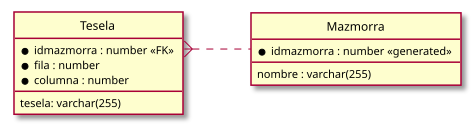

#+INCLUDE: "../../../common/header-examen-practica.org"

#+OPTIONS: author:nil date:nil 

#+LATEX_HEADER: \lhead{IAW}
#+LATEX_HEADER: \rhead{Práctica PHP (II)}

#+title: Segunda práctica PHP

#+latex: \attachfile{../UT04//tiles/tiles.zip}  

* Objetivos de la práctica:
:PROPERTIES:
:UNNUMBERED: t
:END:
En esta práctica se espera que el alumno:
- Se familiarice con el manejo de sesiones
- Se familiarice con el uso de MySQL

Puede consultarse un [[https://443s--main--p3--admin.coder.iesavellaneda.es/public-html/practicas/practica02/listado-mazmorras.php][ejemplo de esta práctica ya implementado]].  

* Diagrama de base de datos
:PROPERTIES:
:UNNUMBERED: t
:END:

#+begin_src plantuml :file media/mazmorra-er.svg
@startuml
' hide the spot
hide circle

' avoid problems with angled crows feet
skinparam linetype ortho

left to right direction

entity "Mazmorra" as Mazmorra {
  ,* idmazmorra : number <<generated>>
  __
  nombre : varchar(255)
}

entity "Tesela" as Tesela {
  ,* idmazmorra : number <<FK>>
  ,* fila : number
  ,* columna : number      
  __
  tesela: varchar(255)
}

Mazmorra .up.{ Tesela::idmazmorra
@enduml
#+end_src

#+attr_latex: :width 0.7\textwidth :placement [H]
#+RESULTS:

* /CRUD/ de mazmorras (2.5 puntos)
Página =listado-mazmorras.php=
- En la parte superior, habrá un campo =text= y un botón de =crear=. Al pulsar el botón, se creará una mazmorra con el nombre indicado, inicialmente vacía. (20%)
- En la parte inferior, mostrará una lista de mazmorras con su identificador, ordenadas por el identificador. (20%)
- Cada mazmorra tendrá tres botones: =borrar=, =editar=, =duplicar=
- El botón =borrar= borrará la mazmorra asociada, después de una pregunta de confirmación (mediante /javascript/) (40%)
- El botón =editar= abrirá la mazmorra asociada en la página =editar-mazmorra.php=, pasando el identificador (10%)
- El botón =duplicar= abrirá la mazmorra asociada en la página =duplicar-mazmorra.php=, pasando el identificador (10%)

* Duplicar mazmorra (2.5 puntos)
Crea una página PHP de nombre =duplicar-mazmorra.php=. Está página
- Recibirá mediante el parámetro =idmazmorra= la mazmorra ya existente a duplicar
- Mostrará una tabla con 5 filas y 10 columnas. En cada celda mostrará la imagen correspondiente con la tesela especificada en la base de datos (20%)
  - Si una celda no tiene información en la base de datos, se mostrará la tesela =E.png=
- En un cuadro de texto, mostrará el nombre de la mazmorra ya existente, pero se podrá editar (10%)
- Si se pulsa el botón =duplicar=, duplicará la mazmorra con el nuevo nombre, y los contenidos de la mazmorra original. (50%) Después volverá a la página =listado-mazmorras.php= (10%)
- Si se pulsa el botón =cancelar=, volverá a la página =listado-mazmorras.php= (10%)
  
* Editar mazmorra  (3 puntos)
Crea una página PHP de nombre =editar-mazmorra.php=. Esta página:
- Recibirá mediante el parámetro =idmazmorra= la mazmorra a editar
- Mostrará una tabla con la mazmorra a editar, como =duplicar-mazmorra.php=
- Mostrará una tabla a modo de paleta, con las opciones de tesela
- Habrá un formulario con fila, columna y valor de tesela. Cuando se envíe, se cambiará en la base de datos y se recargará la página. (60%)
  - Cuando se pinche en la mazmorra, se cambiará con /javascript/ el valor de la fila y columna (15%)
  - Cuando se pinche en la paleta, se cambiará con /javascript/ el valor de la tesela (15%)
#+latex: \begin{Aviso}[Esta UI no es muy buena]
Esta forma de edición no es muy amigable, pero es simple. Si quieres hacer otra forma mejor de editar, ¡adelante!
#+latex: \end{Aviso}
#+BIND: org-latex-image-default-width "0.1\\linewidth"

|---------+-----------------+---------+-----------------+---------+--------------------|
| E.png   |    | IT.png  |   | EIE.png |  |
|---------+-----------------+---------+-----------------+---------+--------------------|
| EI.png  |   | T.png   |    | IE.png  |      |
|---------+-----------------+---------+-----------------+---------+--------------------|
| EIT.png |  | TE.png  |   | TIT.png |     |
|---------+-----------------+---------+-----------------+---------+--------------------|
| ET.png  |   | TI.png  |   | I.png   |       |
|---------+-----------------+---------+-----------------+---------+--------------------|
| ETE.png |  | TIE.png |  |         |                    |
|---------+-----------------+---------+-----------------+---------+--------------------|

Leyenda: ~E~: /empty/ ~I~: /interior/ ~T~: /top/

* Restaurar sesión (2 puntos)
Crea una página PHP de nombre =index.php=
- Se llega a ella sin parámetros
- La página redirige a la última página lanzada por el usuario (=editar-mazmorra.php=, =duplicar-mazmorra.php=, =listado-mazmorras.php=), con el parámetro =idmazmorra= correspondiente, si es el caso.
- Si no ha visitado ninguna página, enviará a =listado-mazmorras.php=    

* Normas de entrega
:PROPERTIES:
:UNNUMBERED: t
:END:
- El código estará en el directorio =~/public-html/practica02/= del /workspace/ de Coder del alumno
  - El profesor copiará las páginas a su propio LAMP para corregir la práctica
  - El profesor se encargará de cambiar los datos de acceso a MySQL. Las páginas deberán crear las tablas que necesiten, si no no se podrá corregir la práctica.
- Los nombres de fichero PHP y los nombres de funciones serán los especificados en los enunciados
- Todos los formularios serán *GET*
  - Si no se pueden ver los parámetros en la URL, el ejercicio no tendrá más del 50% de la nota  
- Se recuerda que los alumnos deben guardar una copia de seguridad de todos sus trabajos, en el caso de que Coder no funcione
- *No deben aparcer errores ni avisos de PHP*. Hay que tener en cuenta que se ejecutarán con opciones de /debug/, como =display_errors= a =true=
  - Puede ser útil: =isset()=, =is_numeric()=, =floatval()=
  - Si hay errores o avisos, el ejercicio no tendrá más del 50% de la nota
- No se tendrán en cuenta:
  - Errores debidos al reenvío de formularios por duplicado (por recarga de página)
  - Errores debidos a parámetros cambiados a mano para teselas/mazmorras que no existen  
      
* Resultados de aprendizaje
:PROPERTIES:
:UNNUMBERED: t
:END:
Esta práctica contribuye a la calificación de los siguientes RA:
- RA 5: parte de "prácticas"
- RA 6: parte de "prácticas"

* URLS a probar :noexport:

https://443s--main--p3--admin.coder.iesavellaneda.es/public-html/practica01
https://443s--main--iaw--adrianalvarez10.coder.iesavellaneda.es/public-html/practica01
https://443s--main--iaw--eduardoanton1.coder.iesavellaneda.es/public-html/practica01
https://443s--main--iaw--agarcia190.coder.iesavellaneda.es/public-html/practica01
https://443s--main--iaw--alejandrojimenez34.coder.iesavellaneda.es/public-html/practica01
https://443s--main--iaw--ismaelmacareno.coder.iesavellaneda.es/public-html/practica01
https://443s--main--iaw--ivanmarin1.coder.iesavellaneda.es/public-html/practica01
https://443s--main--iaw--pablonunez16.coder.iesavellaneda.es/public-html/practica01
https://443s--main--iaw--aroaperez2.coder.iesavellaneda.es/public-html/practica01
https://443s--main--iaw--pabloramo.coder.iesavellaneda.es/public-html/practica01
https://443s--main--iaw--jorgeramos6.coder.iesavellaneda.es/public-html/practica01
https://443s--main--iaw--miguelreyes1.coder.iesavellaneda.es/public-html/practica01
https://443s--main--iaw--joserojas12.coder.iesavellaneda.es/public-html/practica01
https://443s--main--iaw--oskarsajek.coder.iesavellaneda.es/public-html/practica01
https://443s--main--iaw--alvarosanchez308.coder.iesavellaneda.es/public-html/practica01
https://443s--main--iaw--andreasantosesteban.coder.iesavellaneda.es/public-html/practica01
https://443s--main--iaw--fernandovaquerizo.coder.iesavellaneda.es/public-html/practica01
https://443s--main--iaw--alvarovicente1.coder.iesavellaneda.es/public-html/practica01
https://443s--main--iaw--veronicavillaseca.coder.iesavellaneda.es/public-html/practica01

