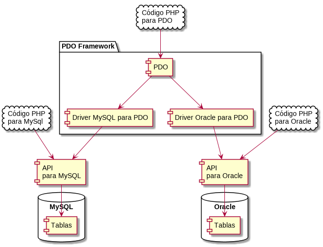

#+INCLUDE: "../../../common/header.org"
#+TITLE: PHP y SQL
#+SUBTITLE: 
#+KEYWORDS: 
#+OPTIONS: reveal_single_file:nil

* API, /driver/ y PDO
- /API/: conjunto de funciones/objetos que permiten conectar a una base de datos SQL
- PDO: conjunto de funciones que pueden acceder a cualquier base de datos, siempre que haya un /driver/ para ello
  - El /driver/ adapta una API al PDO
- Por ser más simple, utilizaremos el [[https://www.php.net/manual/es/book.mysqli.php][API mysqli]]

#+reveal: split

#+begin_src plantuml :file ./media/driver-pdo.svg
@startuml

component [API \npara MySQL] as APIMySQL

component [API \npara Oracle] as APIORACLE

package "PDO Framework" {
        component [PDO] as PDO
        component [Driver MySQL para PDO] as DriverPDOMySQL
        component [Driver Oracle para PDO] as DriverPDOORACLE
}

cloud "Código PHP\npara PDO" as CodigoPDO {
}

cloud "Código PHP\npara MySql" as CodigoMySQL {
}
 
cloud "Código PHP\npara Oracle" as CodigoORACLE {
}

database "MySQL" {
    [Tablas] as TablasMySQL
}

database "Oracle" {
    [Tablas] as TablasORACLE
}

CodigoMySQL --> APIMySQL
APIMySQL --> TablasMySQL

CodigoORACLE --> APIORACLE
APIORACLE --> TablasORACLE

CodigoPDO --> PDO

PDO --> DriverPDOMySQL
DriverPDOMySQL --> APIMySQL

PDO --> DriverPDOORACLE
DriverPDOORACLE --> APIORACLE

@enduml
#+end_src

#+RESULTS:

* =mysqli=: API orientada a objetos o procedimental
- [[https://www.php.net/manual/es/book.mysqli.php][=mysqli=]] puede usarse de dos formas
  - Como métodos de un objeto conexión
  - Como funciones que reciben una conexión  
- No se recomiena mezlarlas

  #+begin_src php
// ORIENTADO A OBJETOS
$conexion = new mysqli("ejemplo.com", "usuario", "contraseña", "basedatos");
$conexion->query("DROP TABLE IF EXISTS test");

// PROCEDIMENTAL
$conexion = mysqli_connect("ejemplo.com", "usuario", "contraseña", "basedatos");
mysqli_query($conexion,"DROP TABLE IF EXISTS test");
  #+end_src

* [[https://www.php.net/manual/es/mysqli.quickstart.connections.php][Conexión]]
- [[https://www.php.net/manual/es/mysqli.construct.php][=mysqli_connect=]]
  - Utiliza opciones por defecto
  - Recibe servidor, usuario, contraseña, base de datos y puerto.  
- [[https://www.php.net/manual/es/mysqli.init.php][=mysqli_init -> mysqli_options -> mysqli_real_connect=]]
  - Permite la configuración de varios parámetros, como el /timeout/ de la conexión.
- Al finalizar, =mysqli_close=    

** Conexiones persistentes
- Cuando el /script/ PHP termina, se cierran todas las conexiones
- Esto puede ser poco eficiente, ya que se debe abrir otra conexión la vez siguiente
- Una [[https://www.php.net/manual/es/features.persistent-connections.php][conexión persistente]] puede ser más eficiente. Cada API tiene su forma de conseguirla
  - En =mysqli=, [[https://www.php.net/manual/en/mysqli.persistconns.php][con ~p:~ delante del nombre de /host/]]
    

* Sentencias DDL
- Con el método =query=
#+begin_src php
$conn->query('
    create table clientes(
      id int auto_increment primary key,
      nombre varchar(255),
      apellidos varchar(255)
    );
');
#+end_src

** Ejercicios
1. Crea una tabla como la del ejemplo. Comprueba que se ha creado desde phpMyAdmin o línea de comandos
2. Crea un formulario que pregunte por el nombre de tabla, el nombre y el tipo de tres campos. El botón de submit creará esa tabla.   

* Sentencias DML
- [[https://www.php.net/manual/es/mysqli.quickstart.statements.php][Pasos generales]]
  1. Lanzar la sentencia
     - Sentencia directa
     - O bien, sentencia preparada
  2. Recoger los resultados
     - El cliente puede requerir todos los datos de una vez, y libera al servidor. Esto puede sobrecargar la memoria del cliente.
     - El cliente puede ir pidiendo datos según necesita. El servidor debe mantener datos en memoria.
  3. O procesar el error          

** Todo en memoria del cliente
#+begin_src php
$resultado = $mysqli->query("SELECT id FROM test ORDER BY id ASC");

$resultado->data_seek(0);
while ($fila = $resultado->fetch_assoc()) {
    echo " id = " . $fila['id'] . "\n";
}
#+end_src

** Todo en memoria del cliente, en un array
#+begin_src php
$resultado = $mysqli->query("SELECT id FROM test ORDER BY id ASC");

$filas = $mysqli->fetch_all(MYSQLI_ASSOC);
foreach ($filas as $fila) {
    echo " id = " . $fila['id'] . "\n";
}

#+end_src

** Como /stream/, sin liberar al servidor
#+begin_src php
$mysqli->real_query("SELECT id FROM test ORDER BY id ASC");
$resultado = $mysqli->use_result();

while ($fila = $resultado->fetch_assoc()) {
    echo " id = " . $fila['id'] . "\n";
}
#+end_src

** Control de errores
#+begin_src php
$result = $sql->query("select ...");
if($result) {
    // HA FUNCIONADO
}
else {
    echo "Código de error mysql: $sql->errno";
    echo "Mensaje de error mysql: $sql->error";
}
#+end_src

#+begin_src php
try{
    $sql->query( "create ...");
    // HA FUNCIONADO
}
catch(Exception $error){
    echo "Error SQL con try-catch:" . htmlspecialchars( $error->getMessage() ) . " \n";
    echo "Error numérico SQL:" . $conexion->errno . " \n";
    foreach( $conexion->error_list as $error_description ){
        var_dump($error_description );
    }
}
#+end_src

- [[https://dev.mysql.com/doc/mysql-errors/8.4/en/][Lista de códigos de error]]

** Ejercicios
1. Crea una página donde se listen todos los clientes existentes, en forma de tabla.
2. Crea un formulario para insertar un nuevo cliente. Tras insertarse, se mostrarán todos los clientes ya insertados.

* Sentencias preparadas
- Las sentencias suelen ser cadenas dinámicas
  - Los datos a seleccionar/borrar/actualizar dependen de parámetros
- Existen la tentación de constuir /strings/ con las sentencias
#+begin_src php
$id = $_GET["id"];
$mysqli->query("delete from USUARIOS where id='$id'");
#+end_src

¿Qué ocurre si =id= es
#+html: 

~' or '1'='1' --~
#+html: 

?

#+reveal: split
https://bobby-tables.com/

[[https://xkcd.com/327/][file:media/exploits_of_a_mom_2x.png]]

** =prepare=, =bind=

https://www.w3schools.com/php/php_mysql_prepared_statements.asp

#+begin_src php
 // prepare sql and bind parameters
  $stmt = $conn->prepare("
    INSERT INTO MyGuests (firstname, lastname, email)
    VALUES (?, ?, ?)"
  );
  stmt->bind_param("sss", $firstname, $lastname, $email);

  $firstname = "John";
  $lastname = "Doe";
  $email = "john@example.com";
  $stmt->execute();
#+end_src

** Tipos de datos
   | ~i~ | integer |
   | ~d~ | double  |
   | ~s~ | string  |
   | ~b~ | BLOB    |

** ¿Y las fechas?
- Como cadenas
  - [[https://www.php.net/manual/es/function.date.php][=date=]]: Formatea a texto [[https://en.wikipedia.org/wiki/Unix_time][un tiempo UNIX]]
  - [[https://www.php.net/manual/es/function.time.php][=time=]]: Consigue el tiempo UNIX actual
  - [[https://www.php.net/manual/es/function.strtotime.php][=strtotime=]]: Pasa de texto a tiempo UNIX
- Precaución: El [[https://www.php.net/manual/en/datetimeimmutable.createfromformat.php][timezone]]

#+begin_src php
$fecha = date('Y-m-d H:i:s');
echo $fecha . "\n";
$unix_time = time();
echo $unix_time . "\n";
$str = strtotime('2024-12-06 19:14:40');
echo $str . "\n";
#+end_src

** Ejercicios
1. Crea un formulario para insertar un nuevo cliente. Tras insertarse, se mostrará el [[https://www.php.net/manual/es/mysqli.insert-id.php][nuevo identificador creado]]
2. Añade un campo =fecha_de_alta= al cliente. Inclúyelo en los listados y las inserciones.

* Transacciones
#+begin_src php
$mysqli = new mysqli("ejemplo.com", "usuario", "contraseña", "basedatos");
$mysqli->autocommit(false);

$mysqli->query("INSERT INTO test(id) VALUES (1)");
$mysqli->rollback();

$mysqli->query("INSERT INTO test(id) VALUES (2)");
$mysqli->commit();
#+end_src

* Sobre todo...
No hay que desesperar

* Referencias
#+include: "../../../common/footer.org"

