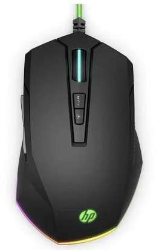
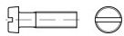

#+INCLUDE: "../../../common/header-examen-practica.org"

#+OPTIONS: author:nil date:nil toc:nil title:nil

#+LATEX_HEADER: \lhead{Cableado de aula}
#+LATEX_HEADER: \rhead{Planificación y Administración de Redes}

* Objetivo de la práctica
En esta práctica el alumno diseñará desde el comienzo una pequeña red de área local. Se espera que el alumno
- Se familiarice con los materiales necesarios para una instalación de red /Ethernet/
- Planifique y presupueste los componentes necesarios
- Se anticipe a las necesidades de un cliente/jefe de proyecto

La última versión de este documento está accesible en [[https://alvarogonzalezsotillo.github.io/apuntes-clase/planificacion-administracion-redes-asir1/apuntes/2/par-2-practica-cableado-aula.pdf][este enlace]]

* Enunciado
Un posible cliente pide un presupuesto para realizar la instalación de una LAN para este aula.
- Se dispone de un punto de red para conectar a la red del resto del instituto.
- Se desea pasar de una distribución en forma de /U/ con una isla, a una forma de grada, en la que habrá filas de puestos de trabajo orientadas hacia la pantalla del proyector.
- El profesor no cambiará de sitio. Necesita al menos dos puntos de red.
- Por simplicidad, se supondrá que no hay columnas ni radiadores.

* Qué se entrega
Un documento que incluya:
- Planos aproximados de la situación de los puestos informáticos, puntos de red y racks
- Presupuesto de los materiales
  - De red: cables, canaletas, rosetas, patch panels, switchs…
  - Desglosados por precio, cantidad, total sin IVA y total con IVA
  - Los materiales incluirán una fotografía orientativa, así como una URL o /hiperlink/ en donde se puedan comprobar sus características y/o precio.
- Se entregará un solo fichero en formato Microsoft Word, Open Office o PDF.

* Qué se valorará
- 2 puntos: La aplicabilidad práctica de los planos
- 4 puntos: La completitud en la relación de materiales
- 1 punto: La compatibilidad de los materiales
- 1 punto: La preparación de la red para futuras mejoras (velocidad, nuḿero de usuarios...)  
- 2 puntos: La apariencia profesional del trabajo

* Instrucciones de entrega
- Se corregirá un solo documento. En él estarán embebidos todos los recursos que se quieran mostrar (explicaciones, imágenes, diagramas, tablas...)
- El ejercicio se realizará y entregará de manera individual.
  - Solo se admiten trabajos en pareja si en clase es necesario compartir ordenador.
- Entrega tu trabajo en formato \textbf{doc}, \textbf{docx}, \textbf{odt} o \textbf{pdf}.
- También puede entregarse como una entrada de blog. Para ello, sube un archivo con la URL de la entrada.
- Sube el documento a la tarea correspondiente [[https://aulavirtual3.educa.madrid.org/ies.alonsodeavellan.alcala][en el aula virtual]]
- Presta atención al plazo de entrega (con fecha y hora).

** Ejemplo de posible Presupuesto
#+BIND: org-latex-image-default-width "0.08\\linewidth"
|------------------+----------+-----------------+---------+-------------------------------------------|
| Artículo con URL | Unidades | Precio unitario |   Total |                                           |
|------------------+----------+-----------------+---------+-------------------------------------------|
|                  |          |                 |         |                                           |
| [[https://www.pccomponentes.com/hp-pavilion-200-raton-gaming-3200-dpi][Ratón]]            |       12 |           23.99 |  287.88 |     |
| [[https://www.tornillos-online.com/975a2es.html][Tornillo]]         |      100 |            3.60 |  360.00 |  |
| [[https://www.tornillos-online.com/975a2es.html][Otro tornillo]]    |     1000 |            3.60 | 3600.00 |  |
| Más cosas....    |          |                 |         |                                           |
|------------------+----------+-----------------+---------+-------------------------------------------|
| IVA 21%          |          |                 |  892.05 |                                           |
| Total            |          |                 | 5139.93 |                                           |
|------------------+----------+-----------------+---------+-------------------------------------------|

** Dónde realizar las compras
- http://www.cablematic.es
- http://www.cablecom.es
- http://www.senetic.es
- http://esp.hyperlinesystems.com
- http://www.universalnetworks.co.uk
- O cualquier otro sitio especializado en componentes  
- No se recomienda Amazon

** Diagrama de decisiones
#+attr_latex: :width 1.0\textwidth
#+BEGIN_SRC dot :file ./media/tareas-en-la-practica.pdf :exports results :cmd dot :cmdline -Tpdf
digraph {
  compound=true
  label=""
  node [shape="ellipse",margin=0];
  rankdir=TD;

  "Decidir cuántos \npuestos (rosetas)" -> "Decidir dónde están\n los puestos"
  "Decidir cuántos \npuestos (rosetas)" -> "Comprar switch"
  "Decidir dónde está el rack" -> "Decidir por dónde\n va el cable"
  "Decidir dónde están\n las rosetas" -> "Decidir por dónde\n va el cable"
  "Decidir dónde están\n los puestos" -> "Decidir dónde están\n las rosetas"
  "Decidir dónde están\n las rosetas" -> "Comprar cables\n macho-macho"
  "Decidir por dónde\n va el cable" -> "Comprar bobinas\n de cable"
  "Decidir por dónde\n va el cable" -> "Canaletas\nColumnas\nBandejas\nRacks\nPuntos de acceso..."
  "Decidir cuántos \npuestos (rosetas)" -> "Comprar\n patch pannels"
}

#+end_src

#+attr_latex: :width 0.9\textwidth
#+RESULTS:
[[file:./media/tareas-en-la-practica.pdf]]

* Fallos típicos 2023-2024                                         :noexport:
- patch panel de fibra
- Switch no de gigabit
- antenas que no son wifi
- comprar rj45 machos
- sin codos para las canaletas o rejillas
- canaletas demasiado pequeñas
- rack grande o pequeño
- canaletas encastradas en pared
- PoE    
              

* Fallos típicos :noexport:
- No se compran rosetas que se puedan poner sobre la pared, o que se puedan poner sobre la columna, o sobre la canaleta...
- No se compran cables de red macho-macho
  - Para ordenadores
  - Para el parcheo (patchcords)
- Faltan puntos de red y de corriente
  - Al menos dos por puesto
  - En zonas comunes hay que poner también, para futuros usos
- Los cables no llegan a los ordenadores
  - Ordenadores en medio de la sala, rosetas en la pared
- No se pone un switch central
  - No es válido poner switches pequeños en las isletas
  - Igualmente para las regletas de corriente
- Faltan materiales /varios/
  - Conectores en las rosetas
  - Rejiband
  - Cable HDMI y de corriente largo para proyector
  - Roseta hembra HDMI
      
