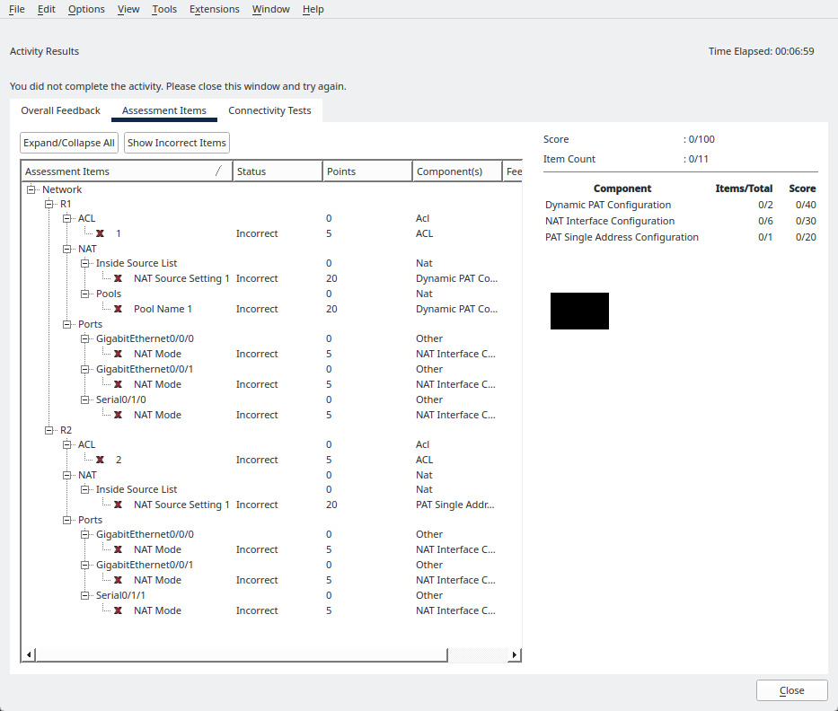

#+INCLUDE: "../../../common/header.org"
#+INCLUDE: "../../../common/header-examen-practica.org"

#+LATEX_HEADER: \lhead{NAT PAT (Packet Tracer)}
#+LATEX_HEADER: \rhead{Planificación y administración de redes}

#+title: NAT PAT (Packet Tracer)

* Objetivo de la práctica
Tras la práctica, se espera que el alumno haya conseguido:
- Familiarizarse con la interfaz de /Packet Tracer/
- Conocer la implemetación de NAT PAT de los routers Cisco  
- RA asociado: RA6

* Ejercicios
Se realizarán los ejercicios del curso de Netacad /CCNA: Redes Empresariales, Seguridad y Automatización/

- Voluntarias: pueden hacerse, pero no forman parte de la nota
  - 6.2.7 Packet Tracer - Investigar operaciones NAT
  - 6.4.5 Packet Tracer - Configurar NAT estática
  - 6.5.6 Packet Tracer - Configuración de NAT dinámica
- Obligatoria: esta es la que tiene nota    
  - 6.6.7 Packet Tracer - Configurar PAT

* Instrucciones
- Se enviará el PKA al 100% de consecución
- Se enviará también un pantallazo de la ventana de "assesment items", con el árbol visible
  
- El pantallazo será del escritorio completo, no solo de la ventana  
