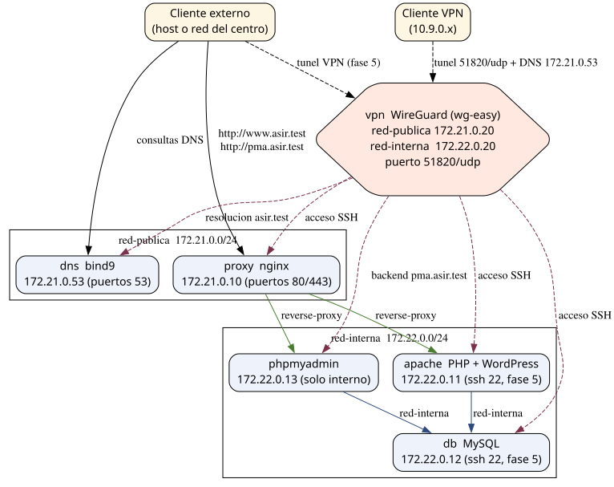

#+EXPORT_EXCLUDE_TAGS: noexport

* Prompt :noexport:
Este proyecto para estudiantes consta de varias fases. En el estado final:
- 6 /containers/: proxy inverso, Apache con PHP, MySQL, Apache con PHPMyAdmin, servidor VPN, servidor DNS
- Los clientes externos pueden utilizar el servidor DNS, el proxy inverso y el servidor DNS
- Los clientes conectados a la VPN Wireguard utilizan el servidor DNS
- Se crea automáticamente con un solo =docker compose= y los /scripts/ necesarios  

| Fase 1 | Servidor DNS que almacena nombres para cada container, www.asir.test es la IP de la máquina host (un script modifica la zona antes de arrancar) |
| Fase 2 | Servidor LAMP, se comprueba                                                                                                                     |
| Fase 3 | Wordpress instalado en LAMP (apache.asir.test)                                                                                                  |
| Fase 4 | Proxy inverso frente a servidor Wordpress y servidor PhpMyAdmin, a través de www.asir.test/wp y www.asir.test/pma                               |
| Fase 5 | Acceso mediante VPN a cada container de la red interna, por SSH                                                                                 |

Diagrama:
#+begin_src dot :file ./media/arquitectura.svg :exports results :cmdline -Tsvg
digraph arquitectura {

  compound=true;
  rankdir="TR";
  node  [shape=box, style="rounded, filled", fillcolor="#eef3fb", fontname="sans-serif"];

  cliente_ext [label="Cliente externo\n(host o red del centro)", fillcolor="#fdf6e3"];
  vpn_client  [label="Cliente VPN\n(10.9.0.x)", fillcolor="#fdf6e3"];

  subgraph cluster_publica {
    label="red-publica  172.21.0.0/24";
    dns   [label="dns  bind9\n172.21.0.53 (puertos 53)"];
    proxy [label="proxy  nginx\n172.21.0.10 (puertos 80/443)"];
    vpn [label="vpn  WireGuard (wg-easy)\nred-publica 172.21.0.20\nred-interna  172.22.0.20\npuerto 51820/udp"];
  }

  subgraph cluster_interna {
    label="red-interna  172.22.0.0/24";
    apache [label="apache  PHP + WordPress\n172.22.0.11 (ssh 22, fase 5)"];
    db     [label="db  MySQL\n172.22.0.12 (ssh 22, fase 5)"];
    pma    [label="phpmyadmin\n172.22.0.13 (solo interno)"];
  }

  vpn_client -> vpn [label=" tunel 51820/udp + DNS 172.21.0.53", style=dashed];

  // cliente_ext -> proxy [label=" http://www.asir.test\n http://pma.asir.test"];
  // cliente_ext -> dns   [label=" consultas DNS"];
  // cliente_ext -> vpn   [label=" tunel VPN (fase 5)", style=dashed];
  cliente_ext -> vpn [label="Acceso por puertos docker mapeados" lhead="cluster_publica"]

  proxy -> apache [label=" reverse-proxy", color="#4a7c2f"];
  proxy -> pma    [label=" reverse-proxy", color="#4a7c2f"];

  apache -> db [label=" red-interna", color="#2f4a7c"];
  pma    -> db [label=" red-interna", color="#2f4a7c"];

  vpn -> apache [label="acceso por vpn",  lhead=cluster_interna]
  // vpn -> pma;
  // vpn -> apache;
  // vpn -> db;
}
#+end_src

#+RESULTS:

Los diagramas se realizan con ``#+begin_src dot'' o similar

Completa este documento donde se detalla el enunciado de las fases para los alumnos.
* Descripción general

** Arquitectura final

El proyecto queda formado por *6 contenedores* distribuidos en dos redes Docker:

- =red-publica= (172.21.0.0/24): =dns= (BIND9), =proxy= (nginx) y =vpn= (WireGuard). Son los servicios que los clientes externos alcanzan a través de los puertos mapeados del host.
- =red-interna= (172.22.0.0/24): =apache= (PHP + WordPress), =db= (MySQL) y =phpmyadmin=. El backend no publica puertos: solo se alcanza a través del =proxy= o de la VPN.

Los clientes externos (host o red del centro) pueden utilizar el servidor DNS, el
proxy inverso y el servidor VPN. Los clientes conectados a la VPN WireGuard usan el
DNS del proyecto, acceden directamente al backend (p. ej. =pma.asir.test= sin pasar
por el proxy) y entran por SSH a =apache= y =db=.

El nombre público =www.asir.test= resuelve a la *IP de la máquina host*: es la
entrada que llega al proxy a través del puerto 80 mapeado. Un script modifica la
zona DNS con esa IP antes de arrancar el escenario.

El proyecto queda formado por *6 contenedores* distribuidos en dos redes Docker:

- =red-publica= (172.21.0.0/24): =dns= (BIND9), =proxy= (nginx) y =vpn= (WireGuard). Son los servicios que los clientes externos alcanzan a través de los puertos mapeados del host.
- =red-interna= (172.22.0.0/24): =apache= (PHP + WordPress), =db= (MySQL) y =phpmyadmin=. El backend no publica puertos: solo se alcanza a través del =proxy= o de la VPN.

Los clientes externos (host o red del centro) pueden utilizar el servidor DNS, el
proxy inverso y el servidor VPN. Los clientes conectados a la VPN WireGuard usan el
DNS del proyecto, acceden directamente al backend (p. ej. =pma.asir.test= sin pasar
por el proxy) y entran por SSH a =apache= y =db=.

El nombre público =www.asir.test= resuelve a la *IP de la máquina host*: es la
entrada que llega al proxy a través del puerto 80 mapeado. Un script modifica la
zona DNS con esa IP antes de arrancar el escenario.

** Redes Docker
- =red-publica= (bridge) con subred =172.21.0.0/24=: contiene los servicios expuestos al exterior: =dns=, =proxy= y =vpn=.
- =red-interna= (bridge) con subred =172.22.0.0/24=: contiene los servicios /backend/: =apache=, =db= y =phpmyadmin=. =proxy= y =vpn= también se conectan a esta red para alcanzar el backend.
- Dentro de una misma red Docker los contenedores se resuelven entre sí por su *nombre de servicio* (=db=, =apache=...). Los nombres públicos del dominio =asir.test= los resuelve el servidor DNS del proyecto.

** Contenedores e IPs

| Contenedor   | Imagen              | IP red-publica | IP red-interna | Funciones principales                                               |
|--------------+---------------------+----------------+----------------+----------------------------------------------------------------------|
| =dns=        | bind9               | 172.21.0.53    | —              | Autoritativo de =asir.test= y recursivo para el resto                 |
| =proxy=      | nginx               | 172.21.0.10    | 172.22.0.10    | Proxy inverso a Apache y a PHPMyAdmin                                 |
| =apache=     | php:8.2-apache      | —              | 172.22.0.11    | Apache + PHP con WordPress, SSH (fase 5)                              |
| =db=         | mysql:8.4           | —              | 172.22.0.12    | MySQL con la base de datos de WordPress, SSH (fase 5)                 |
| =phpmyadmin= | phpmyadmin          | —              | 172.22.0.13    | Gestión web de =db=, accesible solo por proxy o por VPN               |
| =vpn=        | wireguard (wg-easy) | 172.21.0.20    | 172.22.0.20    | Servidor WireGuard con panel web de gestión                          |

** Puertos expuestos en el host

| Puerto       | Servicio | Uso                                                         |
|--------------+----------+-------------------------------------------------------------|
| 53 (TCP+UDP) | =dns=    | Consultas DNS de clientes externos y de clientes VPN        |
| 80 y 443     | =proxy=  | Proxy inverso al wordpress y a PHPMyAdmin (=www.asir.test=) |
| 51820/udp    | =vpn=    | Túnel WireGuard para los clientes VPN                       |

** Dominio
Se emplea el dominio reservado para pruebas =asir.test= (RFC 6761). Registros requeridos:
 - =dns.asir.test=
 - =proxy.asir.test=
 - =vpn.asir.test=
 - =apache.asir.test=
 - =db.asir.test=
 - =pma.asir.test=,
 - alias =phpmyadmin.asir.test= (CNAME de =pma=)
 - Alias =www.asir.test= con la *IP de la máquina host*: es la entrada pública que llega al proxy por el puerto 80. No es un CNAME del backend: la zona la modifica un script (=scripts/install.sh=) antes de arrancar, porque la IP del host puede cambiar entre sesiones.

Los nombres =apache.asir.test=, =db.asir.test= y =pma.asir.test= son del backend (172.22.0.0/24): solo se resuelven y alcanzan desde el host, el =proxy= o los clientes VPN.

** Estructura del repositorio

#+begin_src text
proyecto-asir/
├── docker-compose.yml       # definicion de los 6 servicios
├── .env.example             # variables de entorno (WireGuard)
├── apache/
│   ├── Dockerfile           # php:8.2-apache + sshd
│   ├── entrypoint.sh        # arranca sshd y Apache
│   └── www/                 # documentos web (WordPress, lo genera install.sh)
├── db/
│   ├── Dockerfile           # mysql:8.4 + sshd
│   ├── entrypoint-ssh.sh    # arranca sshd y el entrypoint oficial de MySQL
│   └── data/                # datos persistentes de MySQL
├── proxy/
│   └── conf.d/proxy.conf    # virtual hosts del proxy inverso
├── dns/
│   ├── named.conf
│   ├── named.conf.options
│   ├── named.conf.local
│   └── zones/               # zona directa e inversas (www.asir.test = IP del host)
└── scripts/
    ├── install.sh           # pone la IP del host en la zona DNS, prepara WordPress y .env
    └── comprobaciones.sh    # verifica el despliegue completo
#+end_src
* Fase 1 — Servidor DNS

** Enunciado
- Desplegar un contenedor =dns= con BIND9 que sea *autoritativo* para el dominio =asir.test= y *recursivo* para el resto de nombres.
- Debe almacenar un registro de nombre para cada contenedor del proyecto y los registros de resolución inversa (PTR).
- El registro =www.asir.test= debe ser la *IP de la máquina host*: es la entrada pública que llega al proxy a través del puerto 80. Como la IP del host es dinámica, un script modifica la zona con esa IP antes de arrancar (=scripts/install.sh=).
- Los clientes externos deben poder utilizarlo: desde el host se apunta el /resolver/ a =172.21.0.53=.

** Objetivos
- Montar BIND9 en un contenedor con ficheros de configuración propios.
- Crear zona directa e inversas con registros A, CNAME y PTR.
- Modificar la zona desde un script para adaptarla al entorno (IP del host).
- Configurar la recursividad y comprobar con =dig= / =nslookup=.

** Tareas
1. Añadir el servicio =dns= con la imagen =internetsystemsconsortium/bind9= y publicar los puertos =53= (TCP y UDP).
2. Crear la red =red-publica= (172.21.0.0/24) y asignar a =dns= la IP fija 172.21.0.53.
3. Montar en el contenedor =named.conf=, =named.conf.options=, =named.conf.local= y el directorio =zones/=.
4. Definir la zona directa =asir.test= con un A por contenedor (=dns=, =proxy=, =vpn=, =apache=, =db=, =pma=) y los CNAME =phpmyadmin= → =pma= y =www= con la IP de la máquina host (registro A, no CNAME).
5. Definir las zonas inversas =21.172.in-addr.arpa= y =22.172.in-addr.arpa= con los PTR de todas las IPs del proyecto.
6. Configurar la recursividad con =forwarders= (p. ej. 1.1.1.1 y 8.8.8.8).
7. En =scripts/install.sh=, sustituir el registro =www= de la zona por la IP real del host (=hostname -I=) antes de levantar el escenario.

** Comprobaciones
- Desde el host, apuntando el /resolver/ a 172.21.0.53:

#+begin_src bash
IP_HOST=$(hostname -I | awk '{print $1}')
dig @172.21.0.53 www.asir.test A          # devuelve la IP del host
dig @172.21.0.53 apache.asir.test A       # devuelve 172.22.0.11 (backend)
dig @172.21.0.53 -x 172.22.0.12
dig @172.21.0.53 -x 172.21.0.53
dig @172.21.0.53 google.es A              # recursividad hacia el exterior
#+end_src
- Todos los nombres devuelven el registro esperado; las inversas devuelven el
  nombre correspondiente; =www.asir.test= coincide con =IP_HOST=.

** Entrega
- Configuración de BIND9 y ficheros de zona.
- El fragmento de =scripts/install.sh= que actualiza =www.asir.test= con la IP del host.
- Salida de =dig= de al menos 4 nombres directos, 2 inversos y 1 recursivo.

* Fase 2 — Servidor LAMP

** Enunciado
- Desplegar un servidor LAMP (Linux + Apache + MySQL + PHP) en /tres contenedores/: =apache= (Apache con PHP), =db= (MySQL) y =phpmyadmin= (gestión de =db=).
- Los tres contenedores deben formar parte de una red Docker propia (=red-interna=) y comunicarse entre sí por sus nombres de servicio.
- Debe probarse una página PHP que muestre el resultado de una consulta a MySQL.

** Objetivos
- Crear y administrar redes Docker (driver =bridge=, subred propia, IPs fijas).
- Conocer las variables de entorno de las imágenes MySQL y PHPMyAdmin.
- Conectar un contenedor PHP a la base de datos usando únicamente el nombre =db=.

** Tareas
1. Crear el fichero =docker-compose.yml= con los servicios =db=, =apache= y =phpmyadmin= y la red =red-interna= (172.22.0.0/24) con IPs fijas.
2. Configurar =db= con: volumen persistente (=./db/data=), base de datos =wordpress=, usuario =wp_user= y contraseñas.
3. Configurar =apache= con la imagen =php:8.2-apache= y montar el volumen =./apache/www= en =/var/www/html=.
4. Configurar =phpmyadmin= apuntando a =PMA_HOST=db=.
5. Añadir temporalmente =8080:80= (apache) y =8081:80= (phpmyadmin) para poder probarlos desde el host. Se retirarán en la fase 4.
6. Crear en =apache/www= los ficheros =index.php= (bienvenida del LAMP) y =test-db.php= (consulta a MySQL con =mysqli=).

** Comprobaciones
- =docker compose ps= muestra los tres contenedores arriba.
- Acceder a =http://localhost:8080/index.php= y =http://localhost:8080/test-db.php=.
- =http://localhost:8081= muestra el login de PHPMyAdmin; se entra con =root= / =asir_root= y la base =wordpress= debe existir.
- Desde =apache= debe resolverse el nombre =db=: =docker compose exec apache getent hosts db=.
- El DNS de la fase 1 ya resuelve el backend, y el host alcanza =red-interna= directamente. Por eso, sin retirar los puertos temporales, también funcionan los nombres del proyecto desde el host:

#+begin_src bash
curl http://localhost:8080/test-db.php
curl -u root:asir_root http://localhost:8081/
curl http://apache.asir.test/test-db.php
#+end_src

** Entrega
- =docker-compose.yml=, =index.php= y =test-db.php=.
- Capturas de la resolución de =db= y de las dos páginas web funcionando.

* Fase 3 — WordPress instalado en LAMP (=apache.asir.test=)

** Enunciado
- Instalar WordPress sobre el LAMP de la fase 2, de modo que use la base de datos =db= y el servidor web =apache=.
- En esta fase el sitio queda accesible por =http://apache.asir.test=: el DNS de la fase 1 lo resuelve a 172.22.0.11 y el host alcanza =red-interna= directamente.
- Completar la instalación por web y crear al menos una entrada (página o artículo).

** Objetivos
- Automatizar la descarga de WordPress mediante un /script/ (=scripts/install.sh=).
- Generar =wp-config.php= con las credenciales de =db= y las *salts*.
- Comprobar que una aplicación PHP real persiste sus datos en MySQL.

** Tareas
1. En =scripts/install.sh=: descargar =https://wordpress.org/latest.tar.gz= y extraerlo en =apache/www=. No sobrescribir si ya existe =wp-config.php=.
2. Generar =wp-config.php= con =DB_NAME=wordpress=, =DB_USER=wp_user=, =DB_PASSWORD=wp_pass_2026=, =DB_HOST=db= y las 8 /salts/ generadas con =openssl rand -base64 48=. La URL del sitio no se fija aquí: la establece el asistente web según la dirección usada (la cambiará el proxy en la fase 4).
3. Levantar el escenario y completar el asistente web apuntando el navegador a =http://apache.asir.test= (en esta fase todavía sin proxy; se accede al backend directamente desde el host).
4. Crear un artículo de prueba y comprobar que tras =docker compose restart db= el artículo sigue existiendo (persistencia en =db/data=).

** Comprobaciones
- Muestra las tablas de WordPress.
  #+begin_src bash
  docker compose exec db mysql -u wp_user -pwp_pass_2026 wordpress -e "show tables;"
  #+end_src
  
- =/wp-admin/= permite iniciar sesión con el usuario creado en el asistente; la URL del sitio es =http://apache.asir.test= hasta que el proxy la cambie a =http://www.asir.test= en la fase 4.

** Entrega
- Fragmento relevante de =install.sh=, =wp-config.php= y captura del sitio ya
  instalado.

* Fase 4 — Proxy inverso

** Enunciado
- Colocar un contenedor =proxy= (nginx) como puerta de entrada única al servidor Apache y al servidor PHPMyAdmin.
- El proxy usará dos nombres virtuales: =www.asir.test= → =apache:80= y =pma.asir.test= → =phpmyadmin:80=.
- =www.asir.test= ya resuelve (fase 1) a la IP de la máquina host y el puerto 80 del host está mapeado al proxy: es la entrada pública al sitio WordPress.
- A partir de esta fase los clientes acceden únicamente a través del proxy; se retiran las publicaciones =8080= y =8081=.

** Objetivos
- Comprender el patrón de proxy inverso y la directiva =proxy_pass=.
- Aplicar enrutamiento por =server_name=.
- Ocultar los servidores backend de la red exterior.

** Tareas
1. Añadir el servicio =proxy= (imagen =nginx:1.27-alpine=) a =red-publica= (172.21.0.10) y a =red-interna= (172.22.0.10).
2. Montar =./proxy/conf.d/proxy.conf= en =/etc/nginx/conf.d=.
3. Publicar solo los puertos =80= y =443= de =proxy= en el host.
4. Retirar las publicaciones =8080= y =8081= de =apache= y =phpmyadmin=.
5. Definir los dos bloques =server{}:= para =www.asir.test= y =pma.asir.test= con =proxy_pass http://apache:80= y =proxy_pass http://phpmyadmin:80= respectivamente, propagando =Host= y =X-Forwarded-For=.
6. Cambiar en la base de datos la URL del sitio WordPress a =http://www.asir.test= (en la fase 3 quedó en =http://apache.asir.test=):

#+begin_src bash
docker compose exec db mysql -u wp_user -pwp_pass_2026 wordpress -e \
  "UPDATE wp_options SET option_value='http://www.asir.test' WHERE option_name IN ('home','siteurl');"
#+end_src

7. Comprobar desde el host =http://www.asir.test= (la IP del propio host llega al proxy por el puerto 80) y desde los demás clientes con su /resolver/ apuntando a 172.21.0.53 (fase 1).

** Comprobaciones
  #+begin_src bash
  curl -s -o /dev/null -w "%{http_code}\n" -H "Host: www.asir.test" http://127.0.0.1/
  curl -s -o /dev/null -w "%{http_code}\n" -H "Host: pma.asir.test" http://127.0.0.1/
  curl -s http://www.asir.test/ | grep -c "www.asir.test"   # enlaces ya apuntan al proxy
  #+end_src
- Abriendo =http://www.asir.test= y =http://pma.asir.test= en el navegador (con DNS del sistema apuntando a 172.21.0.53) se ven WordPress y PHPMyAdmin funcionando a través del proxy, con los enlaces de WordPress en =www.asir.test=.

** Entrega
- =proxy.conf= completo y capturas de ambos sitios funcionando a través del proxy.

* Fase 5 — Acceso por VPN WireGuard

** Enunciado
- Desplegar un servidor VPN WireGuard (=vpn=).
- Los clientes conectados a la VPN deben:
  - usar el servidor DNS del proyecto (172.21.0.53) para resolver =asir.test=;
  - acceder al /backend/ PHPMyAdmin (=pma.asir.test=) directamente, sin pasar por
    el proxy;
  - conectarse por SSH a los contenedores =apache= y =db=.

** Objetivos
- Instalar y administrar WireGuard con wg-easy (panel web para clientes).
- Encaminar el tráfico de la VPN hacia las subredes de Docker.
- Publicar servicios del backend de forma segura a través del túnel.

** Tareas
1. Añadir el servicio =vpn= con la imagen =weejewel/wg-easy=, =cap_add NET_ADMIN=, =net.ipv4.ip_forward= y =net.ipv4.conf.all.src_valid_mark=1=.
2. Publicar =51820/udp= (túnel) y =51821/tcp= (panel web de gestión).
   - El puerto =51821= se publica temporalmente, pero tras comprobar el correcto funcionamiento solo será accesible a través de la VPN
3. Conectar =vpn= a =red-publica= (172.21.0.20) y a =red-interna= (172.22.0.20) para alcanzar el backend.
4. Configurar las variables del entorno: =WG_HOST= (IP del host o del servidor), =PASSWORD=, =WG_DEFAULT_DNS=172.21.0.53= y =WG_ALLOWED_IPS= con las subredes públicas, interna y la del túnel (172.21.0.0/24, 172.22.0.0/24 y 10.9.0.0/24).
5. Instalar =openssh-server= en =apache= y =db= (permitiendo login de root con contraseña) e iniciarlo junto con el servicio principal.
6. Crear un cliente VPN desde el panel =http://IP_HOST:51821= y descargar su configuración.

** Comprobaciones (desde el cliente VPN conectado)
  #+begin_src bash
  ip addr show wg0                     # IP 10.9.0.x asignada
  ping -c 3 172.22.0.12                # alcanza MySQL por la VPN
  dig apache.asir.test @172.21.0.53    # usa el DNS del proyecto
  curl http://pma.asir.test/           # backend PHPMyAdmin por la VPN
  ssh root@apache.asir.test            # shell en el contenedor apache
  ssh root@db.asir.test                # shell en el contenedor db
  #+end_src
- En el host se comprueba que el puerto 8081 (PHPMyAdmin) NO está publicado:
  solo se alcanza dentro de la VPN o a través de =pma.asir.test= (proxy).

** Entrega
- Configuración del servicio =vpn= y capturas del cliente VPN con todos los
  apartados anteriores funcionando.

* Evaluación

| Criterio                                                                                              | Peso |
|-------------------------------------------------------------------------------------------------------+------|
| Fase 1: DNS autoritativo, resolución de todos los contenedores y www.asir.test = IP del host (script) |  20% |
| Fase 2: LAMP operativo y explicación de sus componentes                                               |  15% |
| Fase 3: WordPress instalado en =apache.asir.test= y con persistencia en MySQL                         |  15% |
| Fase 4: proxy inverso con doble nombre virtual y backend oculto                                       |  20% |
| Fase 5: cliente VPN con DNS + acceso al backend y SSH a apache/db                                     |  20% |
| Despliegue automático con un solo =docker compose= y los scripts                                      |  10% |
* Solución

** Estructura definitiva del repositorio

#+begin_src text
proyecto-asir/
├── docker-compose.yml
├── .env.example
├── apache/
│   ├── Dockerfile
│   ├── entrypoint.sh
│   └── www/                 # WordPress (lo descarga scripts/install.sh)
├── db/
│   ├── Dockerfile
│   ├── entrypoint-ssh.sh
│   └── data/
├── proxy/
│   └── conf.d/proxy.conf
├── dns/
│   ├── named.conf
│   ├── named.conf.options
│   ├── named.conf.local
│   └── zones/
│       ├── db.asir.test      # www.asir.test lo actualiza scripts/install.sh
│       ├── db.172.21
│       └── db.172.22
└── scripts/
    ├── install.sh
    └── comprobaciones.sh
#+end_src

** docker-compose.yml

#+begin_src yaml
name: proyecto-asir

services:

  proxy:
    image: nginx:1.27-alpine
    container_name: proxy
    restart: unless-stopped
    ports:
      - "80:80"
      - "443:443"
    volumes:
      - ./proxy/conf.d:/etc/nginx/conf.d:ro
    depends_on:
      - apache
      - phpmyadmin
    networks:
      red-publica:
        ipv4_address: 172.21.0.10
      red-interna:
        ipv4_address: 172.22.0.10

  apache:
    build: ./apache
    container_name: apache
    restart: unless-stopped
    volumes:
      - ./apache/www:/var/www/html
    depends_on:
      - db
    networks:
      red-interna:
        ipv4_address: 172.22.0.11

  db:
    build: ./db
    container_name: db
    restart: unless-stopped
    environment:
      MYSQL_ROOT_PASSWORD: asir_root
      MYSQL_DATABASE: wordpress
      MYSQL_USER: wp_user
      MYSQL_PASSWORD: wp_pass_2026
    volumes:
      - ./db/data:/var/lib/mysql
    networks:
      red-interna:
        ipv4_address: 172.22.0.12

  phpmyadmin:
    image: phpmyadmin:5.2
    container_name: phpmyadmin
    restart: unless-stopped
    environment:
      PMA_HOST: db
      PMA_PORT: 3306
      PMA_USER: root
      PMA_PASSWORD: asir_root
      PMA_ABSOLUTE_URI: "http://pma.asir.test"
    depends_on:
      - db
    networks:
      red-interna:
        ipv4_address: 172.22.0.13

  dns:
    image: internetsystemsconsortium/bind9:9.19
    container_name: dns
    restart: unless-stopped
    ports:
      - "53:53/udp"
      - "53:53/tcp"
    volumes:
      - ./dns/named.conf:/etc/bind/named.conf:ro
      - ./dns/named.conf.options:/etc/bind/named.conf.options:ro
      - ./dns/named.conf.local:/etc/bind/named.conf.local:ro
      - ./dns/zones:/etc/bind/zones:ro
    networks:
      red-publica:
        ipv4_address: 172.21.0.53

  vpn:
    image: weejewel/wg-easy
    container_name: vpn
    restart: unless-stopped
    cap_add:
      - NET_ADMIN
      - SYS_MODULE
    sysctls:
      - net.ipv4.conf.all.src_valid_mark=1
      - net.ipv4.ip_forward=1
    ports:
      - "51820:51820/udp"
      - "51821:51821/tcp"
    environment:
      WG_HOST: "${WG_HOST:-127.0.0.1}"
      PASSWORD: "${WG_PASSWORD:-asir-vpn-2026}"
      WG_DEFAULT_ADDRESS: "10.9.0.x"
      WG_DEFAULT_DNS: "172.21.0.53"
      WG_ALLOWED_IPS: "172.21.0.0/24, 172.22.0.0/24, 10.9.0.0/24"
      WG_PERSISTENT_KEEPALIVE: "25"
    networks:
      red-publica:
        ipv4_address: 172.21.0.20
      red-interna:
        ipv4_address: 172.22.0.20

networks:
  red-publica:
    driver: bridge
    ipam:
      config:
        - subnet: 172.21.0.0/24
  red-interna:
    driver: bridge
    ipam:
      config:
        - subnet: 172.22.0.0/24
#+end_src

** .env.example

#+begin_src text
# IP/dominio que usan los clientes VPN para conectarse (IP del host o publica)
WG_HOST=192.168.1.10
# Contrasena del panel web de WireGuard (http://IP_HOST:51821)
WG_PASSWORD=asir-vpn-2026
#+end_src

** apache/Dockerfile

#+begin_src dockerfile
FROM php:8.2-apache

RUN apt-get update \
    && apt-get install -y --no-install-recommends vim openssh-server \
    && docker-php-ext-install mysqli pdo_mysql \
    && a2enmod rewrite \
    && sed -i 's/^#PermitRootLogin.*/PermitRootLogin yes/' /etc/ssh/sshd_config \
    && mkdir -p /run/sshd \
    && echo 'root:asir' | chpasswd

COPY entrypoint.sh /usr/local/bin/entrypoint.sh
RUN chmod +x /usr/local/bin/entrypoint.sh

EXPOSE 80 22
ENTRYPOINT ["/usr/local/bin/entrypoint.sh"]
#+end_src

** apache/entrypoint.sh

#+begin_src bash
#!/bin/bash
/usr/sbin/sshd
exec apache2-foreground
#+end_src

** db/Dockerfile

#+begin_src dockerfile
FROM mysql:8.4

RUN apt-get update \
    && apt-get install -y --no-install-recommends openssh-server vim \
    && sed -i 's/^#PermitRootLogin.*/PermitRootLogin yes/' /etc/ssh/sshd_config \
    && mkdir -p /run/sshd \
    && echo 'root:asir' | chpasswd

COPY entrypoint-ssh.sh /usr/local/bin/entrypoint-ssh.sh
RUN chmod +x /usr/local/bin/entrypoint-ssh.sh

EXPOSE 3306 22
ENTRYPOINT ["/usr/local/bin/entrypoint-ssh.sh"]
CMD ["mysqld"]
#+end_src

** db/entrypoint-ssh.sh

#+begin_src bash
#!/bin/bash
/usr/sbin/sshd
exec docker-entrypoint.sh "$@"
#+end_src

** proxy/conf.d/proxy.conf

#+begin_src nginx
# WordPress a traves del proxy
server {
    listen 80;
    server_name www.asir.test;

    location / {
        proxy_pass http://apache:80;
        proxy_set_header Host $host;
        proxy_set_header X-Real-IP $remote_addr;
        proxy_set_header X-Forwarded-For $proxy_add_x_forwarded_for;
    }
}

# PHPMyAdmin a traves del proxy
server {
    listen 80;
    server_name pma.asir.test phpmyadmin.asir.test;

    location / {
        proxy_pass http://phpmyadmin:80;
        proxy_set_header Host $host;
        proxy_set_header X-Real-IP $remote_addr;
        proxy_set_header X-Forwarded-For $proxy_add_x_forwarded_for;
    }
}
#+end_src
** dns/named.conf

#+begin_src conf
include "/etc/bind/named.conf.options";
include "/etc/bind/named.conf.local";
#+end_src

** dns/named.conf.options

#+begin_src conf
options {
    directory "/var/cache/bind";

    recursion yes;
    allow-query { any; };

    listen-on port 53  { any; };
    listen-on-v6       { any; };

    forwarders { 1.1.1.1; 8.8.8.8; };
    dnssec-validation no;
};
#+end_src

** dns/named.conf.local

#+begin_src conf
// Zona directa del proyecto
zone "asir.test" {
    type master;
    file "/etc/bind/zones/db.asir.test";
};

// Zonas inversas de las dos redes Docker
zone "21.172.in-addr.arpa" {
    type master;
    file "/etc/bind/zones/db.172.21";
};

zone "22.172.in-addr.arpa" {
    type master;
    file "/etc/bind/zones/db.172.22";
};
#+end_src

** dns/zones/db.asir.test

#+begin_src conf
$TTL 86400
@   IN SOA dns.asir.test. admin.asir.test. (
        2026091401 ; serial
        3600       ; refresh
        1800       ; retry
        604800     ; expire
        86400 )    ; minimum

    IN NS  dns.asir.test.

; Servidores
dns     IN A    172.21.0.53
proxy   IN A    172.21.0.10
vpn     IN A    172.21.0.20

; Backend (solo red-interna / VPN)
apache  IN A    172.22.0.11
db      IN A    172.22.0.12
pma     IN A    172.22.0.13

; Alias
phpmyadmin  IN CNAME pma
; www.asir.test es la IP de la maquina host; install.sh la sustituye antes de arrancar
www         IN A    192.168.1.10   ; ejemplo: la IP real la pone scripts/install.sh
#+end_src

** dns/zones/db.172.21

#+begin_src conf
$TTL 86400
@   IN SOA dns.asir.test. admin.asir.test. (
        2026091401 ; serial
        3600       ; refresh
        1800       ; retry
        604800     ; expire
        86400 )    ; minimum

    IN NS  dns.asir.test.

10  IN PTR proxy.asir.test.
20  IN PTR vpn.asir.test.
53  IN PTR dns.asir.test.
#+end_src

** dns/zones/db.172.22

#+begin_src conf
$TTL 86400
@   IN SOA dns.asir.test. admin.asir.test. (
        2026091401 ; serial
        3600       ; refresh
        1800       ; retry
        604800     ; expire
        86400 )    ; minimum

    IN NS  dns.asir.test.

10  IN PTR proxy.asir.test.
11  IN PTR apache.asir.test.
12  IN PTR db.asir.test.
13  IN PTR pma.asir.test.
#+end_src

** scripts/install.sh

#+begin_src bash
#!/bin/bash
# Preparacion automatica del proyecto ASIR.
# Uso: ./scripts/install.sh
set -euo pipefail
cd "$(dirname "$0")/.."

echo "[1/4] Creando directorios de datos"
mkdir -p apache/www db/data

echo "[2/4] Poniendo la IP del host en la zona DNS (www.asir.test)"
HOST_IP=$(hostname -I | awk '{print $1}')
ZONE=dns/zones/db.asir.test
if [ -f "$ZONE" ]; then
  sed -i -E "s/^(www[[:space:]]+IN[[:space:]]+A[[:space:]]+).*/\1${HOST_IP}/" "$ZONE"
  echo "  - www.asir.test -> ${HOST_IP}"
fi

echo "[3/4] Desplegando WordPress (fases 2 y 3)"
if [ ! -f "apache/www/wp-config.php" ]; then
  curl -fsSL https://wordpress.org/latest.tar.gz -o /tmp/wordpress.tar.gz
  tar -xzf /tmp/wordpress.tar.gz -C apache/www --strip-components=1

  SALTS=""
  for i in AUTH_KEY SECURE_AUTH_KEY LOGGED_IN_KEY NONCE_KEY \
           AUTH_SALT SECURE_AUTH_SALT LOGGED_IN_SALT NONCE_SALT; do
    SALTS+=$(printf "define('%s', '%s');\n" "$i" "$(openssl rand -base64 48)")
  done

  cat > apache/www/wp-config.php <<EOF
<?php
define('DB_NAME', 'wordpress');
define('DB_USER', 'wp_user');
define('DB_PASSWORD', 'wp_pass_2026');
define('DB_HOST', 'db');
define('DB_CHARSET', 'utf8mb4');
define('DB_COLLATE', '');

$SALTS
\$table_prefix = 'wp_';

define('WP_DEBUG', false);

// La URL del sitio la fija el asistente web (fase 3, apache.asir.test)
// y la cambia el proxy en la fase 4 a http://www.asir.test

if ( ! defined( 'ABSPATH' ) ) {
    define( 'ABSPATH', __DIR__ . '/' );
}
require_once ABSPATH . 'wp-settings.php';
EOF
  echo "  - wp-config.php generado"
fi

echo "[4/4] Configurando WireGuard (fase 5)"
if [ ! -f .env ]; then
  cat > .env <<EOF
WG_HOST=${HOST_IP}
WG_PASSWORD=asir-vpn-2026
EOF
  echo "  - .env generado (WG_HOST=${HOST_IP})"
fi

echo "Listo. Ejecuta:  docker compose up -d --build"
#+end_src

** scripts/comprobaciones.sh

#+begin_src bash
#!/bin/bash
# Verificacion del despliegue completo.
set -euo pipefail
cd "$(dirname "$0")/.."

DNS_IP=172.21.0.53
IP_HOST=$(hostname -I | awk '{print $1}')

echo "=== 1. Contenedores ==="
docker compose ps --format "table {{.Name}}\t{{.Status}}\t{{.Ports}}"

echo "=== 2. Resolucion directa asir.test ==="
for n in dns proxy www vpn apache db pma phpmyadmin; do
  r=$(dig +short "@${DNS_IP}" "${n}.asir.test" A | head -n1)
  echo "  ${n}.asir.test -> ${r:-SIN RESPUESTA}"
done
echo "  (esperado: www.asir.test -> ${IP_HOST})"

echo "=== 3. Resolucion inversa ==="
for ip in 172.21.0.53 172.21.0.10 172.21.0.20 \
          172.22.0.11 172.22.0.12 172.22.0.13; do
  echo "  ${ip} -> $(dig +short -x "${ip}" "@${DNS_IP}")"
done

echo "=== 4. Proxy inverso ==="
curl -s -o /dev/null -w "  www.asir.test -> HTTP %{http_code}\n" \
     -H "Host: www.asir.test" http://127.0.0.1/
curl -s -o /dev/null -w "  pma.asir.test -> HTTP %{http_code}\n" \
     -H "Host: pma.asir.test" http://127.0.0.1/

echo "=== 5. SSH en backend (fase 5) ==="
docker compose exec apache bash -c 'pgrep sshd >/dev/null && echo "  sshd OK en apache"'
docker compose exec db bash -c 'pgrep sshd >/dev/null && echo "  sshd OK en db"'

echo "=== 6. Log de WireGuard ==="
docker compose logs vpn 2>/dev/null | tail -n 3
#+end_src

** Puesta en marcha

#+begin_src bash
chmod +x scripts/*.sh
./scripts/install.sh   # pone la IP del host en la zona DNS, descarga WordPress y genera .env
docker compose up -d --build
#+end_src

- Acceder a =http://www.asir.test= (WordPress) y =http://pma.asir.test= (PHPMyAdmin) con el DNS del sistema apuntando a 172.21.0.53.
- Crear un cliente VPN en =http://IP_DEL_HOST:51821= y descargar el fichero =*.conf=. Importarlo en el cliente WireGuard, conectarse y repetir la lista de comprobaciones de la fase 5.

** Notas sobre wg-easy
- =WG_HOST= debe ser la IP o dominio que el cliente VPN usa para conectarse: en prácticas de aula basta la IP del host (se detecta en =install.sh=); con clientes externos hay que usar la IP pública o un dominio con registro A.
- Si se prefiere autenticar con hash en lugar de =PASSWORD=, se genera con =docker run --rm weejewel/wg-easy wgpw 'asir-vpn-2026'= y se asigna la variable =PASSWORD_HASH= en el servicio =vpn=.
- wg-easy asigna IPs automáticas dentro de =10.9.0.0/24= a cada cliente creado desde el panel.
