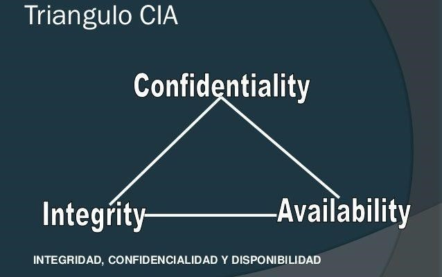
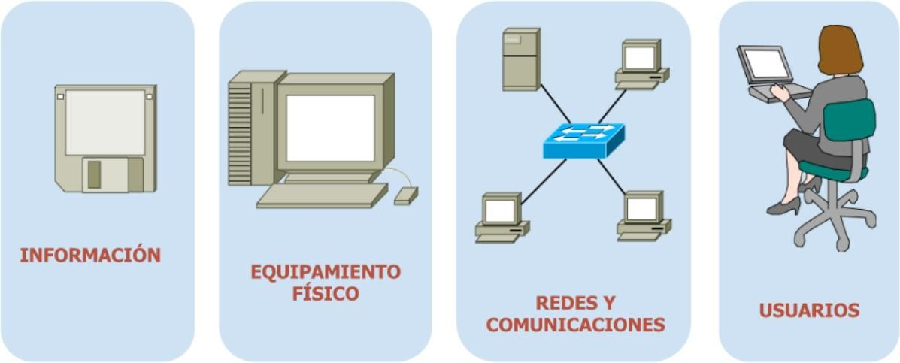
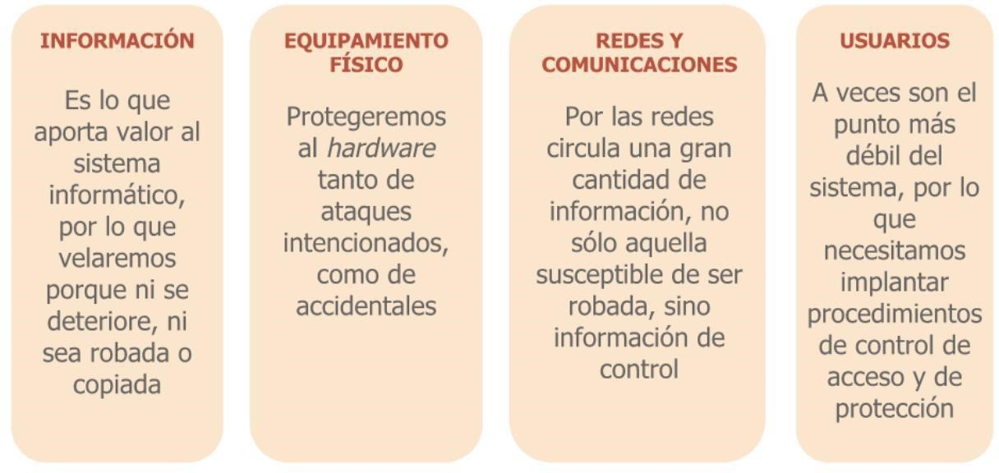
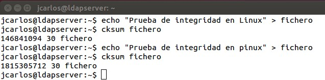
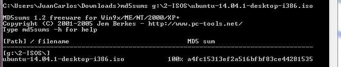
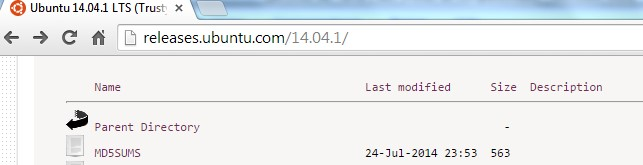
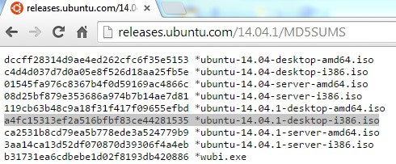
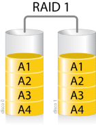
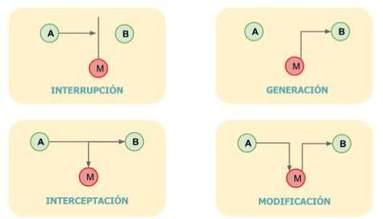

#+INCLUDE: "../../../common/header.org"
#+TITLE:    1.1. Principios de seguridad y alta disponibilidad
#+SUBTITLE: 
#+KEYWORDS: 

* Introducción

#+attr_latex: :width 0.55\textwidth

* Definición de información
- En el entorno empresarial, la *información* se define como el activo que posee valor para una organización.
- Requiere una protección adecuada para:
  - Asegurar la *continuidad del negocio*
  - Minimizar los daños a la organización
  - Maximizar el retorno de las inversiones y las oportunidades de negocio

* Definición de seguridad
- La *seguridad informática* es el conjunto de herramientas, técnicas, dispositivos y procedimientos orientados a conseguir, mejorar o garantizar determinados niveles de:
  - *Confidencialidad*
  - *Disponibilidad*
  - *Integridad*
  - *Autenticidad*
  - *No repudio*
- de la información con la que trabaja un sistema informático.

- Definiciones en la norma *ISO 27002*
  - Traducción al español: *UNE-ISO/IEC 17799*

#+reveal: split

- Cita de *Eugene H. Spafford*:

  "El único sistema que es totalmente seguro es aquel que se encuentra apagado y desconectado, guardado en una caja fuerte de titanio que está enterrada en cemento, rodeada de gas nervioso y de un grupo de guardias fuertemente armados. **Aún así, no apostaría mi vida en ello**."

#+attr_latex: :width 0.3\textwidth

* Problemática de las redes de comunicaciones
- Compartimos recursos
- Sistema complejo
- Perímetro desconocido
- Múltiples puntos de ataque
- Todo ello genera *vulnerabilidades* en el sistema
  - Una **vulnerabilidad** es una debilidad de un activo o grupo de activos que puede ser explotada por una o más amenazas.

#+reveal: split
- [[https://unaaldia.hispasec.com/?s=vulnerabilidad][Últimas vulnerabilidades]]

** Análisis de vulnerabilidades
- Uso de *herramientas especializadas* para examinar sistemas:
  - Fallos de seguridad, configuraciones incorrectas o debilidades del software
  - Pruebas exhaustivas para identificar vulnerabilidades conocidas y desconocidas
- El *análisis manual* es fundamental
  - Inspecciones detalladas y personalizadas
  - Permite una comprensión más profunda de los sistemas y sus riesgos

* ¿Qué debemos proteger?
- Los sistemas informáticos (SSOO, servicios o aplicaciones) se dice que son *seguros* si cumplen las siguientes características u objetivos:

#+attr_latex: :width 0.8\textwidth

#+reveal: split
#+attr_latex: :width 0.9\textwidth

#+reveal: split
#+attr_latex: :width 0.9\textwidth

** Confidencialidad (o privacidad)
- Garantía de que la información sea accesible *solo* por aquellos usuarios o sistemas autorizados
- Ejemplo: cifrar un archivo con contraseña que solo conocen unos pocos usuarios

** Integridad (o confiabilidad)
- La información es *la misma desde que fue generada*: que no se haya manipulado o corrompido
  - No puede ser modificada por personas no autorizadas
- Ejemplos:
  - Generar un código *hash* para un archivo
  - *Firmas digitales*
  - *Control de versiones*
  - Sistema de *detección de intrusos* (alertan sobre cambios no autorizados)

- Comprobación de integridad /anti-rootkit/:
  - Windows: **md5sum**, **SFC** (System File Checker)
  - GNU/Linux: **cksum**, **Rootkit Hunter**

#+reveal: split

- Un *pequeño cambio* en el contenido del archivo se transforma en un *gran cambio* en el valor del *sum*.

#+attr_latex: :width 0.8\textwidth

#+reveal: split

- Ejemplo práctico: *md5sum* en Windows

#+attr_latex: :width 0.8\textwidth

#+reveal: split

#+attr_latex: :width 0.6\textwidth

#+reveal: split

- Ejemplo práctico: *md5sum* en GNU/Linux

#+attr_latex: :width 0.8\textwidth

- [[https://www.wikiversus.com/informatica/como-calcular-suma-comprobacion-checksum-md5-en-windows/][Guía para probar en W10 o W11 de forma nativa con Powershell]]

** Disponibilidad (o accesibilidad)
- Los usuarios o sistemas con privilegios pueden acceder a la información *sin problemas* durante los periodos de tiempo establecidos
- El sistema *se recupera automáticamente* ante errores
- Ejemplos:
  - Sistema de Alimentación Ininterrumpida (**SAI**)
  - Creación de sistemas **RAID** (por ejemplo, FreeNAS)
  - Imagen de disco en Linux: =dd if=/dev/sda of=/dev/sdb=
  - **CPD**
  - Comprobación de disponibilidad de servicios, protocolos y aplicaciones: **NMAP**, **MBSA**, etc.

#+reveal: split

- *Alta disponibilidad* (High Availability): aplicaciones y datos operativos en todo momento y sin interrupciones, de *carácter crítico*
  - Mantener sistemas funcionando *24 horas, 7 días a la semana y 365 días al año* a salvo de interrupciones
  - El mayor nivel acepta 5 minutos de inactividad al año
  - /Disponibilidad de cinco nueves/: **99,999%**

#+attr_latex: :width 0.25\textwidth

#+reveal: split

- El **CPD** (**Centro de Proceso de Datos**) es la instalación donde se concentran los recursos para el tratamiento de la información
- Debe estar protegido frente a amenazas físicas y lógicas

#+attr_latex: :width 0.5\textwidth

** Autenticidad / Autenticación
- Asegura la *identidad* del equipo, los mensajes o usuario que genera la información
- En ocasiones se utilizan *terceras partes confiables* (Autoridad de Certificación) para autenticar
- Ejemplos:
  - Firma digital de un fichero
  - Certificado digital
  - Login + password

** No repudio
- Mecanismo que permite que *ninguno de los participantes* de una comunicación *niegue su participación* en la misma
- *No repudio en el origen*: el emisor no puede negar que envió el mensaje
  - Ejemplo: un mensaje firmado digitalmente por el emisor
- *No repudio en el destino*: el receptor no puede negar que lo recibió
  - Ejemplo: mensaje firmado digitalmente por el emisor

#+reveal: split

- Para conseguir el no repudio se cuenta con terceras partes confiables (Autoridad de Certificación)
- *No repudio en el origen* y *autenticidad* son objetivos estrechamente relacionados

** Servicios frente a ataques

#+ATTR_LATEX: :align |l|p{7cm}|
| *Servicio*       | *Ataque*                                    |
|------------------+---------------------------------------------|
| Disponibilidad   | Interrupción (p. ej. DoS)                   |
| Confidencialidad | Intercepción (p. ej. Man in the middle)     |
| Integridad       | Modificación (p. ej. SQL Injection)         |
| Autenticación    | Falsificación (p. ej. robo de credenciales) |
| No repudio       | Negación (p. ej. operación desde WIFI ajena)|

- **Impacto**: medición y valoración del daño que puede producir a la organización un incidente de seguridad

* Tipos de amenazas
- La *ingeniería social* es una técnica de manipulación que aprovecha el eslabón más débil del sistema de información: *el humano*
  - Una de las técnicas más usadas por los ciberdelincuentes para ganarse la confianza del usuario desprevenido y conseguir que entregue sus claves privadas o compre en sitios web fraudulentos
- Los tipos de amenazas se clasifican en tres:
  - Producidas por *personas*
  - *Lógicas*
  - *Físicas*

** Amenazas producidas por personas
- Son la *principal fuente de amenaza* para un sistema
- Personal de la organización, ex-empleados, curiosos, hackers, crackers, ciberterroristas, sniffers, carders

#+reveal: split

- *Personal de la organización*: a veces de forma accidental, pero si es intencionada es muy dañino (conoce lo valioso y la infraestructura)
- *Ex-empleados*: aprovechan la falta de mantenimiento de los perfiles de acceso
- *Curiosos*: realizan *ataques pasivos* (obtener información sin destruir o modificar la original)
- *Hackers*: expertos en acceder a sistemas protegidos (no siempre con objetivo perjudicial)

#+reveal: split

- *Crackers*: hackers con objetivos perjudiciales, a menudo contratados para espionaje empresarial
- *Ciberterroristas*: espías y saboteadores informáticos que trabajan para países y organizaciones
- *Sniffers*: expertos en redes que analizan el tráfico para extraer información de los paquetes
- *Carders*: atacan los sistemas de tarjetas, como los cajeros automáticos

** Amenazas lógicas
- *Vulnerabilidades de software*: errores de programación (/bugs/) o situaciones no previstas (/excepciones/)
  - El software que aprovecha dichos fallos para atacar se llama *exploit*
- *Canales ocultos*: transferencia de información por medios no destinados a ese propósito
  - Ejemplo: un *keylogger* que envía lo tecleado a un atacante remoto
- *Virus*: programa malicioso que se introduce sin permiso o conocimiento para alterar el funcionamiento del sistema

#+reveal: split

- *Worms (gusanos)*: parecidos a los virus, pero con capacidad de *autopropagarse* a través de las redes (normalmente mediante correo basura o spam)
- *Caballos de Troya (troyanos)*: malware que se presenta como legítimo e inofensivo, pero que da al atacante acceso remoto al equipo
- *Rootkits*: conjunto de software que permite un acceso de privilegio continuo *ocultando su presencia* al control de los administradores

#+reveal: split

- *Backdoors (puertas traseras)*: programa malicioso que proporciona al atacante un acceso remoto no autorizado, oculto en segundo plano
- *Spyware (software espía)*: recopila información del ordenador y la transmite a un equipo remoto sin consentimiento (suele confundirse con el *adware*)
- *Hijackers (secuestro)*: técnicas ilegales de adueñamiento o robo de información (conexiones, sesiones, servicios, navegador, etc.)

#+reveal: split

- *Bombas lógicas*: parte de código que permanece sin realizar ninguna función hasta que es activada (ausencia o presencia de ciertos ficheros, llegada de una fecha/hora concreta, etc.)

** Amenazas físicas

- *Acceso físico*: cuando existe acceso físico a un recurso, ya no existe seguridad alguna sobre el mismo
  - Acceso al lugar donde se encuentra un servidor de personal no autorizado
  - Una entrada de red donde se pueda conectar un ordenador
- *Desastres del entorno y averías del hardware*: picos de sobretensión, apagones que afecten a los servidores, incendios, etc.

#+reveal: split

- *Radiaciones electromagnéticas*: cualquier aparato eléctrico emite radiaciones que se pueden capturar y reproducir con el equipamiento adecuado
- *Desastres naturales*: gotas frías, inundaciones por riadas, lluvias torrenciales, terremotos, etc.

#+reveal: split

- Otra clasificación de las amenazas: [[https://es.wikipedia.org/wiki/Guerra_inform%C3%A1tica][Guerra informática]]
- Otros conceptos de seguridad informática: /pretesting/, /sextorsión/, /baiting/, /shoulder surfing/, /dumpster diving/...
  - [[https://boletines.educa.madrid.org/boletin/3755a6e866fa5288eddcc137e933c6aa][más info]]

* Tipos de ataques
- Los principales ataques que puede sufrir un sistema si se aprovechan sus vulnerabilidades son:

#+ATTR_LATEX: :align |l|p{8cm}|
| *Nombre del ataque* | *Descripción*                                                              |
|---------------------+----------------------------------------------------------------------------|
| *Interrupción*      | Un recurso del sistema o de la red deja de estar disponible debido a un ataque |
| *Generación*        | Falsificación del sistema. Se crea un producto difícil de distinguir del auténtico |
| *Interceptación*    | Un intruso accede a la información de nuestro equipo o a la que enviamos por la red |
| *Modificación*      | La información ha sido modificada sin autorización, por lo que ya no es válida |

#+reveal: split

#+attr_latex: :width 0.85\textwidth

#+reveal: split

- Como ningún sistema es 100% seguro, un *incidente de seguridad* es la materialización de una amenaza
- Debemos:
  - Minimizar las posibilidades de *intrusión*
  - Minimizar el tiempo de *detección* de intrusiones
  - Minimizar el tiempo de *actuación* ante dichas intrusiones
  - *Reconstruir* el estado en el que estaba el sistema

* Análisis y gestión de riesgo
- Proceso que comprende:
  - Identificación de *activos* informáticos
  - Sus *vulnerabilidades* y las *amenazas* a las que están expuestos
  - *Probabilidad* de ocurrencia e *impacto* de las mismas
- Determina los *controles* adecuados para *aceptar, disminuir, transferir o evitar* la ocurrencia del riesgo
- Un riesgo explotado causa daños o pérdidas financieras o administrativas

#+reveal: split

- Los controles, para que sean efectivos, deben implementarse *en conjunto* formando una *arquitectura de seguridad*
  - Preserva las propiedades de confidencialidad, integridad y disponibilidad de los recursos

* Proceso de análisis de riesgos informáticos
- El análisis de riesgo genera habitualmente un documento: la *matriz de riesgo*
  - Elementos identificados, la manera en que se relacionan y los cálculos realizados
- Indispensable para lograr una correcta *administración del riesgo* (gestión de los recursos de la organización)
- Diferentes tipos de riesgo: *riesgo residual* y *riesgo total*
- Tratamiento, evaluación y *gestión* del riesgo

* Herramientas de análisis y gestión de riesgos
** Política de seguridad
- Recoge las *directrices u objetivos* de una organización con respecto a la seguridad de la información
- *Objetivo principal*: concienciar a todo el personal de la necesidad de conocer qué principios rigen la seguridad y cuáles son las normas para conseguir los objetivos
- El contenido depende de la realidad y de las necesidades de la organización
- Estándares por países y áreas; los más internacionales son los de la *ISO*

#+reveal: split

- Una política de seguridad contendrá los objetivos de la empresa, englobados en 5 grupos:
  1. Identificar las necesidades de seguridad, los riesgos y evaluar los *impactos* ante un ataque
  2. Relacionar las *medidas de seguridad* que deben implementarse para afrontar los riesgos
  3. Proporcionar una perspectiva general de las *reglas y procedimientos* para los diferentes departamentos
  4. Detectar todas las *vulnerabilidades* y controlar los fallos de los activos
  5. Definir un *plan de contingencias*

** Ejemplos de herramientas
- **MAGERIT**: metodología de análisis y gestión de riesgos (/Methodology for Information Systems Risk Analysis and Management/)
- **PILAR**: procedimiento informático-lógico para el análisis y gestión de riesgos que sigue la metodología MAGERIT
  - De uso exclusivo de la *Administración Pública Española*

- Documento de apoyo: [[file:Plan de contingencia - Guia y ejemplo.pdf][Plan de contingencia: guía y ejemplo]]

* Auditoría
- Proceso llevado a cabo por profesionales capacitados que consiste en *recoger, agrupar y evaluar evidencias*
- Determina si un Sistema de Información:
  - Salvaguarda el *activo empresarial*
  - Mantiene la *integridad* de los datos
  - Lleva a cabo eficazmente los *fines* de la organización
  - Utiliza *eficientemente* los recursos
  - Cumple las *leyes y regulaciones* establecidas

** Tipos de auditoría
- *Auditoría interna*: se realiza desde dentro de la empresa, sin contratar a personas ajenas
- *Auditoría externa*: la empresa contrata a personas de fuera para que realicen la auditoría
- Auditar consiste principalmente en *estudiar los mecanismos de control* implantados
  - Determinar si son adecuados y cumplen los objetivos o estrategias
  - Establecer los cambios que deberían realizarse

** El informe de auditoría
- Tras el análisis e identificación de vulnerabilidades, el informe contiene como mínimo:
  - Descripción y características de los *activos* y *procesos* analizados
  - Análisis de las *relaciones* y *dependencias* entre activos o en el proceso de la información
  - Relación y evaluación de las *vulnerabilidades* detectadas
  - Verificación del cumplimiento de la *normativa*
  - Propuesta de *medidas* preventivas y de corrección

** Herramientas de análisis
- *Manuales*: observación de activos, procesos y comportamientos, mediciones, entrevistas, cuestionarios, cálculos, pruebas de funcionamiento
- *Software específico (CAAT)*: Computer Assisted Audit Techniques
  - Mejoran la eficiencia de la auditoría
  - Proporcionan una imagen en tiempo real del SI
  - Realizan pruebas de control y emiten informes con vulnerabilidades y normativas incumplidas

#+reveal: split

- La auditoría puede ser:
  - *Total*: sobre todo el sistema de información
  - *Parcial*: sobre determinados activos o procesos

* Plan de contingencias
- Instrumento de gestión con las medidas que garantizan la *continuidad del negocio*
  - Protege el SI de los peligros que lo amenazan
  - O lo recupera tras un impacto
- Consta de *tres subplanes independientes*:
  - Plan de *respaldo*
  - Plan de *emergencia*
  - Plan de *recuperación*

** Plan de respaldo
- Ante una amenaza, se aplican medidas *preventivas* para evitar que se produzca un daño
- Ejemplos:
  - Crear y conservar en lugar seguro *copias de seguridad*
  - Instalar *pararrayos*
  - Hacer *simulacros* de incendio

** Plan de emergencia
- Contempla qué medidas tomar cuando la amenaza *se está materializando* o acaba de producirse
- Ejemplos:
  - *Restaurar* de inmediato las copias de seguridad
  - Activar el sistema automático de *extinción de incendios*

** Plan de recuperación
- Indica las medidas que se aplicarán cuando *se ha producido un desastre*
- El objetivo es evaluar el impacto y regresar lo antes posible a un estado *normal de funcionamiento*
- Ejemplos:
  - Tener un *lugar alternativo* donde continuar la actividad
  - Sustituir el material deteriorado
  - Reinstalar aplicaciones y restaurar copias de seguridad

* Referencias
#+include: "../../../common/footer.org"