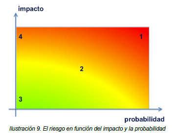
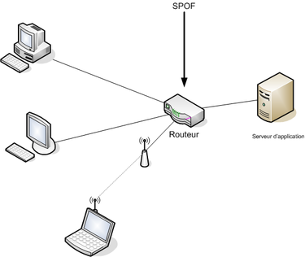

# https://docs.google.com/document/d/14aDD6iO5C_KYfjl0nkfOndUVUS6b71ujUVUdkrTNW9U/edit
#+INCLUDE: "../../../common/header.org"
#+TITLE: Análisis de riesgos
#+OPTIONS:   toc:2

* Análisis de riesgos

El *Análisis de riesgos* consiste en estudiar, analizar, reflexionar y proponer medidas de seguridad fijándose en algunos aspectos de un sistema de información. Es decir, es un estudio dirigido, acotado... destinado a reflexionar sobre una parte o unos aspectos concretos de la seguridad.

Este análisis suele dar como resultado *documentación escrita*. Es decir, el análisis tiene valor en sí mismo, pero es necesario darlo a conocer.

Existen modelos formales que nos ayudan a saber qué pasos realizar para hacer un análisis de riesgos de calidad y exhaustivo (ej MAGERIT).
** Elementos de estudio

*** ACTIVOS:

En lenguaje informal (y en contabilidad), un activo es cualquier cosa que tenga valor para la empresa.

En el ámbito del análisis de riesgos, se denomina así a cualquier recurso de la empresa que sea necesario para que el sistema de información funcione de forma adecuada. Son activos elementos de los datos, el software, el hardware, el personal, las redes, las instalaciones e incluso los servicios y actividades de la empresa. En un análisis de riesgos los enumeraremos y explicaremos lo que son.

*** AMENAZAS:

Se entiende por amenaza la presencia de uno o más factores de diversa índole que -de tener la oportunidad- afectarían al sistema objeto de estudio produciéndole daños.

Hay muchos tipos de amenazas... cortes eléctricos, fallos en hardware, riesgos ambientales, acciones intencionadas, software malicioso, robo, destrucción de información, modificación de información... seguro que se te ocurren un montón.

- Personal de la organización: A veces amenaza de forma accidental, pero si lo hace de forma intencionada es muy dañino, pues es quien mejor conoce lo que es valioso para la empresa y quien mejor puede conocer la infraestructura y el equipamiento. 
- Ex-empleados: En numerosas ocasiones aprovechan la falta de mantenimiento de las organizaciones, que no siempre mantienes actualizados los perfiles de acceso a sus sistemas. Un ex-empleado tiene una motivación extra al amenazar un sistema. 
- Curiosos: Personas que, en general, realizan ataques pasivos (Obtener información sin destruir o modificar la original). 
- Hackers: Aunque no siempre lo hacen con un objetivo perjudicial, los hackers son expertos informáticos en acceder a sistemas protegidos. Muchos de ellos acaban convirtiéndose en analistas de seguridad. 
- Crackers: Son hackers con objetivos perjudiciales, En numerosas ocaciones, contratados para realizar espionaje empresarial. 
- Ciberterrorista: Expertos en informática e intrusiones en la red que trabajan para países y organizaciones como espías y saboteadores informáticos. 
- Sniffers: Expertos en redes que analizan el tráfico para obtener información extrayéndola de los paquetes que se transmiten por la red. 
- Carders: Personas que se dedican al ataque de los sistemas de tarjetas, como los cajeros automáticos. 
- Virus: Un virus informático es un programa malicioso que se introduce en un ordenador, sin permiso o sin conocimiento de su usuario, para alterar su funcionamiento y, particularmente, con la finalidad de modificar o dañar el sistema. Por norma general, se asocian a un archivo ejecutable, quedando el equipo infectado cuando se abre dicho archivo. 
- Worms (gusanos): parecidos a los virus, pero con la capacidad de autopropagarse a través de las redes, normalmente mediante correo basura o spam 
- Caballos de Troya o Troyanos: Es un malware que se presenta al usuario como un programa aparentemente legítimo e inofensivo, pero que, al ejecutarlo, le brinda a un atacante acceso remoto al equipo infectado. 
- Rootkits: Es un conjunto de software que permite un acceso de privilegio continuo a un ordenador pero que mantiene su presencia activamente oculta al control de los administradores al corromper el funcionamiento normal del sistema operativo o de otras aplicaciones. 
- Backdoors (puertas traseras): es un programa malicioso usado para proporcionar al atacante un acceso remoto al ordenador comprometido no autorizado explotando las vulnerabilidades del sistema. Un backdoor funciona en el segundo plano del sistema y se esconde del usuario. 
- Spyware (software espía): Es un malware que recopila información de un ordenador y se transmite a un equipo remoto sin el conocimiento o el consentimiento del propietario del ordenador. Habitualmente se confunde con el Adware.  
- Hijackers (secuestro): Hace referencia a toda técnica ilegal que lleve consigo el adueñamiento o robo de algo (generalmente información) por parte de un atacante, es por tanto un concepto muy abierto y que puede aplicarse a varios ámbitos, de esta manera podemos encontramos con el adueñamiento o secuestro de conexiones de red, sesiones de terminal, servicios, navegador, etc. 
- Bombas lógicas: partes de código de ciertos programas que permanecen sin realizar ninguna función hasta que son activadas (ausencia o presencia de ciertos ficheros o la llegada de una fecha/hora concreta 
- Desastres del entorno y averías del hardware: Dentro de este grupo estarían incluidos sucesos que, sin llegar a la categoría de desastres naturales, pueden tener un impacto igual de importante si no se habilitan las medidas de protección adecuadas: hablamos, por ejemplo, de picos de sobretensión que puedan quemar componentes, apagones que afecten a los servidores, incendios, apagones y similares. 
- Radiaciones electromagnéticas: Sabemos que cualquier aparato eléctrico emite radiaciones y que dichas radiaciones se pueden capturar y reproducir si se dispone del equipamiento adecuado. 
- Desastres naturales: Aquí englobamos gotas frías, las inundaciones por riadas o las lluvias torrenciales puntuales, terremotos, etc. 

Pero en función del daño o manipulación que puedan hacer sobre la información, suelen caer en uno de éstos grupos:

-  De *interrupción*: se deshabilita el acceso a la información, se cortan comunicaciones o accesos.

-  De *interceptación*: se capta la información por personas o elementos no autorizados

-  De *modificación*: La información se altera, bien definitiva o bien circunstancialmente

-  De *fabricación*: se genera información nueva y fraudulenta o errónea.

Como ya comentamos, según su origen pueden ser:

-  Fortuitas (o accidentales)

-  Fraudulentas (o intencionadas)

*** VULNERABILIDADES:

Cada activo es vulnerable en cierto grado a algunas amenazas. Las amenazas sólo afectan a los activos vulnerables. Es necesario estudiar qué activos son vulnerables a qué amenazas.

Ej: (Un tanto exagerado). Imaginemos la siguiente amenaza: "Lluvia de meteoritos desde el espacio exterior que caen sobre nuestra población".

Si los activos que pueden verse afectados son "Yo mismo" y "Superman"... El primer activo es totalmente vulnerable a la amenaza... El segundo activo es prácticamente invulnerable.

Otro ejemplo: El virus "Sasser" estaba programado para aprovecharse de algunas vulnerabilidades de algunos sistemas operativos de la serie Windows. Algunos sistemas Windows eran totalmente vulnerables... otros sólo parcialmente o eran completamente invulnerables. Todos los sistemas tipo unix eran invulnerables.

*** RIESGOS

Riesgo es la probabilidad de que se materialice una amenaza y produzca un daño sobre un activo aprovechando su vulnerabilidad ante dicha amenaza. Es decir... la definición de *riesgo* está íntimamente ligada por un lado a los activos y sus vulnerabilidadades, y por otro a las amenazas.

Ej.: Siguiendo con el ejemplo anterior... el *riesgo* de que se produzca una lluvia de meteoritos sobre ésta población y me afecte a mí (el activo) es muy bajo. (No se conocen lluvias de meteoritos en los últimos siglos sobre esta población).

El riesgo de un virus tipo "Iloveyou" o "wannacry" afecte a un sistema Windows fue muy alto, ya que están diseñados específicamente para propagarse y aprovechar vulnerabilidades de éstos. Pero ya no es tan probable que virus parecidos puedan volver a producirse.

Lo importante de los riesgos es *estimarlos...* hacer una estimación de la probabilidad de que aparezca la amenaza y afecte a un determinado activo.

Ante la detección de un riesgo, se puede optar por tres alternativas:

- *Asumirlo, y no prevenirlo*. Ésto resulta lógico cuando el perjuicio esperado tiene poco valor o cuando el coste de la aplicación de medidas preventivas supera el de la reparación del daño. (Véase "*Plan de contingencias*". En éste caso, es útil. Si no prevengo un riesgo, al menos, saber cómo afrontarlo) Se pueden poner medidas de seguridad pasivas.

- *Prevenirlo*: Aplicar medidas de seguridad activa para disminuirlo o anularlo.

-  *Transferirlo*. Traspasar a un tercero la gestión de ese riesgo: típicamente, *contratar un seguro* para ese riesgo. Tiene sentido cuando el coste de la prevención es elevado, también el de la reparación... pero el riesgo de que ocurra es bajo.

*** ATAQUE:

Llamamos *ataque* a la materialización de una amenaza, independientemente de que su origen sea fortuito o intencionado.

En función del impacto causado y la propiedad del sistema vulnerada, los ataques se clasifican en:

-  *ataques activos*: Si se modifica, daña o suprime información o si se bloquean los canales de comunicación (Es decir, se compromete la /integridad/ o la /disponibilidad/ del sistema

-  *ataque pasivo*: Si solamente se accede a información de manera no autorizada o por canales no autorizados (Es decir, se compromete la /confidencialidad/ del sistema).

| Nombre del ataque | Descripción                                                                                                                                                                                                  |
|-------------------+--------------------------------------------------------------------------------------------------------------------------------------------------------------------------------------------------------------|
| Interrupción      | Un recurso del sistema o la red deja de estar disponible debido a un ataque.                                                                                                                                 |
| Generación        | Falsificación del sistema. Se crea un producto (por ejemplo, una página Web) difícil de distinguir del auténtico y que puede utilizarse para hacerse, por ejemplo, con información confidencial del usuario. |
| Interceptación    | Un intruso accede a la información de nuestro equipo o a la que enviamos por la red.                                                                                                                         |
| Modificación      | La información ha sido modificada sin autorización, por lo que ya no es válida.                                                                                                                              |

*** IMPACTO:

El impacto es la consecuencia de un ataque (producido ya o supuesto). Dicho de otra forma, son los daños causados por un ataque, existente o no.

Los impactos se puede estimar:

-  De forma *cuantitativa*, cuando se puede expresar en términos económicos.

-  De forma *cualitativa*, cuando esos daños no se pueden cuantificar (ej: pérdida de derechos fundamentales, pérdida de vidas, daños morales, de imagen...)

** SPOF (/Single Point of Failure/)

En seguridad, un *single point of failure* o SPOF ("punto único de fallo") es un componente de un sistema que tras un fallo en su funcionamiento ocasiona un fallo global en el sistema completo, dejándolo inoperante. Un SPOF puede ser un componente de hardware, software o eléctrico. Un SPOF es siempre un *riesgo*.

Es conveniente tener identificados los posibles SPOFs de un sistema informático, ya que si no estamos dispuestos a asumir el riesgo de un fallo, habrá que tratarlos con especial dedicación.

En sistemas en los que se quiere lograr alta disponibilidad, los componentes del SPOF suelen ser redundados.

#+caption: En una red de ordenadores, un único enrutador probablemente es un SPOF.

** El proceso del análisis de riesgos:

Para realizar un análisis de riesgos, en primer lugar estudiaremos el caso que tengamos entre manos, tratando de encontrar sus elementos.

Después, deberíamos seguir un cierto esquema, que, sin duda pasa por estos puntos:

-  *Enumerar y valorar los activos*: decir cuáles son los implicados en el caso, cuál es su función, qué contienen, en qué actividades se ven involucrados, quién los utiliza... etc.

-  *Identificar y valorar las vulnerabilidades* de cada activo ante cada amenaza: dadas las amenazas a estudiar, algunos activos presentarán vulnerabilidades, otros no, y otros sólo en cierto grado o aspecto: reflexionar sobre ello y plasmarlo.

-  *Identificar y valorar las amenazas que pueden afectar a los activos*: definir qué amenazas pueden tener impacto sobre los activos enumerados... en qué consisten, en qué circunstancias se producirían

-  *Determinar la medida de los riesgos:* Cada amenaza tendrá una cierta probabilidad de aparición, y, según las vulnerabilidades de cada activo a cada amenaza, supondrá un cierto nivel de riesgo. Es necesario /estimarlo,/ si es posible, con datos o herramientas que lo refrenden, y plasmarlo convenientemente.

-  *Identificar y evaluar las medidas de seguridad existentes*: qué medidas hay ya tomadas en el sistema. Cómo afectan a las amenazas, activos y vulnerabilidades descritas.

-  *Identificar los objetivos de seguridad de la organización*. ¿Qué es lo que queremos lograr? ¿Para qué estamos haciendo éste análisis?

-  *Determinar el impacto de un ataque:* Si el ataque se ha producido, describirlo y evaluar su impacto. De las posibles amenazas no materializadas, intentar /estimar/ su supuesto impacto.

-  *Identificar y seleccionar las medidas de seguridad propuestas*: proponer medidas de seguridad, tanto activas como pasivas para reducir los riesgos. Es conveniente estimar sus costes, tanto de implantación como de mantenimiento.

   -  Es necesario establecer un orden en las medidas propuestas. Dar alternativas... Un análisis de riesgos debe concluir con varias aportaciones de seguridad activa o pasiva, que deben quedar perfectamente definidas.

   -  Si algunas de las aportaciones son excluyentes (ej.... optar por una o por otra), debe quedar perfectamente claro para el que lo lee, y cuál es la prioritaria y por qué.

   -  Las medidas de seguridad no siempre se proponen "sueltas"... normalmente se combinan de forma ordenada y lógica... en ese caso, forman un *mecanismo de seguridad*. Seguro que muchas de las mejores propuestas se expresan normalmente en forma de mecanismos, y no de medidas sueltas.

Es importante resaltar que las medidas de seguridad activas intentan eliminar una *vulnerabilidad*, mientras que las medidas de seguridad pasivas mitigan los impactos de un daño producido por una *amenaza*

#+caption: Resumen de medidas activas y pasivas

En conclusión.... el *análisis de riesgos* es mucho más que un documento... ES UN *ANÁLISIS*: un estudio y reflexión del profesional que lo realiza, y se refiere la seguridad de algún aspecto de un sistema informático, con aporte de soluciones para reducir los riegos, y estudio y evaluación de todos los elementos implicados, desde los puntos de vista más amplios posible.

Es la herramienta clave de la SEGURIDAD, tanto informática como de cualquier otro aspecto, y es el punto de partida hacia el aporte de soluciones. Lo emplearemos intensiva y extensivamente en los casos que veamos a lo largo del curso.

Más[[http://es.wikipedia.org/wiki/An%C3%A1lisis_de_riesgo][ /Análisis de riesgos/]] en Wikipedia.

** Herramientas para análisis de riesgos

- MAGERIT. Es una metodología de análisis y gestión de riesgos de los sistemas de información. En inglés Methodology for Information Systems Risk Analysis and Management. 
- PILAR. Es un procedimiento informático-lógico para el análisis y gestión de riesgos, que sigue la metodología MAGERIT. De uso exclusivo de la Administración Pública Española. 
* Políticas de seguridad

Llamamos así a las *directrices u objetivos* de una organización con respecto a la seguridad.

Toda organización debe tener recogidas esas directrices, que todas las personas involucradas de alguna manera con la empresa deben conocer y cumplir.

Las políticas de seguridad se refieren a todos los aspectos de seguridad de la empresa, pero por supuesto, habrá medidas referidas a los sistemas informáticos. Las medidas en ese sentido deben proponerse *a partir de los análisis de riesgos*.

Un análisis de riesgos es un documento técnico y exhaustivo. Si a partir de uno o varios análisis de riesgos se llega a una medida o mecanismo de seguridad que deba ser conocido y respetado por todos, debe estar plasmado en las *políticas de seguridad* de la empresa.

Las políticas de seguridad no son un documento técnico ni exhaustivo. Es un documento generalista y es para que todas las personas de la empresa lo conozcan y velen por el cumplimiento de las normas que exhibe.

Es un documento que debe ser aprobado por la dirección de la empresa y conocido por todos.

La parte referida a los sistemas informáticos será propuesta sin duda por personal técnico a partir de uno o más análisis de riesgos.

Existen estándares para realizar las políticas de seguridad de las empresas. Por ejemplo el ISO (International Organization for Standarization) define uno. [[https://administracionelectronica.gob.es/pae_Home/pae_Documentacion/pae_Metodolog/pae_Magerit.html#.WdSrHXWCyis][MAGERIT]] también.

Entre los puntos que debe cubrir la política de seguridad podemos destacar:

-  Identificar las necesidades de seguridad y riesgos

-  Relación de todas las medidas de seguridad

-  Reglas y procedimientos que deben aplicarse en los diferentes departamentos de la organización, y los que deben aplicarse con carácter general.

-  Mecanismos de detección de vulnerabilidades y fallos

-  Definir planes de contingencias para amenazas posibles.

* Plan de contingencias

Un plan de contingencias intenta describir los pasos a seguir ante la materialización de un amenaza.

Ante muchas amenazas, se pueden poner medidas preventivas (seguridad activa) que impidan que se materialicen en un ataque.

A menudo, esas medidas no se pueden poner (porque su coste es caro con respecto al riesgo que supone la amenaza) o a veces, a pesar de las medidas de seguridad activa, el ataque se produce.

Ante un ataque, algunas actividades de la empresa se verán afectadas, impidiendo su normal desarrollo.

Un plan de contingencias intenta organizar la manera de actuar ante la presencia de un ataque, de manera que el desarrollo de la actividad empresarial afectada pueda continuar.

Es decir, está enfocado a continuar con la actividad de la empresa aunque se produzca un ataque... NO a la continuidad del funcionamiento del sistema informático. 

#+ATTR_HTML: :style margin-left: auto; margin-right: auto;
| Lo importante no es el sistema informático, sino el sistema de información|

En ese sentido, para cada contingencia previsible (cada posible amenaza), debería existir un plan de contingencias (que se anexa a las políticas de seguridad), y que contenga cada uno al menos tres planes independientes:

-  *El plan de emergencia*: el que contempla qué hacer *cuando se está produciendo* un ataque o acaba de producirse: qué se debe hacer para continuar con las actividades empresariales afectadas. Debe ser una descripción clara y sencilla: debemos intentar que cada persona actúe de acuerdo al plan (sea bueno o menos bueno), de esa manera se intenta evitar la desorganización y el caos.

-  *Plan de respaldo*: Contempla las contramedidas preventivas *antes* de que se materialice una amenaza. Su finalidad es evitar dicha materialización.

-  *Plan de recuperación*: Contempla las medidas necesarias *después* de materializada y controlada la amenaza. Su finalidad es *restaurar* el estado de las cosas tal y como se encontraban antes de la materialización de la amenaza.

Los planes de contingencia forman parte de las políticas de seguridad de una empresa.

[más: [[http://es.wikipedia.org/wiki/Plan_de_Contingencias][/Planes de contingencia/]] en wikipedia]

* Auditorías de seguridad

En nuestro ámbito, una auditoría es un análisis pormenorizado de un sistema de información que permite descubrir, identificar y corregir vulnerabilidades en los activos que lo componen y en los procesos que se realizan.

Su finalidad es *verificar* que se cumplen los objetivos de la *política de seguridad* de la empresa.

Proporciona una idea actual del estado de seguridad e un sistema de información.

No obstante, la auditoría en sí misma se ha convertido en una parte importante de la seguridad.

Hablando en concreto de la Seguridad Informática, la auditoría tiene su propia dinámica.

** Pentesting (pruebas de penetración)

Es una prueba en la que se realizan ataques intencionados hacia uno o más sistemas de información por parte de especialistas en seguridad, y por encargo de la dirección de la empresa cliente, con el objetivo de debilitar alguna de las propiedades seguras encontrando vulnerabilidades

Un *pentesting* no es una *auditoría de seguridad*, aunque en el contexto de una auditoría puede solicitarse uno o más pentestings.

más:
-  /[[http://es.wikipedia.org/wiki/Auditoria_inform%C3%A1tica][Auditoría informática]]/ en wikipedia
-  /[[https://es.wikipedia.org/wiki/Examen_de_penetraci%C3%B3n][pentesting]]/ en wikipedia
   
#+caption: Diagrama de documentos del análisis de riesgos

