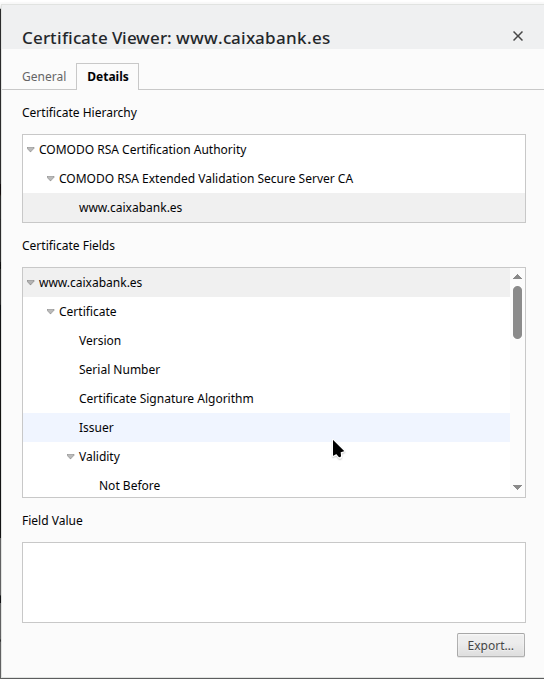

#+INCLUDE: "../../../common/header.org"
#+TITLE:  PKI
#+OPTIONS:   toc:2
#+HTML_HEAD: 

* Sistemas de confianza e intercambio de claves: la PKI y PGP
La criptografía asimétrica tiene una utilidad apasionante, pero también tiene un punto débil.  Si bien proporciona un cifrado prácticamente imposible de romper, se basa en la difusión de una clave pública, por mecanismos públicos, y que siempre va asociada a una identidad. Es decir, yo puedo generar una clave pública para mi y publicarla donde sea asociada a mi nombre o a mi dirección de correo... o a cualquier otro dato que me identifique.... /pero cualquiera puede hacer lo mismo suplantando mi identidad/. En ese supuesto caso... si un intruso pone en algun lugar público una dirección de correo y una clave pública diciendo que soy yo... un posible emisor de un mensaje podría confundirse y enviarle a él un mensaje cifrado pensando que soy yo. Él lo podría descifrar, dado que ha sido él quien ha creado la clave pública. 

La criptografía asimétrica necesita un mecanismo para autentificar la identidad de los receptores de los mensajes.

** PGP (Pretty Good Privacy)
PGP es un programa creado en 1991, para el intercambio de mensajes cifrados utilizando
criptografía asimétrica. El programa sigue hoy en día actualizado.

El grupo GNU tiene un programa parecido GnuPG y en cierto modo, compatible con PGP.
Con este programa uno puede generar sus propias claves, y difundir la pública.

Hay servidores web con aplicaciones web para intercambiar claves públicas. Estos funcionan bien para pequeñas organizaciones, donde la identidad de cada uno se pueda autenticar por otros medios.

Cuanto más grande el conjunto de usuarios de usuarios, también es más fácil la intrusión mediante suplantación de la clave pública en uno de éstos servidores de claves públicas PGP.

PGP es un buen medio para enviar mensajes cifrados, pero no para autenticar. La autenticidad de los certificados se basa en el llamado "anillo de confianza" en el cual, cuando una persona puede garantizar que un certificado de otra persona es de confianza, lo firma... si se distribuye el certificado firmado y quien lo recibe confía en el firmante, entonces confía también en el certificado original. Este proceso puede repetirse indefinidamente.... ir firmando los certificados y transmitirlos firmados es una manera de transmitir la confianza.

* x509 y la Public Key Infrastructure (PKI)
En otro ámbito, existe un estándar llamado x509, y propuesto por la ITU (Unión Internacional de Telecomunicaciones), que es el que se utiliza para los certificar la identidad de los sitios web que usan https, y también para la identificación y firma digital de personas en España, mediante el DNIe o el certificado de la Fábrica Nacional de Moneda y Timbre (FNMT)

Es un formato de intercambio de claves públicas, en lo que ellos llaman “certificados”.

Un certificado es un fichero que contiene en su interior al menos uno de éstos elementos:
- Datos de identificación de una persona u organización
- Una clave privada
- Una clave pública
- Una firma digital.

En cierto modo, x509 puede hacer lo mismo que PGP, sólo que con un propósito más general (PGP está orientado a los mensajes -nivel aplicación- y x509 es más multifuncional).

Alrededor del sistema x509 se ha montado una infraestructura de validación de certificados llamada PKI (Public Key Infrastructure). En ella, algunas entidades son CERTIFICADORAS. Firman certificados para otras entidades o personas. Generar un certificado es sencillo, se puede realizar de forma particular con una  aplicación. Estas entidades FIRMAN el certificado que otros generan. A estas entidades que firman se les denomina *Autoridades de Certificación (CA)*.

El sistema PKI está basado en que en el mundo existen una serie de CA, que garantizan la identidad de otras organizaciónes... A partir de ahí, las otras organizaciones a su vez pueden generar y firmar nuevos certificados para otras entidades o personas. Las claves públicas de las CA están incluídas en las distribuciones de nuestros navegadores y sistemas operativos.

En resumen... cualquier persona u organización puede tener un certificado y hacerlo público, que contenga: su identidad, su clave pública y una firma digital de quien lo ha emitido.  Para verificar su identidad, podemos comprobar la firma del certificado. Si quien lo ha emitido no es una CA, su certificado irá a su vez firmado por otra entidad... repetimos el proceso de verificación hasta llegar a la CA.

La PKI consiste en la infraestructura que permite la verificación de la identidad a partir de los certificados x.509 hechos públicos por distintos medios.

Si por cualquier motivo, no se puede autenticar un certificado x.509 (es decir, no se puede demostrar que la persona u organización que exhibe el certificado es quien dice ser), entonces el certificado vale igualmente para cifrar... pero ¿nuestro interlocutor es quien dice ser o podría ser un intruso suplantador?

Cada certificado cuenta con una firma que es posible verificar, hasta llegar a una CA. En el sistema PKI, a eso se le llama la ruta de certificación.

Ej: En la dirección web https://www.caixabank.es me muestran un certificado x509 para su uso en TLS
- Si miro los detalles, veo que el certificado de La Caixa
- va firmado por la empresa COMODO RSA secure server
- Que va firmado por COMODO RSA authority
- Del cual me fio en las preferencias

  

  

