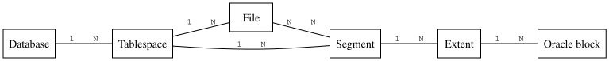

#+INCLUDE: "../../../common/header.org"
#+TITLE: Usuarios, privilegios y roles de *Oracle*
# #+OPTIONS: reveal_single_file:nil

* Introducción
- Oracle puede utilizarse simultáneamente por varios procesos y clientes
- Cada uno puede tener distintos permisos y capacidades
  - Espacio de disco disponible
  - Gasto en CPU, red
  - Acceso a diferentes tablas de datos

* /Tablespaces/
- *Oracle* almacena datos en los /tablespaces/
  - Conjuntos de ficheros
  - Normas para su tamaño: inicial, máximo, crecimiento
- Cada tablespace puede usarse para diferentes funciones
  - Datos de usuario o del sistema: /permanent tablespace/
  - Datos de recuperación: /undo tablespace/
  - Datos temporales: /temporary tablespace/

** Recordatorio: Tipos de fichero según su uso

- Permanentes (/permanent/)
  - Datos que deben ser guardados
  - Ejemplo: Empleados contratados, nóminas pagadas, declaraciones de impuestos,…
- De movimiento (/undo/)
  - Cambios que deben ser incluidos en archivos permanentes
  - Ejemplo: un puesto de peaje debe guardar todos los pagos con tarjeta, y enviarlos juntos
- De maniobra (/temporary/)
  - Se utilizan como extensión a la RAM de un ordenador, se borran cuando el proceso termina
  - Ejemplo: caché de disco de los navegadores

** ¿Por qué tantas normas?
- Disponibilidad
  - ¿Es mejor garantizar el espacio para las tablas?
  - ¿Es mejor ahorrar espacio mientras se pueda?
- Velocidad
  - Hacer crecer un fichero es lento
  - Un fichero que ha crecido poco a poco está disperso en el disco (y es más lento)
- Capacidad
  - Cada sistema de ficheros tiene un tamaño de fichero máximo

** /Tablespaces/ por defecto
- Por defecto, *Oracle* crea en una nueva base de datos
  - =users=: Tablespace asignado por defecto para los datos de todos los usuarios
  - =system=: Datos acerca de la instancia y del diccionario de datos
  - =sysaux=: Operaciones temporales del administrador que no caben en memoria
  - =undo= (=undotbs1=): Datos para deshacer las transacciones (=rollback=)
  - =temp=: Operaciones temporales de usuarios que no caben en memoria

#+reveal: split

#+begin_src sql
select tablespace_name, contents from dba_tablespaces;
#+end_src

-----
Mas información en:
- https://docs.oracle.com/cd/B19306_01/server.102/b14200/statements_7003.htm
- https://docs.oracle.com/cd/B19306_01/server.102/b14220/physical.htm

** Crear un /tablespace/
#+begin_src sql
CREATE TABLESPACE ejemplo_tablespace
  DATAFILE
  '/tablespaces/ejemplo_1.dbf'  SIZE 10M
  AUTOEXTEND ON  NEXT 200k  MAXSIZE 14M,
  '/tablespaces/ejemplo_2.dbf'  SIZE 10M
  AUTOEXTEND ON  NEXT 200k  MAXSIZE 14M;
#+end_src

Más en [[https://docs.oracle.com/en/database/oracle/oracle-database/19/sqlrf/CREATE-TABLESPACE.html][docs.oracle.com]]

** ¿Por qué es tan complicado?
- Esta flexibilidad permite:
  - Que cada usuario tenga sus /tablespaces/
  - Que cada /tablespace/ esté en discos distintos (rapidez)
  - Que un /tablespace/ se localice en varios discos (rapidez, tamaño)
  - Mover /tablespaces/ una vez creados

** Ejercicio: Llena un tablespace
- Crea un /tablespace/ con un tamaño inicial de 10MB, y un tamaño máximo de 14MB
- Crea una tabla sobre el /tablespace/
- Inserta datos en la tabla hasta conseguir el error =ORA-01653=

#+begin_comment
create table datos(valor varchar(2048)) tablespace ejemplo_tablespace;  
begin
    for j in 1..1 loop
        for i in 1..1000 loop
            insert into datos values( 'datos ' || i );
        end loop;
        commit;
    end loop;
end;
/
#+end_comment

** Ejercicio: /tablespace/ por defecto
- Consulta el /tablespace/ por defecto de los usuarios (=dba_users=)
- Cambia el /tablespace/ por defecto de un usuario (=alter user=)
- Consulta el /tablespace/ por defecto por (=DATABASE_PROPERTIES=)  
- Cambia el /tablespace/ por defecto por defecto (=alter database=)
  - Nota: esto cambia el /tablespace/ por defecto de todos los usuarios existentes
- Cambiar una tabla de tablespace: =ALTER TABLE ... MOVE TABLESPACE=  

#+begin_comment  
ALTER TABLE <TABLE NAME to be moved> MOVE TABLESPACE <destination TABLESPACE NAME>
#+end_comment

** Ejercicio: más /tablespaces/
1. Crea un /tablespace/ =PRUEBA1=
   - inicialmente 10M, máximo 20M
2. Crea un usuario
   - no le digas /tablespace/ por defecto
   - pero que al crearlo su /tablespace/ por defecto sea =PRUEBA1=
3. Crea una tabla
   - =MISDATOS(DATOS VARCHAR(255))=
4. Llena la tabla hasta que no quede espacio en =PRUEBA1=
5. Crea un /tablespace/ =PRUEBA2=
   - tamaño inicial igual al máximo, 30M
6. mueve =MISDATOS= a =PRUEBA2=
7. Vuelve a llenar la tabla hasta que se llene =PRUEBA2=

#+begin_comment
create tablespace PRUEBA1
  DATAFILE
  '/tablespaces/prueba1.dbf'  SIZE 10M
  AUTOEXTEND ON  NEXT 1M  MAXSIZE 20M;

ALTER DATABASE DEFAULT TABLESPACE prueba1;

alter session set "_oracle_script"=true;

create user usuarioprueba1 identified by a;
grant connect,resource to usuarioprueba1;
alter user usuarioprueba1 quota unlimited on prueba1;

connect usuarioprueba1/a
create table misdatos(datos varchar(255));

select * from dba_tables where tABLE_NAME='MISDATOS';

alter session set current_schema=prueba1;

BEGIN
  LOOP
     insert into misdatos values('hola');
     commit;
  end loop;

END;
/

create tablespace PRUEBA2
  DATAFILE
  '/tablespaces/prueba2.dbf'  SIZE 30M;

  
alter user usuarioprueba1 quota unlimited on prueba2;

connect usuarioprueba1/a
alter table misdatos move tablespace prueba2;

begin
  LOOP
     for i in 1 .. 10 loop
       insert into misdatos values('hola');
     end loop;
     commit;
  end loop;

END;
/

#+end_comment   

** Conceptos de almacenamiento
#+begin_src dot :file ./media/conceptos-almacenamiento.svg :exports results :cmdline -Tsvg
graph{
  //graph [nodesep=0.5, ranksep=0.5]
  node[ shape="box"]
  edge[fontname="courier", fontsize="10"]
  splines=true
  rankdir="LR"

  Database -- Tablespace [label="1    N"]
  Tablespace -- File[label="1    N"]
  File -- Segment [label="N    N"]
  Segment -- Extent [label="1    N"]
  Extent -- "Oracle block" [label="1    N"]

  Segment -- Tablespace[label="1    N"]

}
#+end_src

#+RESULTS:

Más información en [[https://docs.oracle.com/cd/B19306_01/server.102/b14220/logical.htm][Oracle.com]]
#+BEGIN_NOTES
https://www.erpgreat.com/oracle-database/tablespace-datafile-data-block-segment-extent.htm
Data Blocks

At the finest level of granularity, Oracle stores data in data blocks (also called logical blocks, Oracle blocks, or pages). One data block corresponds to a specific number of bytes of physical database space on disk. You set the data block size for every Oracle database when you create the database. This data block size should be a multiple 
of the operating system's block size within the maximum limit. Oracle data blocks are the smallest units of storage that Oracle can use or allocate.

Extents

The next level of logical database space is called an extent. An extent is a specific number of contiguous data blocks that is allocated for storing a specific type of information. 

Segments

The level of logical database storage above an extent is called a segment. A segment is a set of extents that have been allocated for a specific type of data structure, and that all are stored in the same tablespace. For example,each table's data is stored in its own data segment, while each index's datails stored in its own index segment. Oracle allocates space for segments in extents. Therefore, when the existing extents of a segment are full, Oracle allocates another extent for that segment. Because extents are allocated as needed, the extents of a segment may or may not be contiguous on disk. The segments also can span files, but the individual extents cannot. 

Databases and tablespaces 

An Oracle database is comprised of one or more logical storage units called tablespaces. The database's data is collectively stored in the database's tablespaces. 

Tablespaces and datafiles 

Each tablespace in an Oracle database is comprised of one or more operating system files called datafiles. A tablespace's datafiles physically store the associated database data on disk. 

Databases and datafiles 

A database's data is collectively stored in the datafiles that constitute each tablespace of the database. For example, the simplest Oracle database would have one tablespace and one datafile. A more complicated database might have three tablespaces, each comprised of two datafiles (for a total of six datafiles).  
#+END_NOTES

** ¿Si se pierde un fichero?
#+begin_example
ORA-01157: cannot identify/lock data file 46 - see DBWR trace file
ORA-01110: data file 46: '/home/students/usuario12/tablespaces/NUEVO_TB_2.dbf'
#+end_example
- Si se pierde un fichero
  - Mejor opción: recuperar un backup
  - Si no hay más remedio: borrarlo de la base de datos
  - Es necesario saber de qué PDB  

#+reveal: split
- Buscar el fichero que falta en todas las PDB
#+begin_src sql
show pdbs;
ALTER SESSION SET CONTAINER = <nombre de pdb>;

SELECT 
    df.file#,
    df.name AS file_name,
    ts.name AS tablespace_name,
    df.status,
    df.enabled
FROM v$datafile df
JOIN v$tablespace ts ON df.ts# = ts.ts#
where df.name like '%el fichero que se busca%'
ORDER BY df.file#;
#+end_src

#+reveal: split
- Borrar todos los ficheros necesarios
#+begin_src sql
ALTER SESSION SET CONTAINER = pdb_usuario12;

ALTER DATABASE DATAFILE 46 OFFLINE DROP;
ALTER DATABASE DATAFILE 50 OFFLINE DROP;
ALTER DATABASE DATAFILE 55 OFFLINE DROP;
ALTER DATABASE DATAFILE 57 OFFLINE DROP;
ALTER DATABASE DATAFILE 59 OFFLINE DROP;
ALTER DATABASE DATAFILE 61 OFFLINE DROP;
ALTER DATABASE DATAFILE 63 OFFLINE DROP;
ALTER DATABASE DATAFILE 65 OFFLINE DROP;
ALTER DATABASE DATAFILE 66 OFFLINE DROP;
ALTER DATABASE DATAFILE 67 OFFLINE DROP;
ALTER DATABASE DATAFILE 69 OFFLINE DROP;
ALTER DATABASE DATAFILE 70 OFFLINE DROP;
ALTER DATABASE DATAFILE 71 OFFLINE DROP;
alter session set container = cdb$root;
shutdown immediate;
startup open;
#+end_src

** listar todos los ficheros de todas las pdb :noexport:
#+begin_src bash :dir /ssh:oracle@oraclelinux-r8.local: :results raw drawer
#!/bin/bash
export ORACLE_HOME=/opt/oracle-install
export PATH=$ORACLE_HOME/bin:$PATH
export ORACLE_SID="asir"

# Get PDB list into bash array
mapfile -t PDBS < <(
sqlplus -S / as sysdba <<EOF
SET HEADING OFF FEEDBACK OFF PAGESIZE 0 TRIMSPOOL ON
SELECT name FROM v\$pdbs WHERE name <> 'PDB\$SEED';
EXIT;
EOF
)

echo "Found PDBs:"
printf '%s\n' "${PDBS[@]}"

echo "-----------------------------"

# Loop through each PDB and list datafiles
for pdb in "${PDBS[@]}"; do
  echo "PDB: $pdb"

  sqlplus -S / as sysdba <<EOF
SET LINES 200 PAGES 200 FEEDBACK OFF HEADING ON linesize 10000 echo off feedback off

ALTER SESSION SET CONTAINER=$pdb;

SELECT file_id, file_name
FROM dba_data_files
ORDER BY file_id;

EXIT;
EOF

  echo "-----------------------------"

done
#+end_src

#+RESULTS:
:results:
Found PDBs:
PDASIR
PDB_USUARIO15
PDB_AGONZALEZ
KK
PDB_USUARIO01
PDB_USUARIO02
PDB_USUARIO03
PDB_USUARIO04
PDB_USUARIO05
PDB_USUARIO06
PDB_USUARIO07
PDB_USUARIO08
PDB_USUARIO09
PDB_USUARIO10
PDB_USUARIO11
PDB_USUARIO12
PDB_USUARIO13
PDB_USUARIO14
PDB_USUARIO16
PDB_USUARIO17
PDB_USUARIO18
PDB_USUARIO19
PDB_USUARIO20
PDB_USUARIO21
PDB_USUARIO22
PDB_USUARIO23
PDB_USUARIO24
PDB_USUARIO25
PDB_USUARIO26
PDB_USUARIO27
PDB_USUARIO28
PDB_USUARIO29
-----------------------------
PDB: PDASIR

   FILE_ID FILE_NAME
---------- ---------------------------------------------------------------------------------------------------------------------------------------------------------------------------------------------------------------------------------------------------------------------------------------------------------------------------------------------------------------------------------------------------------------------------------------------------------------------------------------------------------------------------------
	 9 /opt/app/alumno/oradata/ASIR/04C9525F7DF04814E065000000000001/datafile/o1_mf_system_lhn2mtmb_.dbf
	10 /opt/app/alumno/oradata/ASIR/04C9525F7DF04814E065000000000001/datafile/o1_mf_sysaux_lhn2mtmk_.dbf
	11 /opt/app/alumno/oradata/ASIR/04C9525F7DF04814E065000000000001/datafile/o1_mf_undotbs1_lhn2mtml_.dbf
	12 /opt/app/alumno/oradata/ASIR/04C9525F7DF04814E065000000000001/datafile/o1_mf_users_lhn2n4o7_.dbf
	99 /opt/app/alumno/homes/OraDB21Home1/dbs/TBL1_1.dbf
       100 /opt/app/alumno/homes/OraDB21Home1/dbs/TBL1_2.dbf
       101 /home/alumno/tablespaces/TBL2_1.dbf
       102 /home/alumno/tablespaces/TBL2_2.dbf
-----------------------------
PDB: PDB_USUARIO15

   FILE_ID FILE_NAME
---------- ---------------------------------------------------------------------------------------------------------------------------------------------------------------------------------------------------------------------------------------------------------------------------------------------------------------------------------------------------------------------------------------------------------------------------------------------------------------------------------------------------------------------------------
       163 /opt/app/alumno/oradata/ASIR/datafile/pdb_usuario15system_lhn2bbc3_.dbf
       164 /opt/app/alumno/oradata/ASIR/datafile/pdb_usuario15sysaux_lhn2bbc5_.dbf
       165 /opt/app/alumno/oradata/ASIR/datafile/pdb_usuario15undotbs1_lhn2bbc5_.dbf
       166 /opt/app/alumno/oradata/ASIR/datafile/pdb_usuario15_users.dbf
-----------------------------
PDB: PDB_AGONZALEZ

   FILE_ID FILE_NAME
---------- ---------------------------------------------------------------------------------------------------------------------------------------------------------------------------------------------------------------------------------------------------------------------------------------------------------------------------------------------------------------------------------------------------------------------------------------------------------------------------------------------------------------------------------
	34 /home/alumno/tablespaces/A_1.dbf
	35 /home/alumno/tablespaces/A_2.dbf
       103 /opt/app/alumno/oradata/ASIR/datafile/pdb_agonzalezsystem_lhn2bbc3_.dbf
       104 /opt/app/alumno/oradata/ASIR/datafile/pdb_agonzalezsysaux_lhn2bbc5_.dbf
       105 /opt/app/alumno/oradata/ASIR/datafile/pdb_agonzalezundotbs1_lhn2bbc5_.dbf
       106 /opt/app/alumno/oradata/ASIR/datafile/pdb_agonzalez_users.dbf
-----------------------------
PDB: KK

   FILE_ID FILE_NAME
---------- ---------------------------------------------------------------------------------------------------------------------------------------------------------------------------------------------------------------------------------------------------------------------------------------------------------------------------------------------------------------------------------------------------------------------------------------------------------------------------------------------------------------------------------
	52 /opt/app/alumno/oradata/ASIR/datafile/KKsystem_lhn2bbc3_.dbf
	53 /opt/app/alumno/oradata/ASIR/datafile/KKsysaux_lhn2bbc5_.dbf
	54 /opt/app/alumno/oradata/ASIR/datafile/KKundotbs1_lhn2bbc5_.dbf
-----------------------------
PDB: PDB_USUARIO01

   FILE_ID FILE_NAME
---------- ---------------------------------------------------------------------------------------------------------------------------------------------------------------------------------------------------------------------------------------------------------------------------------------------------------------------------------------------------------------------------------------------------------------------------------------------------------------------------------------------------------------------------------
       107 /opt/app/alumno/oradata/ASIR/datafile/pdb_usuario01system_lhn2bbc3_.dbf
       108 /opt/app/alumno/oradata/ASIR/datafile/pdb_usuario01sysaux_lhn2bbc5_.dbf
       109 /opt/app/alumno/oradata/ASIR/datafile/pdb_usuario01undotbs1_lhn2bbc5_.dbf
       110 /opt/app/alumno/oradata/ASIR/datafile/pdb_usuario01_users.dbf
-----------------------------
PDB: PDB_USUARIO02

   FILE_ID FILE_NAME
---------- ---------------------------------------------------------------------------------------------------------------------------------------------------------------------------------------------------------------------------------------------------------------------------------------------------------------------------------------------------------------------------------------------------------------------------------------------------------------------------------------------------------------------------------
       111 /opt/app/alumno/oradata/ASIR/datafile/pdb_usuario02system_lhn2bbc3_.dbf
       112 /opt/app/alumno/oradata/ASIR/datafile/pdb_usuario02sysaux_lhn2bbc5_.dbf
       113 /opt/app/alumno/oradata/ASIR/datafile/pdb_usuario02undotbs1_lhn2bbc5_.dbf
       114 /opt/app/alumno/oradata/ASIR/datafile/pdb_usuario02_users.dbf
-----------------------------
PDB: PDB_USUARIO03

   FILE_ID FILE_NAME
---------- ---------------------------------------------------------------------------------------------------------------------------------------------------------------------------------------------------------------------------------------------------------------------------------------------------------------------------------------------------------------------------------------------------------------------------------------------------------------------------------------------------------------------------------
       115 /opt/app/alumno/oradata/ASIR/datafile/pdb_usuario03system_lhn2bbc3_.dbf
       116 /opt/app/alumno/oradata/ASIR/datafile/pdb_usuario03sysaux_lhn2bbc5_.dbf
       117 /opt/app/alumno/oradata/ASIR/datafile/pdb_usuario03undotbs1_lhn2bbc5_.dbf
       118 /opt/app/alumno/oradata/ASIR/datafile/pdb_usuario03_users.dbf
-----------------------------
PDB: PDB_USUARIO04

   FILE_ID FILE_NAME
---------- ---------------------------------------------------------------------------------------------------------------------------------------------------------------------------------------------------------------------------------------------------------------------------------------------------------------------------------------------------------------------------------------------------------------------------------------------------------------------------------------------------------------------------------
       119 /opt/app/alumno/oradata/ASIR/datafile/pdb_usuario04system_lhn2bbc3_.dbf
       120 /opt/app/alumno/oradata/ASIR/datafile/pdb_usuario04sysaux_lhn2bbc5_.dbf
       121 /opt/app/alumno/oradata/ASIR/datafile/pdb_usuario04undotbs1_lhn2bbc5_.dbf
       122 /opt/app/alumno/oradata/ASIR/datafile/pdb_usuario04_users.dbf
-----------------------------
PDB: PDB_USUARIO05

   FILE_ID FILE_NAME
---------- ---------------------------------------------------------------------------------------------------------------------------------------------------------------------------------------------------------------------------------------------------------------------------------------------------------------------------------------------------------------------------------------------------------------------------------------------------------------------------------------------------------------------------------
       123 /opt/app/alumno/oradata/ASIR/datafile/pdb_usuario05system_lhn2bbc3_.dbf
       124 /opt/app/alumno/oradata/ASIR/datafile/pdb_usuario05sysaux_lhn2bbc5_.dbf
       125 /opt/app/alumno/oradata/ASIR/datafile/pdb_usuario05undotbs1_lhn2bbc5_.dbf
       126 /opt/app/alumno/oradata/ASIR/datafile/pdb_usuario05_users.dbf
-----------------------------
PDB: PDB_USUARIO06

   FILE_ID FILE_NAME
---------- ---------------------------------------------------------------------------------------------------------------------------------------------------------------------------------------------------------------------------------------------------------------------------------------------------------------------------------------------------------------------------------------------------------------------------------------------------------------------------------------------------------------------------------
       127 /opt/app/alumno/oradata/ASIR/datafile/pdb_usuario06system_lhn2bbc3_.dbf
       128 /opt/app/alumno/oradata/ASIR/datafile/pdb_usuario06sysaux_lhn2bbc5_.dbf
       129 /opt/app/alumno/oradata/ASIR/datafile/pdb_usuario06undotbs1_lhn2bbc5_.dbf
       130 /opt/app/alumno/oradata/ASIR/datafile/pdb_usuario06_users.dbf
-----------------------------
PDB: PDB_USUARIO07

   FILE_ID FILE_NAME
---------- ---------------------------------------------------------------------------------------------------------------------------------------------------------------------------------------------------------------------------------------------------------------------------------------------------------------------------------------------------------------------------------------------------------------------------------------------------------------------------------------------------------------------------------
       131 /opt/app/alumno/oradata/ASIR/datafile/pdb_usuario07system_lhn2bbc3_.dbf
       132 /opt/app/alumno/oradata/ASIR/datafile/pdb_usuario07sysaux_lhn2bbc5_.dbf
       133 /opt/app/alumno/oradata/ASIR/datafile/pdb_usuario07undotbs1_lhn2bbc5_.dbf
       134 /opt/app/alumno/oradata/ASIR/datafile/pdb_usuario07_users.dbf
-----------------------------
PDB: PDB_USUARIO08

   FILE_ID FILE_NAME
---------- ---------------------------------------------------------------------------------------------------------------------------------------------------------------------------------------------------------------------------------------------------------------------------------------------------------------------------------------------------------------------------------------------------------------------------------------------------------------------------------------------------------------------------------
       135 /opt/app/alumno/oradata/ASIR/datafile/pdb_usuario08system_lhn2bbc3_.dbf
       136 /opt/app/alumno/oradata/ASIR/datafile/pdb_usuario08sysaux_lhn2bbc5_.dbf
       137 /opt/app/alumno/oradata/ASIR/datafile/pdb_usuario08undotbs1_lhn2bbc5_.dbf
       138 /opt/app/alumno/oradata/ASIR/datafile/pdb_usuario08_users.dbf
-----------------------------
PDB: PDB_USUARIO09

   FILE_ID FILE_NAME
---------- ---------------------------------------------------------------------------------------------------------------------------------------------------------------------------------------------------------------------------------------------------------------------------------------------------------------------------------------------------------------------------------------------------------------------------------------------------------------------------------------------------------------------------------
       139 /opt/app/alumno/oradata/ASIR/datafile/pdb_usuario09system_lhn2bbc3_.dbf
       140 /opt/app/alumno/oradata/ASIR/datafile/pdb_usuario09sysaux_lhn2bbc5_.dbf
       141 /opt/app/alumno/oradata/ASIR/datafile/pdb_usuario09undotbs1_lhn2bbc5_.dbf
       142 /opt/app/alumno/oradata/ASIR/datafile/pdb_usuario09_users.dbf
-----------------------------
PDB: PDB_USUARIO10

   FILE_ID FILE_NAME
---------- ---------------------------------------------------------------------------------------------------------------------------------------------------------------------------------------------------------------------------------------------------------------------------------------------------------------------------------------------------------------------------------------------------------------------------------------------------------------------------------------------------------------------------------
       143 /opt/app/alumno/oradata/ASIR/datafile/pdb_usuario10system_lhn2bbc3_.dbf
       144 /opt/app/alumno/oradata/ASIR/datafile/pdb_usuario10sysaux_lhn2bbc5_.dbf
       145 /opt/app/alumno/oradata/ASIR/datafile/pdb_usuario10undotbs1_lhn2bbc5_.dbf
       146 /opt/app/alumno/oradata/ASIR/datafile/pdb_usuario10_users.dbf
-----------------------------
PDB: PDB_USUARIO11

   FILE_ID FILE_NAME
---------- ---------------------------------------------------------------------------------------------------------------------------------------------------------------------------------------------------------------------------------------------------------------------------------------------------------------------------------------------------------------------------------------------------------------------------------------------------------------------------------------------------------------------------------
       147 /opt/app/alumno/oradata/ASIR/datafile/pdb_usuario11system_lhn2bbc3_.dbf
       148 /opt/app/alumno/oradata/ASIR/datafile/pdb_usuario11sysaux_lhn2bbc5_.dbf
       149 /opt/app/alumno/oradata/ASIR/datafile/pdb_usuario11undotbs1_lhn2bbc5_.dbf
       150 /opt/app/alumno/oradata/ASIR/datafile/pdb_usuario11_users.dbf
-----------------------------
PDB: PDB_USUARIO12

   FILE_ID FILE_NAME
---------- ---------------------------------------------------------------------------------------------------------------------------------------------------------------------------------------------------------------------------------------------------------------------------------------------------------------------------------------------------------------------------------------------------------------------------------------------------------------------------------------------------------------------------------
       151 /opt/app/alumno/oradata/ASIR/datafile/pdb_usuario12system_lhn2bbc3_.dbf
       152 /opt/app/alumno/oradata/ASIR/datafile/pdb_usuario12sysaux_lhn2bbc5_.dbf
       153 /opt/app/alumno/oradata/ASIR/datafile/pdb_usuario12undotbs1_lhn2bbc5_.dbf
       154 /opt/app/alumno/oradata/ASIR/datafile/pdb_usuario12_users.dbf
-----------------------------
PDB: PDB_USUARIO13

   FILE_ID FILE_NAME
---------- ---------------------------------------------------------------------------------------------------------------------------------------------------------------------------------------------------------------------------------------------------------------------------------------------------------------------------------------------------------------------------------------------------------------------------------------------------------------------------------------------------------------------------------
       155 /opt/app/alumno/oradata/ASIR/datafile/pdb_usuario13system_lhn2bbc3_.dbf
       156 /opt/app/alumno/oradata/ASIR/datafile/pdb_usuario13sysaux_lhn2bbc5_.dbf
       157 /opt/app/alumno/oradata/ASIR/datafile/pdb_usuario13undotbs1_lhn2bbc5_.dbf
       158 /opt/app/alumno/oradata/ASIR/datafile/pdb_usuario13_users.dbf
-----------------------------
PDB: PDB_USUARIO14

   FILE_ID FILE_NAME
---------- ---------------------------------------------------------------------------------------------------------------------------------------------------------------------------------------------------------------------------------------------------------------------------------------------------------------------------------------------------------------------------------------------------------------------------------------------------------------------------------------------------------------------------------
       159 /opt/app/alumno/oradata/ASIR/datafile/pdb_usuario14system_lhn2bbc3_.dbf
       160 /opt/app/alumno/oradata/ASIR/datafile/pdb_usuario14sysaux_lhn2bbc5_.dbf
       161 /opt/app/alumno/oradata/ASIR/datafile/pdb_usuario14undotbs1_lhn2bbc5_.dbf
       162 /opt/app/alumno/oradata/ASIR/datafile/pdb_usuario14_users.dbf
-----------------------------
PDB: PDB_USUARIO16

   FILE_ID FILE_NAME
---------- ---------------------------------------------------------------------------------------------------------------------------------------------------------------------------------------------------------------------------------------------------------------------------------------------------------------------------------------------------------------------------------------------------------------------------------------------------------------------------------------------------------------------------------
       167 /opt/app/alumno/oradata/ASIR/datafile/pdb_usuario16system_lhn2bbc3_.dbf
       168 /opt/app/alumno/oradata/ASIR/datafile/pdb_usuario16sysaux_lhn2bbc5_.dbf
       169 /opt/app/alumno/oradata/ASIR/datafile/pdb_usuario16undotbs1_lhn2bbc5_.dbf
       170 /opt/app/alumno/oradata/ASIR/datafile/pdb_usuario16_users.dbf
-----------------------------
PDB: PDB_USUARIO17

   FILE_ID FILE_NAME
---------- ---------------------------------------------------------------------------------------------------------------------------------------------------------------------------------------------------------------------------------------------------------------------------------------------------------------------------------------------------------------------------------------------------------------------------------------------------------------------------------------------------------------------------------
       171 /opt/app/alumno/oradata/ASIR/datafile/pdb_usuario17system_lhn2bbc3_.dbf
       172 /opt/app/alumno/oradata/ASIR/datafile/pdb_usuario17sysaux_lhn2bbc5_.dbf
       173 /opt/app/alumno/oradata/ASIR/datafile/pdb_usuario17undotbs1_lhn2bbc5_.dbf
       174 /opt/app/alumno/oradata/ASIR/datafile/pdb_usuario17_users.dbf
-----------------------------
PDB: PDB_USUARIO18

   FILE_ID FILE_NAME
---------- ---------------------------------------------------------------------------------------------------------------------------------------------------------------------------------------------------------------------------------------------------------------------------------------------------------------------------------------------------------------------------------------------------------------------------------------------------------------------------------------------------------------------------------
       175 /opt/app/alumno/oradata/ASIR/datafile/pdb_usuario18system_lhn2bbc3_.dbf
       176 /opt/app/alumno/oradata/ASIR/datafile/pdb_usuario18sysaux_lhn2bbc5_.dbf
       177 /opt/app/alumno/oradata/ASIR/datafile/pdb_usuario18undotbs1_lhn2bbc5_.dbf
       178 /opt/app/alumno/oradata/ASIR/datafile/pdb_usuario18_users.dbf
-----------------------------
PDB: PDB_USUARIO19

   FILE_ID FILE_NAME
---------- ---------------------------------------------------------------------------------------------------------------------------------------------------------------------------------------------------------------------------------------------------------------------------------------------------------------------------------------------------------------------------------------------------------------------------------------------------------------------------------------------------------------------------------
       179 /opt/app/alumno/oradata/ASIR/datafile/pdb_usuario19system_lhn2bbc3_.dbf
       180 /opt/app/alumno/oradata/ASIR/datafile/pdb_usuario19sysaux_lhn2bbc5_.dbf
       181 /opt/app/alumno/oradata/ASIR/datafile/pdb_usuario19undotbs1_lhn2bbc5_.dbf
       182 /opt/app/alumno/oradata/ASIR/datafile/pdb_usuario19_users.dbf
-----------------------------
PDB: PDB_USUARIO20

   FILE_ID FILE_NAME
---------- ---------------------------------------------------------------------------------------------------------------------------------------------------------------------------------------------------------------------------------------------------------------------------------------------------------------------------------------------------------------------------------------------------------------------------------------------------------------------------------------------------------------------------------
       183 /opt/app/alumno/oradata/ASIR/datafile/pdb_usuario20system_lhn2bbc3_.dbf
       184 /opt/app/alumno/oradata/ASIR/datafile/pdb_usuario20sysaux_lhn2bbc5_.dbf
       185 /opt/app/alumno/oradata/ASIR/datafile/pdb_usuario20undotbs1_lhn2bbc5_.dbf
       186 /opt/app/alumno/oradata/ASIR/datafile/pdb_usuario20_users.dbf
-----------------------------
PDB: PDB_USUARIO21

   FILE_ID FILE_NAME
---------- ---------------------------------------------------------------------------------------------------------------------------------------------------------------------------------------------------------------------------------------------------------------------------------------------------------------------------------------------------------------------------------------------------------------------------------------------------------------------------------------------------------------------------------
       187 /opt/app/alumno/oradata/ASIR/datafile/pdb_usuario21system_lhn2bbc3_.dbf
       188 /opt/app/alumno/oradata/ASIR/datafile/pdb_usuario21sysaux_lhn2bbc5_.dbf
       189 /opt/app/alumno/oradata/ASIR/datafile/pdb_usuario21undotbs1_lhn2bbc5_.dbf
       190 /opt/app/alumno/oradata/ASIR/datafile/pdb_usuario21_users.dbf
-----------------------------
PDB: PDB_USUARIO22

   FILE_ID FILE_NAME
---------- ---------------------------------------------------------------------------------------------------------------------------------------------------------------------------------------------------------------------------------------------------------------------------------------------------------------------------------------------------------------------------------------------------------------------------------------------------------------------------------------------------------------------------------
       191 /opt/app/alumno/oradata/ASIR/datafile/pdb_usuario22system_lhn2bbc3_.dbf
       192 /opt/app/alumno/oradata/ASIR/datafile/pdb_usuario22sysaux_lhn2bbc5_.dbf
       193 /opt/app/alumno/oradata/ASIR/datafile/pdb_usuario22undotbs1_lhn2bbc5_.dbf
       194 /opt/app/alumno/oradata/ASIR/datafile/pdb_usuario22_users.dbf
-----------------------------
PDB: PDB_USUARIO23

   FILE_ID FILE_NAME
---------- ---------------------------------------------------------------------------------------------------------------------------------------------------------------------------------------------------------------------------------------------------------------------------------------------------------------------------------------------------------------------------------------------------------------------------------------------------------------------------------------------------------------------------------
       195 /opt/app/alumno/oradata/ASIR/datafile/pdb_usuario23system_lhn2bbc3_.dbf
       196 /opt/app/alumno/oradata/ASIR/datafile/pdb_usuario23sysaux_lhn2bbc5_.dbf
       197 /opt/app/alumno/oradata/ASIR/datafile/pdb_usuario23undotbs1_lhn2bbc5_.dbf
       198 /opt/app/alumno/oradata/ASIR/datafile/pdb_usuario23_users.dbf
-----------------------------
PDB: PDB_USUARIO24

   FILE_ID FILE_NAME
---------- ---------------------------------------------------------------------------------------------------------------------------------------------------------------------------------------------------------------------------------------------------------------------------------------------------------------------------------------------------------------------------------------------------------------------------------------------------------------------------------------------------------------------------------
	 2 /opt/app/alumno/oradata/ASIR/datafile/pdb_usuario24undotbs1_lhn2bbc5_.dbf
	13 /opt/app/alumno/oradata/ASIR/datafile/pdb_usuario24_users.dbf
       199 /opt/app/alumno/oradata/ASIR/datafile/pdb_usuario24system_lhn2bbc3_.dbf
       200 /opt/app/alumno/oradata/ASIR/datafile/pdb_usuario24sysaux_lhn2bbc5_.dbf
-----------------------------
PDB: PDB_USUARIO25

   FILE_ID FILE_NAME
---------- ---------------------------------------------------------------------------------------------------------------------------------------------------------------------------------------------------------------------------------------------------------------------------------------------------------------------------------------------------------------------------------------------------------------------------------------------------------------------------------------------------------------------------------
	14 /opt/app/alumno/oradata/ASIR/datafile/pdb_usuario25system_lhn2bbc3_.dbf
	15 /opt/app/alumno/oradata/ASIR/datafile/pdb_usuario25sysaux_lhn2bbc5_.dbf
	16 /opt/app/alumno/oradata/ASIR/datafile/pdb_usuario25undotbs1_lhn2bbc5_.dbf
	17 /opt/app/alumno/oradata/ASIR/datafile/pdb_usuario25_users.dbf
-----------------------------
PDB: PDB_USUARIO26

   FILE_ID FILE_NAME
---------- ---------------------------------------------------------------------------------------------------------------------------------------------------------------------------------------------------------------------------------------------------------------------------------------------------------------------------------------------------------------------------------------------------------------------------------------------------------------------------------------------------------------------------------
	18 /opt/app/alumno/oradata/ASIR/datafile/pdb_usuario26system_lhn2bbc3_.dbf
	19 /opt/app/alumno/oradata/ASIR/datafile/pdb_usuario26sysaux_lhn2bbc5_.dbf
	20 /opt/app/alumno/oradata/ASIR/datafile/pdb_usuario26undotbs1_lhn2bbc5_.dbf
	21 /opt/app/alumno/oradata/ASIR/datafile/pdb_usuario26_users.dbf
-----------------------------
PDB: PDB_USUARIO27

   FILE_ID FILE_NAME
---------- ---------------------------------------------------------------------------------------------------------------------------------------------------------------------------------------------------------------------------------------------------------------------------------------------------------------------------------------------------------------------------------------------------------------------------------------------------------------------------------------------------------------------------------
	22 /opt/app/alumno/oradata/ASIR/datafile/pdb_usuario27system_lhn2bbc3_.dbf
	23 /opt/app/alumno/oradata/ASIR/datafile/pdb_usuario27sysaux_lhn2bbc5_.dbf
	24 /opt/app/alumno/oradata/ASIR/datafile/pdb_usuario27undotbs1_lhn2bbc5_.dbf
	25 /opt/app/alumno/oradata/ASIR/datafile/pdb_usuario27_users.dbf
-----------------------------
PDB: PDB_USUARIO28

   FILE_ID FILE_NAME
---------- ---------------------------------------------------------------------------------------------------------------------------------------------------------------------------------------------------------------------------------------------------------------------------------------------------------------------------------------------------------------------------------------------------------------------------------------------------------------------------------------------------------------------------------
	26 /opt/app/alumno/oradata/ASIR/datafile/pdb_usuario28system_lhn2bbc3_.dbf
	27 /opt/app/alumno/oradata/ASIR/datafile/pdb_usuario28sysaux_lhn2bbc5_.dbf
	28 /opt/app/alumno/oradata/ASIR/datafile/pdb_usuario28undotbs1_lhn2bbc5_.dbf
	29 /opt/app/alumno/oradata/ASIR/datafile/pdb_usuario28_users.dbf
-----------------------------
PDB: PDB_USUARIO29

   FILE_ID FILE_NAME
---------- ---------------------------------------------------------------------------------------------------------------------------------------------------------------------------------------------------------------------------------------------------------------------------------------------------------------------------------------------------------------------------------------------------------------------------------------------------------------------------------------------------------------------------------
	30 /opt/app/alumno/oradata/ASIR/datafile/pdb_usuario29system_lhn2bbc3_.dbf
	31 /opt/app/alumno/oradata/ASIR/datafile/pdb_usuario29sysaux_lhn2bbc5_.dbf
	32 /opt/app/alumno/oradata/ASIR/datafile/pdb_usuario29undotbs1_lhn2bbc5_.dbf
	33 /opt/app/alumno/oradata/ASIR/datafile/pdb_usuario29_users.dbf
-----------------------------
:end:

* Usuarios
¿Qué usuario hemos utilizado con =sqlplus= hasta ahora?

#+reveal: split
- *Oracle* tiene dos modos de autentificar usuarios
  - Autentificación de sistema operativo (parámetro =os_authent_prefix=)
  - Autentificación con seguridad nativa de *oracle*
- Al instalarlo, elegimos que el grupo =wheel= era administrador

#+begin_comment
SQL> SHOW PARAMETER os_authent_prefix

NAME                                 TYPE        VALUE
------------------------------------ ----------- ------------------------------
os_authent_prefix                    string      ops$
SQL>

-- UNIX
CREATE USER ops$tim_hall IDENTIFIED EXTERNALLY;
GRANT CREATE SESSION TO ops$tim_hall;
#+end_comment

** Creación de usuarios
#+begin_src sql
CREATE USER usuario IDENTIFIED BY contrasena
  DEFAULT TABLESPACE tablespace
  TEMPORARY TABLESPACE tablespace
  QUOTA UNLIMITED ON tablespace
  QUOTA tamano ON tablespace
  ACCOUNT LOCK
  ACCOUNT UNLOCK
#+end_src

** Modificación de usuario
- Modificación de un usuario ya creado
  #+begin_src sql
  ALTER USER usuario
    cualquier opción válida al crear usuario
  #+end_src

- Borrado de usuario
  #+begin_src sql
  DROP USER usuario
  #+end_src

* Privilegios
- Cada usuario puede tener unos permisos distintos
- Ya hemos visto dos permisos
  - En qué /tablespaces/ se puede escribir 
  - Cuántos datos se pueden escribir en esos /tablespaces/
  - Si una cuenta está bloqueada
- Pero hay más permisos
  - Veremos los /privilegios/ de *Oracle*

** Privilegios de *Oracle*
|   | Privilegio                       | Objeto sobre el que se aplica                              |
|---+----------------------------------+------------------------------------------------------------|
| / | <>                               | <>                                                         |
|   | =Create, alter, drop=            | =Table, sequence, view, user, synonym, session, procedure= |
|   | =select, update, delete, insert= | Sobre campos de tablas y filas                             |

** Sintaxis de =Grant=

#+begin_src sql
grant PRIVILEGIO1,PRIVILEGIO2,...,PRIVILEGION 
on OBJETO
to USUARIO
with grant option;
#+end_src

#+begin_src sql
create table alumnos(...);
create user profesor ...;
grant select on alumnos to profesor;
#+end_src

[[https://docs.oracle.com/database/121/TTSQL/privileges.htm#TTSQL339][Fuente: docs.oracle.com]]

** Ejercicio
- Crea un usuario =CONPERMISOS=
  - Que tenga privilegios de =connect= y =resource=
  - Utilízalo para crear una tabla =DATOS(TEXTO varchar2(255),numero integer)=
  - Inserta datos (puede que necesite cuota)
- Crea un usuario =LIMITADO=
- Haz que =CONPERMISOS= de privilegios a =LIMITADO= para que:
  - Pueda leer todos los campos de la tabla =DATOS=
  - Pueda actualizar el campo =NUMERO= de tabla =DATOS=
  - Pero no pueda modificar el campo =TEXTO=, ni borrar filas, ni insertar filas

#+BEGIN_NOTES
grant update(column-name) on table-name to user-name
#+END_NOTES

** Ejercicio
- Haz que el usuario =CONPERMISOS= tenga una cuota de 100k en el tablespace =USERS=
- Llena toda su cuota insertando filas en la tabla =DATOS=
- ¿Qué ocurre?

#+BEGIN_NOTES
create user conpermisos identified by conpermisos;
grant resource,connect to conpermisos;
alter user conpermisos quota 100k on users;

connect conpermisos/conpermisos

create table datos(texto varchar2(255),numero integer);
insert into datos(texto) values('En un lugar de la Mancha de cuyo nombre no quiero acordarme');
insert into datos(texto) values('En un lugar de la Mancha de cuyo nombre no quiero acordarme');
insert into datos(texto) values('En un lugar de la Mancha de cuyo nombre no quiero acordarme');
insert into datos(texto) values('En un lugar de la Mancha de cuyo nombre no quiero acordarme');
insert into datos(texto) values('En un lugar de la Mancha de cuyo nombre no quiero acordarme');
commit;

ORA-01536: space quota exceeded for tablespace 'USERS'

#+END_NOTES

** Quitar privilegios
- Los privilegios se quitan con =revoke=
- Cuando un usuario pierde un privilegio, los pierden también todos los que recibieron el mismo privilegio a través de él
  - Por la cláusula =with grant option=

#+begin_src sql
connect sys/*******
grant select on unatabla to unusuario with grant option;

connect unusuario/*******
grant select on unatabla to otrousuario;

connect sys/*******
revoke select on unatabla from unusuario;

-- AQUI NI unusuario NI otrousuario TIENEN PRIVILEGIO SOBRE unatabla
#+end_src

** Privilegios de sistema
- No se aplican sobre tablas/objetos concretos
  - =CREATE ANY TABLE=, =CREATE ANY VIEW=,...
  - =CREATE SESSION=, =CREATE SYNONYM=,..
  - =UNLIMITED TABLESPACE=, =SYSDBA=,...

* Roles
- Asignar todos los privilegios a un usuario es trabajoso, pero factible
- ¿Qué ocurre si tenemos que manejar a muchos usuario?
- Los *roles* permiten dar nombre a un grupo de privilegios
  - Se pueden asignar privilegios a un rol
  - Y después asignar ese rol a varios usuarios

** Sintaxis de roles
#+begin_src sql
create role NOMBREROL;
grant PRIVILEGIOS on OBJETOS to NOMBREROL;
grant NOMBREROL to USUARIO;
#+end_src

[[https://docs.oracle.com/cd/B10501_01/server.920/a96521/privs.htm][Fuente: docs.oracle.com]]

** Ejercicio
Se pueden asignar privilegios a =PUBLIC=, para que todos los usuarios tengan dicho privilegio. Decide si =PUBLIC= es un usuario o un rol, y compruébalo en las tablas de diccionario.

** Ejercicio
- Imagina que
  1. Creas un rol con sus permisos
  2. Le asignas privilegios
  3. Lo asignas al usuario =USUARIOANTES=
  4. Quitas algún privilegio del rol
  5. Asignas el rol al usuario =USUARIODESPUES=
- El usuario =USUARIODESPUES=, ¿tiene más, menos o los mismos privilegios que =USUARIOANTES=?
  - O lo que es lo mismo, ¿los permisos del rol se /copian/ al usuario o se /enlazan/?

#+BEGIN_NOTES
drop role ELROL;

create role ELROL;
grant resource, connect to ELROL;
grant select on LIMITADO.DATOS to ELROL;

drop user usuarioantes;
create user usuarioantes identified by u;
grant ELROL to usuarioantes;

revoke select on LIMITADO.DATOS from ELROL;

drop user usuariodespues;
create user usuariodespues identified by u;
grant ELROL to usuariodespues;

#+END_NOTES

** ¿Qué privilegios tengo?
- Un usuario puede tener muchos permisos otorgados directamente y a través de un rol
- Además, [[https://docs.oracle.com/cd/B19306_01/network.102/b14266/admusers.htm#i1006858][algunos roles son por defecto]], pero otros hay que activarlos con [[https://www.oracletutorial.com/oracle-administration/oracle-set-role/][=SET ROLE=]]

#+begin_src sql
select * from session_roles;
select * from session_privs;
#+end_src
   
** Consultas recursivas
- =start with=: Primeras filas seleccionadas de la tabla
- =connect by=:
  - =prior=: Hace referencia a la columna de la fila /previamente ya seleccionada/
  - Columna sin =prior=: Hace referencia a la columna de la fila actual  

#+begin_src sql
select * from dba_role_privs connect by prior granted_role = grantee start with grantee = '&USER' order by 1,2,3;

select * from dba_sys_privs  where grantee = '&USER' or grantee in (
  select granted_role from dba_role_privs connect by prior granted_role = grantee start with grantee = '&USER'
)
order by 1,2,3;

select * from dba_tab_privs  where grantee = '&USER' or grantee in (
  select granted_role from dba_role_privs connect by prior granted_role = grantee start with grantee = '&USER'
)
order by 1,2,3,4;
#+end_src

Ver [[https://docs.oracle.com/en/database/oracle/oracle-database/19/sqlrf/Hierarchical-Queries.html][=connect by prior=]]
* Perfiles

- Un /profile/ es un conjunto de limitaciones sobre el sistema *Oracle*
- No limita acceso a datos, sino al propio SGBD y sistema operativo

** Creación de perfiles
#+begin_src sql
CREATE PROFILE nombreperfil LIMIT 
   SESSIONS_PER_USER          UNLIMITED 
   CPU_PER_SESSION            UNLIMITED 
   CPU_PER_CALL               3000 
   CONNECT_TIME               45 
   IDLE_TIME                  1
   LOGICAL_READS_PER_SESSION  DEFAULT 
   LOGICAL_READS_PER_CALL     1000 
   PRIVATE_SGA                15K
   COMPOSITE_LIMIT            5000000; 

ALTER SYSTEM SET resource_limit = TRUE scope = BOTH 
#+end_src

- Nota: Según la fuente, los tiempos se miden en días. Se pueden especificar fracciones de día.
  - Pero a mí me funcionan como minutos 

[[https://docs.oracle.com/cd/B19306_01/server.102/b14200/statements_6010.htm][Fuente: docs.oracle.com]]

** Asignación de perfil a un usuario
- En la creación (=create user=), o posteriormente
  #+begin_src sql
  alter user USUARIO profile NOMBREDEPERFIL;
  #+end_src

** Ejercicio
- Haz que el usuario =LIMITADO= 
  - se quede sin sesión tras 1 minuto de inactividad
  - se quede sin sesión a los 2 minutos de conectarse, aunque no haya estado inactivo

#+BEGIN_NOTES
alter system set resource_limit = true scope=both;
drop profile limitado cascade;
create profile limitado limit idle_time 1 connect_time 2;
alter user limitado profile limitado;

ERROR at line 1:
ORA-02396: exceeded maximum idle time, please connect again

ERROR at line 1:
ORA-02399: exceeded maximum connect time, you are being logged off

#+END_NOTES

** Ejercicio
- Utiliza las vistas de *Oracle* para conocer los límites del profile por defecto.

** Ejercicio
- Usa la opción [[http://www.dba-oracle.com/t_password_verify_function.htm][=PASSWORD_VERIFY_FUNCTION=]] para evitar que las contraseñas sean más largas de tres caracteres
     
#+BEGIN_NOTES
Create or Replace Function tres_caracteres_o_menos
(in_username in varchar2,
in_new_password in varchar2,
in_old_password in varchar2)
return boolean
as
pwd_okay boolean;
begin
-- ***************************************************
-- you can write your own password validation here ...
-- ***************************************************
if LENgth(in_new_password) > 3 then
  raise_application_error(-20001, 'LA CONTRASEÑA ES MUY LARGA');
end if;
return true;
end;
/

CREATE PROFILE EJEMPLO LIMIT 
   CONNECT_TIME               1
   IDLE_TIME                  1
   PASSWORD_VERIFY_FUNCTION tres_caracteres_o_menos;
#+END_NOTES

* Referencias
#+INCLUDE: "../../../common/footer.org"
